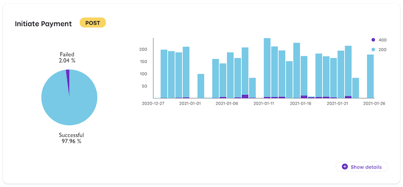

# Vipps Developers

This repository contains various resources for Vipps developers, including:

* [Getting started](vipps-getting-started.md) with Vipps development
* [Settlements](https://github.com/vippsas/vipps-developers/tree/master/settlements)
  for information about settlements
* [How to contribute](contribute.md) to Vipps projects on GitHub

Document version: 2.3.3.

## Table of contents

- [API documentation](#api-documentation)
- [Partners](#partners)
- [Plugins](#plugins)
- [Status pages](#status-pages)
- [The Vipps test environment (MT)](#the-vipps-test-environment-mt)
- [Postman](#postman)
- [API Dashboard](#api-dashboard)
- [Vipps API servers](#vipps-api-servers)
- [Vipps request servers](#vipps-request-servers)
- [Vipps design guidelines](#vipps-design-guidelines)
- [Questions?](#questions)

## API documentation

First of all: See [Getting started](vipps-getting-started.md).

The most commonly used APIs:
* [Vipps eCom API](https://github.com/vippsas/vipps-ecom-api)
* [Vipps Login API](https://github.com/vippsas/vipps-login-api)
* [Vipps Recurring API](https://github.com/vippsas/vipps-recurring-api)

All Vipps APIs are available here: https://github.com/vippsas

## Partners

See our [Partner section](partners/).

## Plugins

Vipps provides several open source plugins for various web solutions.
See our [Plugins section](https://github.com/vippsas/vipps-plugins).

## Status pages

We have several status pages, where you can also subscribe to alerts:

* Test environment: https://vipps-test.statuspage.io
* Production environment: https://vipps.statuspage.io
* BankID production: https://www.bankid.no/status/
* BankID preprod: https://bankidpreprod.statuspage.io

## The Vipps test environment (MT)

See
[The Vipps test environment (MT)](https://github.com/vippsas/vipps-developers/blob/master/vipps-test-environment.md)
for more information about general test functionality,
the iOS and Android test apps, etc

## Postman

See our
[Postman guide](https://github.com/vippsas/vipps-developers/blob/master/postman-guide.md)
or the
[Postman documentation](https://www.getpostman.com/docs/)
for more information about using Postman.

## API Dashboard

All merchants have access to an API Dashboard on
[portal.vipps.no](https://portal.vipps.no) under the "Utvikler" tab. Keep in mind that the "Utvikler" tab is only available to users with admin or developer roles.

It shows information about your API usage, an overview of errors, etc.
Here's an example for one endpoint:

*Note: The API dashboard is not real-time, and events might take up to 10 minutes before they appear.*

## Vipps API servers

The test and production environments are separate and require different API credentials:

| Production (Prod)   | Test (MT)              |
| ------------------- | ---------------------- |
| api.vipps.no        | apitest.vipps.no       |

**Please note:** Vipps may change the IP addresses for the API servers. To ensure
that you are whitelisting the correct IP addresses please use these hostnames
and DNS, and automatically update your firewall rules if there are DNS changes.

## Vipps request servers

Requests made by Vipps are made from the servers specified below.
Vipps normally only uses one server at a time, and change servers approximately
every three months.

| Production (Prod)   | Disaster recovery (DR) | Test (MT)              |
| ------------------- | ---------------------- | ---------------------- |
| callback-1.vipps.no | callback-dr-1.vipps.no | callback-mt-1.vipps.no |
| callback-2.vipps.no | callback-dr-2.vipps.no | callback-mt-2.vipps.no |
| callback-3.vipps.no | callback-dr-3.vipps.no | callback-mt-3.vipps.no |
| callback-4.vipps.no | callback-dr-4.vipps.no | callback-mt-4.vipps.no |

The disaster recovery environment is as important as the production environment.

**Please note:** Vipps may change the IP addresses for the request servers. To ensure
that you are whitelisting the correct IP addresses please use these hostnames
and DNS, and automatically update your firewall rules if there are DNS changes.

For API products where Vipps makes requests to your servers, please make sure
that these request servers are allowed through firewalls, etc.

## Vipps design guidelines

Guidelines, logos, buttons, etc is here:
[vipps-design-guidelines](https://github.com/vippsas/vipps-design-guidelines).

## Questions?

We're always happy to help with code or other questions you might have!
Please create an [issue](https://github.com/vippsas/vipps-developers/issues),
a [pull request](https://github.com/vippsas/vipps-developers/pulls),
or [contact us](https://github.com/vippsas/vipps-developers/blob/master/contact.md).

Sign up for our [Technical newsletter for developers](https://github.com/vippsas/vipps-developers/tree/master/newsletters).
