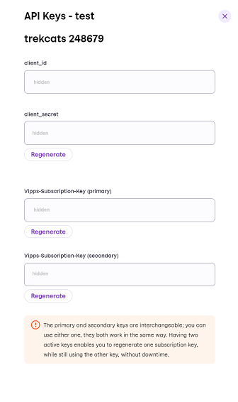

# API keys

<!-- START_COMMENT -->
ℹ️ Please use the website:
[Vipps MobilePay Technical Documentation](https://developer.vippsmobilepay.com/docs/vipps-developers/common-topics/api-keys/).
<!-- END_COMMENT -->

When you start using the Vipps API, you will need to provide API keys.
These are like passcodes that confirm your identity and that your API request is valid.

Your API keys are specific for your sales unit, and you will use them to interact with all the
[Vipps API products](https://developer.vippsmobilepay.com/docs/APIs).

The same API keys are used for many types of integration:
Direct integration, native apps for iOS and Android, point of sale integrations,
[all the Vipps plugins](https://developer.vippsmobilepay.com/docs/vipps-plugins)
and any other solution based on the Vipps APIs.

**Please note:** There are no API keys for
[Vippsnummer](https://www.vipps.no/produkter-og-tjenester/bedrift/ta-betalt-i-butikk/ta-betalt-med-vipps/),
as there is no external API.

**Please note**: This page describes the keys that are provided to you, as a merchant.
Partners use special keys that will work for all their merchants. These are known as
[*Partner keys*](https://developer.vippsmobilepay.com/docs/vipps-partner/partner-keys).

## Production and Test Keys

The test environment and production environments are completely separate.
You will, therefore, need to use a different set of API keys for the test environment versus the production environment.

* API keys for the test environment:
  Normally available a few minutes after the sales unit is created.
  See [Developer resources: How to create a test sales unit](../developer-resources/portal.md#how-to-create-a-test-sales-unit) for details.
* API keys for the production environment:
  Normally available after a few days after application, depending on the
  workload and whether we need additional information.

💥 **Use caution with storing and transferring API keys** 💥

* Vipps MobilePay will never ask for your API keys, and you must keep them secret.
* *Always* send API keys by encrypted email.
* If you accidentally share your API keys, you must generate new ones by clicking the *regenerate* button on your [portal.vipps.no](https://portal.vipps.no) page. Please remember to update your integrations so they will continue working.

**Please note:**

* Vipps MobilePay cannot provide API keys in any other way, such as by
  email or over the phone, as the API keys give access to transferring money.
* If your developers do not have Norwegian BankID, you will need to retrieve
  the API keys for them, and send them to the developers securely.

### Getting the API keys

1. Log-in to [portal.vipps.no](https://portal.vipps.no) using BankID.
   * If you have problems, see [Permissions and users](../developer-resources/portal.md#permissions-and-users).
1. Select *Vipps På Nett* > *Utvikler*.
   In the page that opens, you will see a table with many sales units listed.
   Hover over the `i` in the column heading for additional information.
   
1. Select either *Production* or *Test*, depending on the type of keys you need.
1. Find your desired sales unit.
   * If you need to create your own test sales unit,
     select *Test* and then click *Add test sales unit* and fill out the form.
     See [create a new test sales unit](../developer-resources/portal.md#how-to-create-a-test-sales-unit) for more details.
1. Click the *Show keys* button corresponding to your sales unit.
   The API keys will be displayed.
   **Please note:** You can only see API keys that you have access to. All others will be hidden.
   

## How to use the API keys

The API Keys are:

| API Key Name             | Description                                                         | Format | Example                              |
|--------------------------|---------------------------------------------------------------------|--------|--------------------------------------|
| `client_id`              | Client ID for the sales unit (the "username")                        | GUID   | fb492b5e-7907-4d83-bc20-c7fb60ca35de |
| `client_secret`          | Client secret for the merchant (the "password")                     | Base64 | Y8Kteew6GE3ZmeycEt6egg==             |
| `Vipps-Subscription-Key` (primary)   | Subscription key for the API product                    | Base64 | 0f14ebcab0eb4b29ae0cb90d91b4a84a     |
| `Vipps-Subscription-Key` (secondary) | Subscription key for the API product                    | Base64 | 0f14ebcab0eb4b29ae0cb90d91b4a84a     |

The `client_id` and `client_secret` are used with the
[Access token API](https://developer.vippsmobilepay.com/docs/APIs/access-token-api)
to get an access token to use for all subsequent API requests.

There are both a primary and secondary `Vipps-Subscription-Key`.
The primary and secondary keys are interchangeable: You can use either one,
they both work in the same way.
Having two active keys enables you to
regenerate one subscription key, while still using the other key, without downtime.
If you want, you can just ignore the second key.

**Please note:** The header which supplies this subscription key for the Vipps API is
`Ocp-Apim-Subscription-Key`.

## Historical note

Vipps has previously had separate API keys for each API product, and a set of
API keys were directly linked to one sales unit. This meant that customers
needed to keep track of multiple API keys, and that access to a new API
required a new sales unit. The API keys for Vipps eCom v1 and v2 APIs have been “upgraded” to include the same APIs as
Vipps API.  The `Vipps-API` product also includes some *legacy* APIs, such as *eCom API v1* *Signup and Login*.

If you are still using a legacy API, you should upgrade as soon as possible.
See:
[Vipps API Lifecycle](api-lifecycle.md) for more information.
