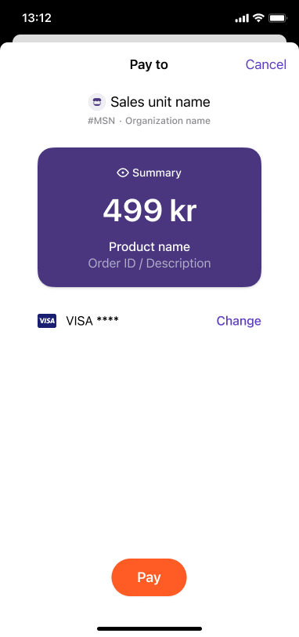
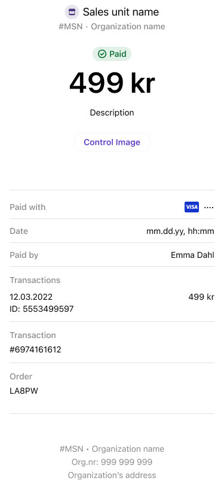

import ApiSchema from '@theme/ApiSchema';
import Tabs from '@theme/Tabs';
import TabItem from '@theme/TabItem';

# Payment screen

The following is the payment screen in the Vipps or MobilePay app.

<Tabs
defaultValue="vipps"
groupId="brand"
values={[
{label: 'Vipps', value: 'vipps'},
{label: 'MobilePay', value: 'mobilepay'},
]}>
<TabItem value="vipps">

* *Sales unit name* - The name of the sales unit.
  A company or organization can have multiple sales units to represent different physical shops, vending machines, collection points, services, and similar.
* *MSN* - The Merchant Serial Number, or ID number, for a sales unit.
* *Organization name* - The name of the company or organization that owns this sales unit.
* *Product name* - The name of the product being purchased.
* *Order ID / Description* - The orderId or description provided by the merchant.

</TabItem>
<TabItem value="mobilepay">

*To be provided soon.*

</TabItem>
</Tabs>

The following is the receipt screen:

<Tabs
defaultValue="vipps"
groupId="brand"
values={[
{label: 'Vipps', value: 'vipps'},
{label: 'MobilePay', value: 'mobilepay'},
]}>
<TabItem value="vipps">

* *Organization number* - The ID for the organization that owns the sales unit.
* *Transaction ID* - The internal Vipps MobilePay ID for the transaction.

</TabItem>
<TabItem value="mobilepay">

*To be provided soon.*

</TabItem>
</Tabs>
