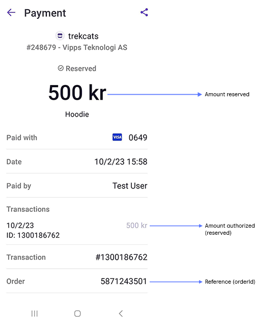
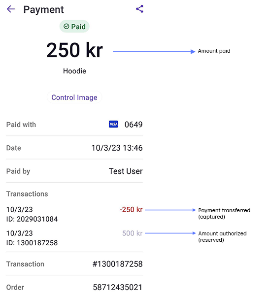

# Payment screen

The following is the payment screen in the Vipps or MobilePay app.

## Payment request

When you create a [payment request](https://developer.vippsmobilepay.com/docs/APIs/epayment-api/operations/create/),
with the user's phone number, they will get a notification in their Vipps or MobilePay app.
If you don't have their phone number, you can specify that they should be directed to the
[Vipps or MobilePay Landing page](landing-page.md), where they enter their phone number and then open their own app.

Within the user's Vipps or MobilePay app, they will be presented with a payment screen with the following details:

* *Sales unit name* - The name of the sales unit.
  A merchant can have multiple sales units to represent different physical shops, vending machines, collection points, services, and similar.
* *Organization name* - The name of the merchant that owns this sales unit.
* *Merchant Serial Number* - The Merchant Serial Number (MSN), or ID number, for a sales unit.
* *Reference (orderId)* - The orderId associated with this purchase as provided by the merchant.

## Payment reservation

When the user authorizes the payment, the amount will be reserved.
It will remain in the "reserved" state up until you capture it.

The payment details will show the authorized amount in faint gray (e.g., 500 kr).

## Payment capture

The payment transactions are shown in reverse order, where the oldest transaction is at the bottom of the list.
So, here you see the authorized amount at the bottom of the *Transactions* list in faint gray (e.g., 500 kr).

The payment transfer (i.e., *capture*) is reflected as a negative transaction in red (e.g., -500 kr), so the user can see that you have transferred 500 kr from their account.

If you later refund an amount (perhaps there was a mistake), the refunded amount will be shown in green (e.g., 250 kr) at the top of the list. The total amount paid will be updated to show the new amount.

In cases where the final amount owed is not known at the time of the payment request
(e.g., for vending machines, charging stations, and taxis),
it's common to reserve a larger (but reasonable) amount, so they
have authorization to cover the cost of the service.
Once the true amount is known, they capture this amount and cancel the remaining.

In this case, you see that the captured amount (e.g., -250 kr) is less than the original authorized amount (e.g., 500 kr). The actual amount paid is also updated.

