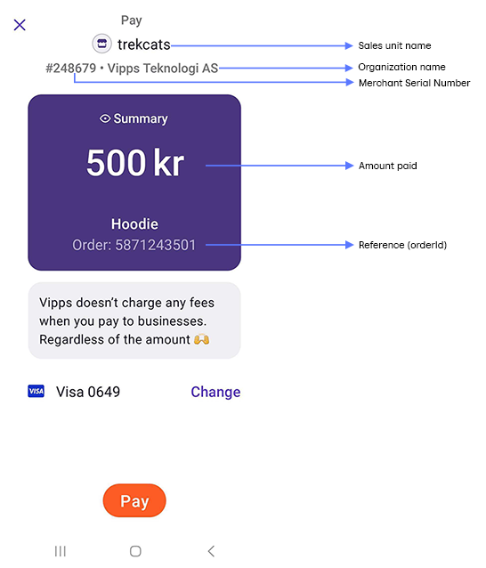
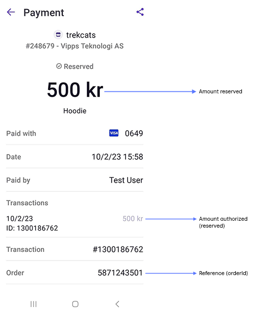
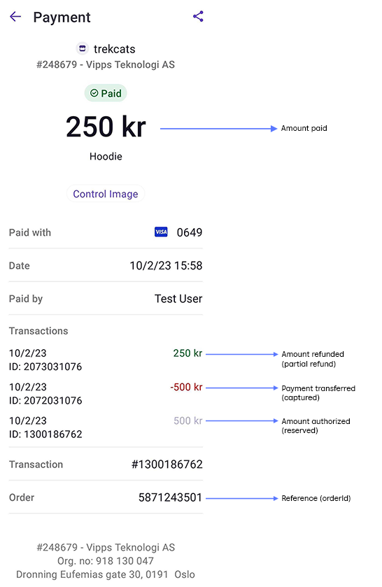
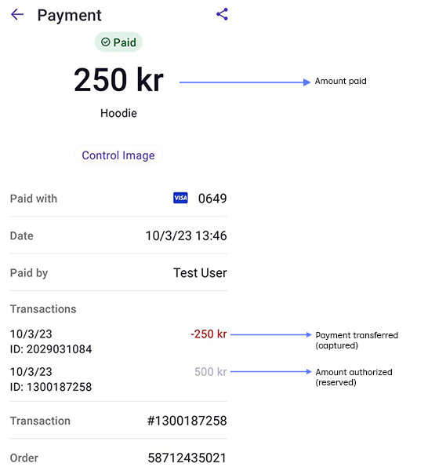

# Payments

The following is the payment screen in the Vipps or MobilePay app.

## Payment request

When you create a [payment request](https://developer.vippsmobilepay.com/docs/APIs/epayment-api/operations/create/),
with the user's phone number, they will get a notification in their Vipps or MobilePay app.
If you don't have their phone number, you can specify that they should be directed to the
[Vipps or MobilePay Landing page](landing-page.md), where they enter their phone number and then open their own app.

Within the user's Vipps or MobilePay app, they will be presented with a payment screen with the following details:

* *Sales unit name* - The name of the sales unit.
  A merchant can have multiple sales units to represent different physical shops, vending machines, collection points, services, and similar.
* *Organization name* - The name of the merchant that owns this sales unit.
* *Merchant Serial Number* - The Merchant Serial Number (MSN), or ID number, for a sales unit.
* *Reference (orderId)* - The orderId associated with this purchase as provided by the merchant.

## Payment reservation

When the user authorizes the payment, the amount will be reserved.
It will remain in the "reserved" state up until you capture it.

The payment details will show the authorized amount in faint gray (e.g., 500 kr).

## Payment capture

The payment transactions are shown in reverse order, where the oldest transaction is at the bottom of the list.
So, here you see the authorized amount at the bottom of the *Transactions* list in faint gray (e.g., 500 kr).

The payment transfer (i.e., *capture*) is reflected as a negative transaction in red (e.g., -500 kr), so the user can see that you have transferred 500 kr from their account.

If you later refund an amount (perhaps there was a mistake), the refunded amount will be shown in green (e.g., 250 kr) at the top of the list. The total amount paid will be updated to show the new amount.

In cases where the final amount owed is not known at the time of the payment request
(e.g., for vending machines, charging stations, and taxis),
it's common to reserve a larger (but reasonable) amount, so they
have authorization to cover the cost of the service.
Once the true amount is known, they capture this amount and cancel the remaining.

In this case, you see that the captured amount (e.g., -250 kr) is less than the original authorized amount (e.g., 500 kr). The actual amount paid is also updated.

## Using Vipps MobilePay for payments

It's possible to use the [ePayment API](https://developer.vippsmobilepay.com/docs/APIs/epayment-api/)
for several types of payments.
The regulatory requirements are different for different types of purchases.
One major difference is if the cardholder is physically present and
"can look the seller in the eye" while making the payment.

Vipps MobilePay needs to do more thorough "Know Your Customer" (KYC) and compliance checks
for some examples above. This must be done per sales unit.
Vipps MobilePay is also required to have the correct MCC
([Merchant Category Code](https://en.wikipedia.org/wiki/Merchant_category_code))
for each sales unit.

Because of this, merchants must use separate sales units for separate types
of purchases. This also has some benefits:

* Each sales unit has its own name presented to the user in the app
* Each sales unit has separate transaction logs
* Each sales unit can have its own settlement account. Sharing a single account across multiple sales units is available on request.

## High success rate for direct integrations

**Please note:** We have extremely high success rate (low drop-off) for direct integration.
Almost every user that selects to pay with Vipps completes the payment. The
success rate is much higher than when using a payment card directly.

When comparing drop-off rates: Remember to compare drop-off data for when the
user *selects* payment method, do not compare Vipps to numbers for when the
user has selected card payment and already has manually entered the card number, etc.:

* Drop-off data for Vipps: Measure the success rate after the user has selected Vipps MobilePay.
* Drop-off rate for cards: Measure the success rate after the user has selected card,
  but from *before* the user has to enter the card details.

The success rate for PSP integrations is not quite as high.
See:
[Direct integration and PSP integration](https://developer.vippsmobilepay.com/docs/common-topics/direct-vs-psp)
and
[Benefits of direct integration](https://developer.vippsmobilepay.com/docs/common-topics/direct-vs-psp#benefits-of-direct-integration).

## Card payments

The
[ePayment API](https://developer.vippsmobilepay.com/docs/APIs/epayment-api/)
and the
[Checkout API](https://developer.vippsmobilepay.com/docs/APIs/checkout-api/)
support freestanding card payments:
Users can enter their card details and pay with the card without using the app.
This means that payments are possible also for users in countries where
Vipps MobilePay is not yet available.

Both Visa and Mastercard are supported.
This includes any cards that are co-branded with VISA and Mastercard.

Visa Electron is supported if card is enabled for online purchases.

**Important:** To reduce risk, we do a 3D Secure step-up for *all* cards
used for freestanding payments. We do not have the delegated SCA
used in the app, when users are making freestanding payments.
Therefore, this additional security is required.
If the issuer does not handle 3D Secure correctly, the payment will fail.

Cards issued in the following countries are accepted:

* EEA/EØS (European Economic Area)
* UK
* Canada
* USA
* Australia
* New Zealand
* South Korea
* Japan
* Israel

**Please note**: Just to avoid confusion: Payments with the app are also done using
the users' cards that they have been added there. The user gets all the benefits of the card,
and since the app has delegated SCA, the user gets a faster and simpler user experience.
See also:
[Direct integration and PSP integration](direct-vs-psp.md).

## Information about payment and settlements

The [merchant portal](https://portal.vipps.no)
provides information about your transactions, sales units and settlement reports.
You can also subscribe to daily or monthly transaction reports by email.

See:

* [Report API](https://developer.vippsmobilepay.com/docs/APIs/report-api)
* [Settlements](../settlements/README.md)

### How can I use Vipps MobilePay for different types of payments?

It's possible to use the eCom API for several types of payments.

Let's say you run a book store. You can then use eCom API in several ways, such as:

1. A webshop that sells physical books:
   eCom API with "reserve capture", since you cannot capture the payment before the book is shipped.
2. A webshop that sells digital, downloadable books that are immediately available:
   eCom API with either "reserve capture" or "direct capture", depending on whether the digital product
   needs to be generated or not.
3. A physical store where customers buy physical books in person:
   eCom API with "direct capture", possibly integrated with the POS.
4. A physical store where customers can buy physical books by scanning a
   QR code in the window, and have the physical book delivered by mail:
   eCom API with "reserve capture", since you cannot capture the payment before the book is shipped.

The regulatory requirements are different for different types of purchases.
One major difference is if the cardholder is physically present and
"can look the seller in the eye" while making the payment.

Vipps MobilePay needs to do more thorough "Know Your Customer" (KYC) and compliance checks
for some examples above. This must be done per sales unit.
Vipps MobilePay is also required to have the correct MCC
([Merchant Category Code](https://en.wikipedia.org/wiki/Merchant_category_code))
for each sales unit.

Because of this, merchants must use separate sales units for separate types
of purchases. This also has some benefits:

* Each sales unit has its own name presented to the user in the app
* Each sales unit has separate transaction logs
* Each sales unit can have its own settlement account. Sharing a single account across multiple sales units is available on request.

## Why do payments fail?

### Common reasons why payments are not completed

The most common reasons why payments are not completed are:

1. The debit/credit card has expired.
   We notify users in the app in good time before a card expires, but users must
   update the card(s) themselves.
   We verify cards for *every* payment (resulting in an extremely low fraud rate).
   **Please note:** *Vennebetaling* (Person-to-person) uses bank accounts directly, not the card.
   It's therefore possible for a user to pay another person (using the bank account),
   but not be able to pay a merchant (since the card is expired).
2. The debit/credit is no longer valid.
   This can happen when a user has received a new card, but the previous card's
   expiry date has not yet been reached.
   See point 1 above.
3. For freestanding card payments with the
   [ePayment API](https://developer.vippsmobilepay.com/docs/APIs/epayment-api/): If the card issuer does
   not correctly handle the "3D Secure step up", meaning the required secure
   customer identification, the payment will fail. See
   [Card payments](payments.md/#card-payments).
   Payments also fail if the user is attempting to pay with a card
   from a country that is not allowed.
4. Insufficient funds on the debit/credit card.
   There is not enough money in the debit card's bank account,
   or not enough credit left on the credit card.
   With a direct integration, the user can retry the same payment with a
   different card, and because of this "second chance" the success rate is high.
   See
   [Direct integration and PSP integration](https://developer.vippsmobilepay.com/docs/common-topics/direct-vs-psp/).
5. The debit/credit card has been rejected by the issuer.
   There are many possible reasons for this, and we may not be allowed to
   give the details to the merchant.
   See 1 above.
6. Payment limit reached, BankID required.
   There are some amount limits to prevent misuse and fraud, and when a limit is reached
   the user sometimes (not often) needs to authenticate with BankID, even in Vipps MobilePay.
   Some users *still* need their physical BankID *kodebrikkke* (*code card*), which they may not have available.
7. The payment has timed out.
   This happens if the user does not confirm in the app within 10 minutes
   (5 minutes to log in, then 5 minutes to confirm the payment),
   typically if the user has deactivated push notifications and does not open
   Vipps manually.
   See:
   [Timeouts](timeouts.md).
8. Attempt to capture an amount that exceeds the reserved amount.
   It's not possible to capture a higher amount than the user has confirmed in Vipps MobilePay.
   Some merchants experience this because of rounding errors on their side.
   See: [Why does capture fail?](reserve-and-capture.md#why-does-capture-fail)
9. Attempt to capture an amount that has not been reserved.
   If the user does not confirm the payment in the app, it's impossible for the
   merchant to capture it.
   The payment must have status "reserved" for capture to be possible.
   See: [Why does capture fail?](reserve-and-capture.md#why-does-capture-fail)
10. The user has reached the limit for payments within a time period.
   See: [Payment limits, in Norwegian](https://vipps.no/hjelp/vipps/sende-og-motta-penger/har-vipps-belopsgrenser/).

### Investigating problems

We strongly recommend checking the full history of every payment with
the API. You can see if a payment has been actively rejected, if the user has
not done anything, etc.
See: [Get payment details](https://developer.vippsmobilepay.com/docs/APIs/ecom-api/vipps-ecom-api#get-payment-details).

We are continuously improving the error messages in the app. Some of the
above errors may only have a general error message when attempting to pay.

**Please note:** We are not allowed to give detailed information about all errors to the
merchant, as some information should only be provided to the user.
We will not "leak" more user details
than we have to. The general rule is that if the problem must be corrected by
the user in the Vipps or MobilePay app, all necessary information will be provided to the user there.

**Tip:** Everyone can test their Vipps or MobilePay app with credit and debit cards in our demo store:
[demo.vipps.no](https://demo.vipps.no).

See: [HTTP response codes and errors](errors.md)

## Payment FAQ

### Why a user doesn't receive the payment notification

Push notifications must be active.

Push notifications are "best effort", and we can't guarantee that all
push notifications arrive. It depends on services, networks, and other things outside our control.

If the Vipps or MobilePay app is already open and active when the push notification is received,
the user must press the *Send* button and move to the payments screen to see
the payment notification. The app isn't able to poll or discover the
payment notification automatically.

### How can I open the fallback URL in a specific (embedded) browser?

The phone's operating system always opens URLs in the default browser.

This means that the `fallback` URL (the "result page") will be opened in
the default browser. We have no way to open the `fallback` URL in the
embedded browser on Facebook, Instagram, etc. Similarly, there is no way
for us to open the `fallback` URL in the same tab that the user came from
before the app-switch.

This means that the merchant must be able to detect or recognize the user
when the `fallback` URL is opened, without relying on session, cookies, etc.

### Why a user might not be sent back to where they came from when they have paid?

If the payment started in a custom browser (like Chrome on iOS, or an embedded
browser on Instagram, instead of the default Safari browser), the `fallback` URL
(the result page) will still be opened in the default browser.

### Can I split payments to charge a fee?

No. We don't support splitting payments to charge a fee.

If you want to charge a fee (like 3 %) of your payments, you can:

1. Receive the full payment, take your 3 %, and then pay the remaining
   97 % to your customer (merchant). In order to receive payments in this way,
   you may need the regulatory approval as
   [*e-pengeforetak* (*e-money institution*)](https://www.finanstilsynet.no/konsesjon/e-pengeforetak/)
   from the Finanstilsynet.
2. Have your customer (merchant) receive the full payment directly, then send an
   invoice for your 3 % fee.

Companies that receive payments through Vipps MobilePay needs to be our customers.
See:
[What are the requirements for merchants?](applying-for-services.md#what-are-the-requirements-for-merchants)

### I have initiated an order, but I can't find it

For the eCom API, see
[I have initiated an order, but I can't find it](https://developer.vippsmobilepay.com/docs/APIs/ecom-api/vipps-ecom-api-faq#i-have-initiated-an-order-but-i-cant-find-it).

### How long is an initiated order valid, if the user does not confirm in the app?

Orders through the ePayment API can have longer timeouts. See
[ePayment API: Long-living payments](https://developer.vippsmobilepay.com/docs/APIs/epayment-api/features/long-living-payments/).

Orders through the eCom API have a max timeout of 10 minutes: 5 minutes to log in and 5 minutes to confirm the payment.

It's important that the merchant waits (at least) this long, otherwise the user may confirm in the app,
and right after get an error from the merchant that the order has been cancelled.

See: [Timeouts](timeouts.md).

### How long does it take until the money is in my account?

See: [Settlements](../settlements/README.md).

### Why has one of my customers been charged twice for the same payment?

Once in a while a customer claims they have "paid double", "paid twice" or similar.

This does not happen, except in *extremely* rare cases where multiple services,
both at Vipps, banks, PSPs, etc. fail simultaneously. In reality: This never happens.

The most common reason for misunderstanding is that customers do not understand
the difference between a *reservation* and a *payment* and/or that some banks
do not present this to their customers in a way that the customer understands.

Some banks will display the reservation of a payment even *after* the payment has
been captured. This may lead some customers into thinking that both the
reservation and the capture are payments, and that they have paid twice.

Most banks manage to do this properly, but apparently not all.

Please check the payment:

1. Find the `orderId` for the payment.
2. Log in on [portal.vipps.no](https://portal.vipps.no).
3. Click "Transaksjoner" (*Transactions*) and then *Søk på ID* (*Search for ID*)
4. Search for the `orderId` from step 1.
5. Click the order.
6. See the "History" details.

This is of course also supported in the [eCom API](https://developer.vippsmobilepay.com/docs/APIs/ecom-api), and it is a requirement to use
this functionality when integrating with Vipps MobilePay:
[`GET:/ecomm/v2/payments/{orderId}/details`](https://developer.vippsmobilepay.com/api/ecom#tag/Vipps-eCom-API/operation/getPaymentDetailsUsingGET)

The user can also check the payment in the Vipps or MobilePay app:

1. Start the app and log in.
2. Press *Payments* on the main screen.
3. Scroll down and press *History*
4. Check the payment and the *Transactions*.
5. Verify that the orderId and transaction ID matches the ones in step 6 above.

See:
[For how long is a payment reserved?](reserve-and-capture.md#for-how-long-is-a-payment-reserved)

### In which sequence are callbacks and fallbacks done?

We can't guarantee a particular sequence, as this depends on user
actions, network connectivity/speed, etc. Because of this, it is not
possible to base an integration on a specific sequence of events.

See:
[Initiate payment flow: Phone and browser](https://developer.vippsmobilepay.com/docs/APIs/ecom-api/vipps-ecom-api#initiate-payment-flow-phone-and-browser)

### Where can I find reports on transactions?

The [merchant portal](https://portal.vipps.no) provides information about
your transactions, sales units and settlement reports.
You can also subscribe to daily or monthly transaction reports by email.

See: [Settlements](../settlements/README.md).

### When do users get a "soft decline" and need to complete a 3-D Secure verification?

We handle everything related to "soft declines" and 3-D Secure.
We also handle BankID verification, when that is required.
There is nothing a merchant needs to.

We use delegated SCA (Secure Customer Authentication) from the banks, which
significantly simplifies the user experience, as there is normally no need for
BankID verification. The biometric login in the Vipps or MobilePay app is enough.

We use tokenized cards, which eliminates the need for "soft decline".
As long as the token is valid, the user never has to verify the card again.

In order to prevent misuse and fraud, we require users to do a 3-D Secure
verification if the user has paid more than 15 000 NOK during the last five days.

In short: Users paying with Vipps MobilePay have a much faster and simpler user experience
than when using a card directly.

We also have an extremely low fraud rate, as it is impossible to pay
with a card that has been invalidated in any way by the issuer. All users
must log in to the app with their BankID verified identity to use their card.

See:

* [Benefits of direct integration](direct-vs-psp.md#benefits-of-direct-integration)
* [Extremely high success rate of direct integrations](direct-vs-psp.md#extremely-high-success-rate-of-direct-integrations)

### How do I perform "testing in production"?

To do this, you need a live Vipps MobilePay account.
You can order this on
[portal.vipps.no](https://portal.vipps.no).

We recommend testing with 2 NOK, even though 1 NOK is the smallest possible amount.
1 NOK is not reliable, as it gets low priority in some systems.

## Can you send us logs, so we can look for errors?

Unfortunately, Vipps MobilePay can't extract logging info for one merchant or one MSN. There are
terabytes of data, and it's not trivial to provide data for just one merchant
or MSN.

We provide as much information as we can for all API requests that fail, both
by using a sensible HTTP status for the response and by including as much
relevant information as possible in the response body.

It's important to use this information. If you discard it, it's gone.

The API Dashboard on
[portal.vipps.no](https://portal.vipps.no)
provides a high-level overview of errors in the use of the APIs,
but it does in no way replace a proper handling of errors and error messages.

Having said that, it *is* possible to investigate specific API calls in special
cases if you send us enough information. Please do your own investigations before
contacting us about this.
