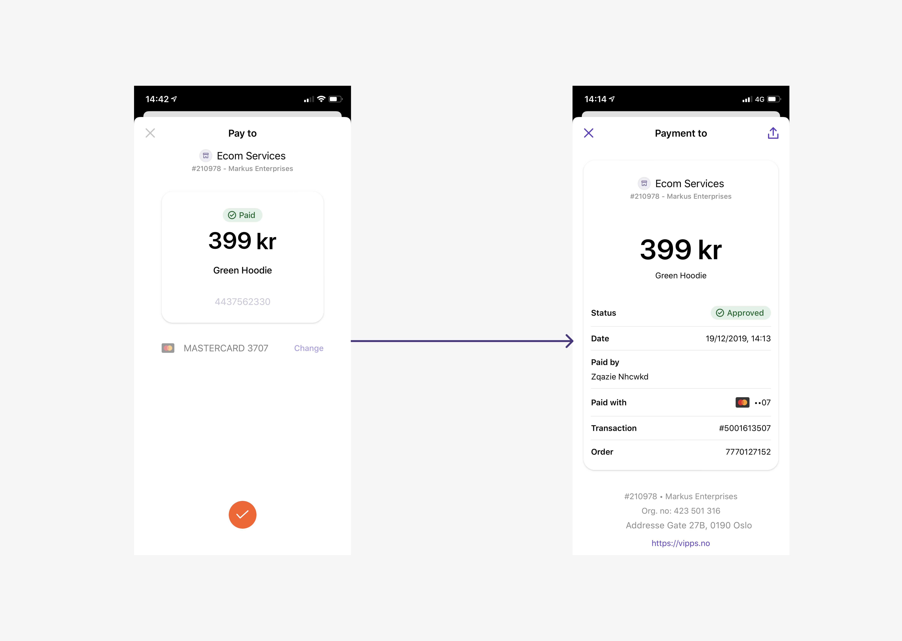

# Reserve and capture

When you initiate a payment, it will be _reserved_ until you _capture_ it:

* When a payment is reserved it means the customer has approved the payment.
  The funds are still in the customer's account, but not available to spend on other things.
* When a payment is captured it means the funds are moved from customer's account to merchant's account.
  * Captured funds will be settled to the merchant's settlement account after two business days. See
  [Settlement Information](../settlements/README.md) for more details.

Vipps supports both _reserve capture_ and _direct capture_:

* _Reserve capture_ is the default, and works for all types if payments.
  When you initiate a payment, it will be reserved until you capture it.
  The capture can be done a few seconds later, or several days later.
* _Direct capture_ is available in the
  [eCom API](https://developer.vippsmobilepay.com/docs/APIs/ecom-api/)
  for historical reasons, but not available in the newer
  [ePayment API](https://developer.vippsmobilepay.com/docs/APIs/epayment-api/).
  When _direct capture_ is configured for a sales unit, all payment reservations
  will instantly be captured, without the need for a separate capture request.
  This is provided for legacy reasons and was intended for situations
  where the product or service is immediately provided to the customer, and
  there is absolutely no chance that the service is not available or sold out,
  e.g. digital services.
  We have since moved away from this, and strongly recommend that all integrations
  use the ePayment API and _reserve capture_.
  Direct capture requires additional compliance checks of the merchant.

**Important:** It's completely fine to use _reserve capture_ almost exactly like
_direct capture_: Just do the capture immediately after the reservation.
The user experience is exactly the same.

Important things to consider for cancellations and refunds:

* If a payment has been _reserved_ (as with "reserve capture"), the merchant can
  make a "cancel" API request to immediately release the reservation and make available
  in the customer's account.
  This may be useful even in situations where it's "impossible" that the goods/service
  is sold out.
* If a payment has been _captured_ (as with "direct capture"), the merchant has to
  make an "refund" API request, and it then takes several days before the amount is
  available in the customer's account.
* With "reserve capture" it is possible to reserve a higher amount and only
  capture a part of it (useful for electric car charging stations, etc.).
  It is also possible to capture the full amount with multiple captures ("partial capture").

This is applicable to:

* [Checkout API](https://developer.vippsmobilepay.com/docs/APIs/checkout-api)
* [eCom API](https://developer.vippsmobilepay.com/docs/APIs/ecom-api)
* [ePayment API](https://developer.vippsmobilepay.com/docs/APIs/epayment-api)
* [Partner API](https://developer.vippsmobilepay.com/docs/APIs/partner-api)
* [PSP API](https://developer.vippsmobilepay.com/docs/APIs/psp-api)
* [Recurring API](https://developer.vippsmobilepay.com/docs/APIs/recurring-api)

## Reserve

When the user confirms the purchase in Vipps, the payment status changes to `RESERVE`.
The respective amount will be reserved for capture, which may be done immediately or later.

For example:

See the FAQ:

* [For how long is a payment reserved?](../faqs/reserve-and-capture-faq.md#for-how-long-is-a-payment-reserved)

## Capture

There are three types of capture:

* [Reserve capture](#reserve-capture)
* [Direct capture](#direct-capture)
* [Partial capture](#partial-capture)

These are described in more detail below.

Always use an [idempotency key](http-headers.md#idempotency) in the capture call.

To perform a capture of the entire amount owed, the `amount` can be
omitted from the API request (i.e., not sent at all), set to `null` or set to `0`.
When doing a [partial capture](#partial-capture), you need to specify the amount.

**Please note:** It is important to check the response of the capture
call. The capture is only successful when the response is `HTTP 200 OK`.

Payment capture can be made up to 180 days after reservation.
Attempting to capture an older payment will result in a
`HTTP 400 Bad Request`.

See the FAQ:

* [When should I charge the customer?](../faqs/reserve-and-capture-faq.md#when-should-i-charge-the-customer)
* [What is the difference between "Reserve Capture" and "Direct Capture"?](../faqs/reserve-and-capture-faq.md#what-is-the-difference-between-reserve-capture-and-direct-capture)
* [When should I use "Direct Capture"?](../faqs/reserve-and-capture-faq.md#when-should-i-use-direct-capture)

### Reserve capture

_Reserve capture_ is the normal flow.

When the end user approves an initiated payment, it will be reserved until you
capture it. When the order is reserved, the amount is marked as reserved by the
bank, but not transferred.

### Direct capture

**Important:** _Direct capture_ is available in the
[eCom API](https://developer.vippsmobilepay.com/docs/APIs/ecom-api/)
for historical reasons,  but not available in the newer
[ePayment API](https://developer.vippsmobilepay.com/docs/APIs/epayment-api/).

When _direct capture_ is activated, all payment reservations will instantly be captured.

With _direct capture_, Vipps is responsible for the customer receiving the purchased product.
Because of this, _direct capture_ requires additional compliance checks.

A sales unit can only have one capture type, and it must be configured by Vipps.
You can't turn _direct capture_ on or off as a merchant.

We strongly recommend using "reserve capture" in all situations.

**Please note:** Vipps only offers "direct capture" for merchants that use
Vipps through a partner, and for merchants that have a Key Account Manager.
"Direct capture" must be requested by the partner from the partner manager,
or by KAM merchants from the Key Account Manager.

See the FAQ:

* [When should I use "Direct Capture"?](../faqs/reserve-and-capture-faq.md#when-should-i-use-direct-capture)
* [How can I check if I have "reserve capture" or "direct capture"?](../faqs/reserve-and-capture-faq.md#how-can-i-check-if-i-have-reserve-capture-or-direct-capture)

### Partial capture

Partial capture may be used in cases where a partial order is shipped or for other
reasons.

Partial capture may be called as many times as required while
there is a remaining amount that is reserved and has not yet been captured.

If one or more partial captures have been made, any remaining reserved amount
will be automatically released after a few days if using the eCom API,
and (by default) released immediately with the ePayment API.

For the eCom API it is also possible to do a partial capture and send an optional parameter to
explicitly free the remaining amount immediately.
