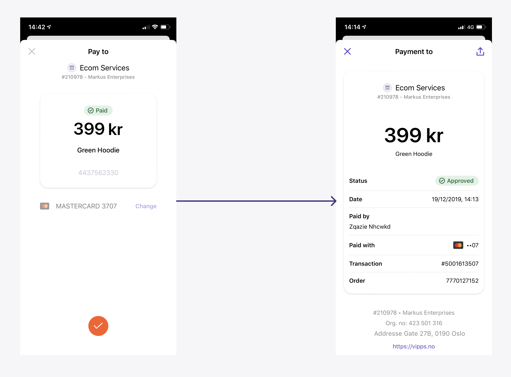

<!-- START_METADATA
---
title: Reserve and capture
pagination_next: null
pagination_prev: null
---
END_METADATA -->

# Reserve and capture

When you initiate a payment, it will be _reserved_ until you _capture_ it.
Reserved means the customer has approved the payment. The funds are still
in the customer's account, but not available to spend on other things.
Capture means the funds are moved from customer's account to merchant's account.
Vipps supports both _reserve-capture_ and _direct capture_:

* _Reserve capture_ is the default. When you initiate a payment, it will be
  reserved until you capture it. The capture can be done a few seconds later,
  or several days later.
* When _direct capture_ is activated, all payment reservations will instantly be
  captured. This is intended for situations where the product or service is
  immediately provided to the customer, and there is no chance that the service
  is not available or sold out, e.g. digital services.
  Direct capture requires additional compliance checks of the merchant.

**Important:** It's completely fine to use _reserve capture_ almost exactly like
_direct capture_: Just do the capture immediately after the reservation.
The user experience is exactly the same.

Some things to consider:

* If a payment has been _reserved_ (as with "reserve capture"), the merchant can
  make a `/cancel` call to immediately release the reservation and make available
  in the customer's account.
* If a payment has been _captured_ (as with "direct capture"), the merchant has to
  make a `/refund` call, and it then takes several days before the amount is
  available in the customer's account.
* With "reserve capture" it is possible to reserve a higher amount and only
  capture a part of it (useful for electric car charging stations, etc).
  It is also possible to capture the full amount
  with multiple captures ("partial capture").

## Reserve

When the user confirms the purchase in Vipps, the payment status changes to `RESERVE`.
The respective amount will be reserved for future capturing.

For example:


See the FAQ:

* [For how long is a payment reserved?](../faqs/reserve-and-capture-faq.md#for-how-long-is-a-payment-reserved)

## Capture

We strongly recommend that you use an [idempotency key](http-headers.md#idempotency) in the capture call. Then, if a capture
request fails for any reason, it can be retried with the same idempotency key.
You can use any unique id for your idempotency key.

To perform a normal capture of the entire amount, `amount` can be
omitted from the API request (i.e., not sent at all), set to `null` or set to `0`.
When doing a [partial capture](#partial-capture), you need to specify the `amount`.

**Please note:** It is important to check the response of the `/capture`
call. The capture is only successful when the response is `HTTP 200 OK`.

Capture can be made up to 180 days after reservation.
Attempting to capture an older payment will result in a
`HTTP 400 Bad Request`.

See the FAQ:

* [When should I charge the customer?](../faqs/reserve-and-capture-faq.md#when-should-i-charge-the-customer)
* [What is the difference between "Reserve Capture" and "Direct Capture"?](../faqs/reserve-and-capture-faq.md#what-is-the-difference-between-reserve-capture-and-direct-capture)
* [When should I use "Direct Capture"?](../faqs/reserve-and-capture-faq.md#when-should-i-use-direct-capture)

### Reserve capture

As mentioned above, _Reserve capture_ is the normal flow.

When the end user approves an initiated payment, it will be reserved until you
capture it. When the order is reserved, the amount is marked as reserved by the
bank, but not transferred.

### Direct capture

When _direct capture_ is activated, all payment reservations will instantly be captured.

With _direct capture_, Vipps is responsible for the customer receiving the purchased product.
Because of this, _direct capture_ requires additional compliance checks.

A sale unit can only have one capture type, and it must be configured by Vipps.
You can't turn _direct capture_ on or off as a merchant.

**Please note:** Vipps only offers "direct capture" for merchants that use
Vipps through a partner, and for merchants that have a Key Account Manager.
"Direct capture" must be requested by the partner from the partner manager,
or by KAM merchants from the Key Account Manager.

We strongly recommend using "reserve capture" in all situations.

See the FAQ:

* [When should I use "Direct Capture"?](../faqs/reserve-and-capture-faq.md#when-should-i-use-direct-capture)

### Partial capture

Partial capture may be used in cases where a partial order is shipped or for other
reasons. Partial capture may be called as many times as required while
there is a remaining reserved amount.

If one or more partial captures have been made, any remaining reserved amount
will be automatically released after a few days.

It is also possible to explicitly release the remaining funds. See:
[Cancelling a partially captured order](#cancelling-a-partially-captured-order).

### Cancelling a partially captured order

If you wish to cancel an order that you have partially captured, send a
[`PUT:/ecomm/v2/payments/{orderId}/cancel`](https://vippsas.github.io/vipps-developer-docs/api/ecom#tag/Vipps-eCom-API/operation/cancelPaymentRequestUsingPUT)
request with `shouldReleaseRemainingFunds: true` in the body.
The payment must be `RESERVED` for this to take effect.

If `shouldReleaseRemainingFunds` is not set, it will default to `false`.

When `shouldReleaseRemainingFunds` is set to `false`,
any request to cancel after a partial or full capture has been performed will be rejected.

This is a useful and recommended feature, as it releases any reserved balance
as soon as the card issuer and/or bank permits.

See also the FAQ:
[How long does it take from a refund is made until the money is in the customer's account?](../faqs/refunds-faq.md#how-long-does-it-take-from-a-refund-is-made-until-the-money-is-in-the-customers-account)

Example Request:

```json
{
  "merchantInfo": {
    "merchantSerialNumber": "123456"
  },
  "transaction": {
    "transactionText": "No socks for you!"
  },
  "shouldReleaseRemainingFunds": true
}
```

Response:

```json
{
  "orderId": "acme-shop-123-order123abc",
  "transactionInfo": {
    "amount": 20000,
    "transactionText": "No socks for you!",
    "status": "Cancelled",
    "transactionId": "5001420063",
    "timeStamp": "2018-11-14T15:31:10.004Z"
  },
  "transactionSummary": {
    "capturedAmount": 10000,
    "remainingAmountToCapture": 0,
    "refundedAmount": 0,
    "remainingAmountToRefund": 10000
  }
}
```

**Please note:** Once this operation has been performed, there will be zero
funds remaining to capture. Do not call this endpoint until you are sure you
have captured all you need.
