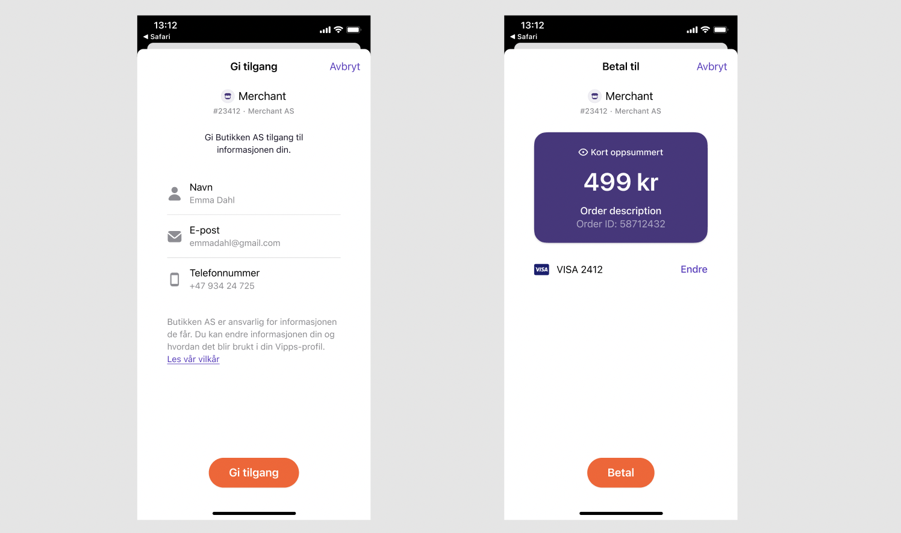
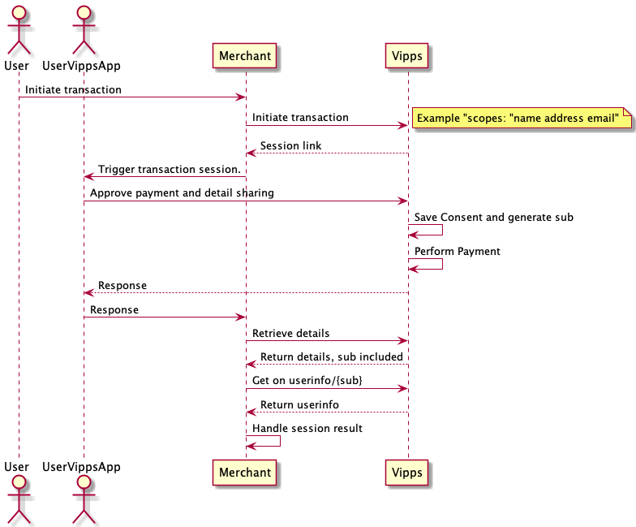
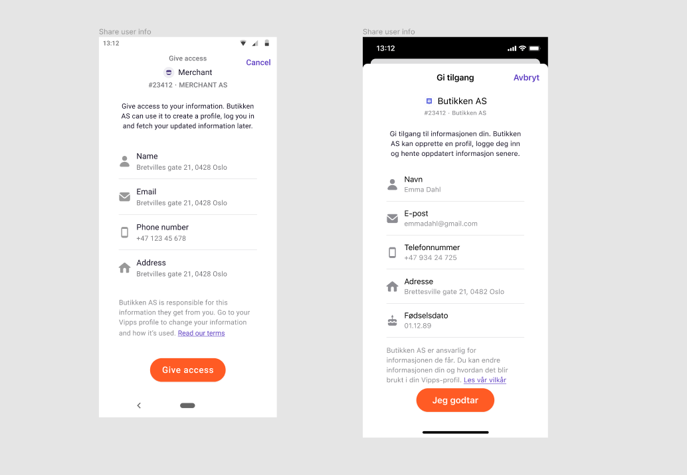

<!-- START_METADATA
---
title: Userinfo
pagination_next: null
pagination_prev: null
---
END_METADATA -->

# Userinfo

This is applicable to:

* [Checkout API](https://vippsas.github.io/vipps-developer-docs/docs/APIs/checkout-api)
* [eCom API](https://vippsas.github.io/vipps-developer-docs/docs/APIs/ecom-api)
* [Login API](https://vippsas.github.io/vipps-developer-docs/docs/APIs/login-api)
* [Recurring API](https://vippsas.github.io/vipps-developer-docs/docs/APIs/recurring-api)

Vipps offers the possibility for merchants to ask for the user's profile information as part of the payment flow.
This is done through Vipps Userinfo which follows
the [OIDC Standard](https://openid.net/specs/openid-connect-core-1_0.html#UserInfo).

To enable the possibility to fetch profile information for a user, the merchant can add a `scope`
parameter to the initiate call.

If the end user has not already consented to sharing information from Vipps to the
merchant, they will be asked for any remaining consents before completing the payment flow.
Once the payment flow is completed, the merchant can get the profile
information from our Userinfo endpoint.

A user's consent to share information with a merchant applies across our services. Thus, if the merchant implements Vipps Login as part of the payment flow,
in addition to profile information, they can also use Vipps to log the user in without the need for additional consents.

Example of the userInfo flow:



<!-- START_COMMENT -->

## Table of contents

* [Scope](#scope)
* [Userinfo call-by-call guide](#userinfo-call-by-call-guide)
* [Get userinfo](#get-userinfo)
* [Userinfo call](#userinfo-call)
  * [Request](#request)
* [Consent](#consent)

<!-- END_COMMENT -->


## Scope

Scope is the type of information you want access to. This can include any of the following values, separated by a space.

| Scope            | Description | User consent required |
|:-----------------|:------------|:----------------------|
| `address`        | A list containing the user's addresses. The list always contains the home address from the National Population Register and can also include work address and other addresses added by the user in Vipps. | yes |
| `birthDate`      | Birth date. Verified with BankID. ISO 8601 format (2022-12-31) | yes |
| `email`          | Email address. The flag `email_verified : true` (or `false`) in the response indicates whether the email address is verified. | yes |
| `name`           | First, middle and given name. Verified with the National Population Register. | yes |
| `phoneNumber`    | Phone number. Verified when creating the Vipps account. MSISDN format (4791234567).| yes |
| `nin`            | Norwegian national identity number. Verified with BankID. **NB:** Merchants need to apply for access to NIN. See: [Who can get access to NIN and how?](/docs/APIs/login-api/vipps-login-api-faq.md#who-can-get-access-to-nin-and-how)    | yes |

**Please note:** If the e-mail address that is delivered has the flag `email_verified : false`,
this address should not be used to link the user to an existing account without
further authentication. Such authentication could be to prompt the user to
log in to the original account or to confirm the account linking by providing a
confirmation link sent to the email address.

## Userinfo call-by-call guide

Scenario: You want to complete a payment and get the name, address, email and phone number of
a customer. Details about each step are described in the sections below.

This is a high-level description, common for the APIs that support Userinfo:

1. Retrieve the access token with `POST:/accesstoken/get`.
2. Add the `scope` to the transaction object: Include the scope you need access
   to (e.g., "name address email phoneNumber"), separated by spaces.
3. Make the API call that initiates the Vipps payment.
4. The user consents to the information sharing and completes the payment in Vipps.
5. Make the API call to get the details of the payment, and get the `sub` which identifies the user.
6. Retrieve the user's information based on the `sub`:
   [`GET:/vipps-userinfo-api/userinfo/{sub}`](https://vippsas.github.io/vipps-developer-docs/api/ecom#tag/Vipps-Userinfo-API/operation/getUserinfo).

For specific examples, see:

* [eCom API Guide: Userinfo call-by-call guide](https://vippsas.github.io/vipps-developer-docs/docs/APIs/ecom-api/vipps-ecom-api#userinfo-call-by-call-guide)
* [Recurring API Guide: Userinfo call-by-call guide](https://vippsas.github.io/vipps-developer-docs/docs/APIs/recurring-api/vipps-recurring-api#userinfo-call-by-call-guide)

**Please note:** The `sub` is added asynchronously, so if the API call in (5) above
is made within (milli)seconds of the payment approval in the app, it may not be
available. If that happens, simply make another request.
See
[Polling guidelines](polling-guidelines.md)
for more recommendations.

### Example calls

Example of how `scope` is specified in the API request:

```json
{
  [...]
  "scope": "address name email birthDate phoneNumber"
  [...]
}
```

The user then consents (and pays) in Vipps.

**Please note:** This operation has an all-or-nothing approach, a user must
complete a valid agreement and consent to all values in order to complete the
session. If a user chooses to reject the terms the agreement will not be
processed. Unless the whole flow is completed, this will be handled as a
regular failed agreement by the recurring APIs.


## Get userinfo

Once the user completes the session, a unique identifier `sub` can be retrieved.

Example `sub` format:

```json
"sub": "c06c4afe-d9e1-4c5d-939a-177d752a0944",
```

This `sub` is a link between the merchant and the user and can be used to retrieve
the user's details from Vipps userinfo.

The `sub` is based on the user's national identity number ("fødselsnummer"
in Norway), and does not change (except in very special cases).

**Please note:** It is recommended to get the user's information directly after
completing the transaction. There is a *time limit of 168 hours*
(one week) to retrieve the consented profile data from the `/userinfo` endpoint. This is to
better support merchants that depend on manual steps/checks in their process of
fetching the profile data. The merchant will get the information that is in the
user profile at the time when they actually fetch the information. This means
that the information might have changed from the time the user completed the
transaction and the fetching of the profile data.

## Userinfo call

This endpoint returns the payload with the information that the user has consented to share.

Call [`GET:/vipps-userinfo-api/userinfo/{sub}`](https://vippsas.github.io/vipps-developer-docs/api/ecom#tag/Vipps-Userinfo-API/operation/getUserinfo)
with the `sub` that was retrieved earlier. See below on how to construct the call.

### Request

#### Headers

| Header        | Description             |
|:--------------|:------------------------|
| Authorization | "Bearer {Access Token}" |

The access token is received on a successful request to the token endpoint described in [Authentication](./authentication.md).

**Example response from a successful call:**

```json
{
  "sub": "c06c4afe-d9e1-4c5d-939a-177d752a0944",
  "birthdate": "1815-12-10",
  "email": "user@example.com",
  "email_verified": true,
  "nin": "10121550047",
  "name": "Ada Lovelace",
  "given_name": "Ada",
  "family_name": "Lovelace",
  "sid": "f26d25af56909b55",
  "phone_number": "4791234567",
  "address": {
    "street_address": "Suburbia 23",
    "postal_code": "2101",
    "region": "OSLO",
    "country": "NO",
    "formatted": "Suburbia 23\\n2101 OSLO\\nNO",
    "address_type": "home"
  },
  "other_addresses": [
    {
      "street_address": "Fancy Office Street 2",
      "postal_code": "0218",
      "region": "OSLO",
      "country": "NO",
      "formatted": "Fancy Office Street 2\\n0218 OSLO\\nNO",
      "address_type": "work"
    },
    {
      "street_address": "Summer House Lane 14",
      "postal_code": "1452",
      "region": "OSLO",
      "country": "NO",
      "formatted": "Summer House Lane 14\\n1452 OSLO\\nNO",
      "address_type": "other"
    }
  ],
  "accounts": [
    {
      "account_name": "My savings",
      "account_number": "12064590675",
      "bank_name": "My bank"
    }
  ]
}
```

Userinfo sequence:



## Consent

A user's consent to share information with a merchant applies across all Vipps
services. Thus, if the merchant implements Vipps Login as part of the payment flow,
in addition to profile information, they can also use Vipps to
log the user in without the need for additional consent.

The user is presented with a consent card that must be accepted before
approving the payment in Vipps. The following screenshots show examples
of consent cards for Android(left) and iOS(right):

`

**Please note:** This operation has an all or nothing approach, a user must
complete a valid agreement and consent to all values in order to complete the
session. If a user chooses to reject the terms the agreement will not be
processed. Unless the whole flow is completed, this will be handled as a regular failed agreement by the Vipps APIs.
