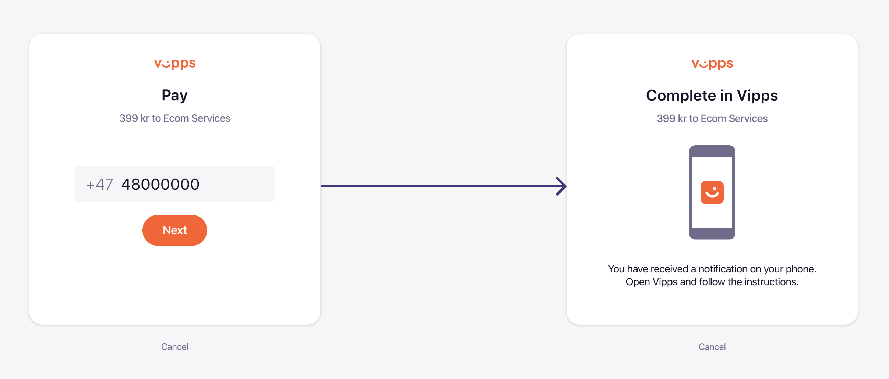

<!-- START_METADATA
---
title: Vipps landing page
pagination_next: null
pagination_prev: null
---
END_METADATA -->

# The Vipps landing page

When a payment is initiated the user is directed to the `url`.
The user will either be taken to Vipps or to the Vipps landing page:

* In a mobile browser, the Vipps app will automatically be opened with app-switch.
  The result is the same for the `vipps://` and the `https://` URLs.
  This is done by the phone's operating system; It recognized that the `https://`
  URL for the landing page is a Vipps URL, and knows that it should be open the
  Vipps app instead of the opening it in a web browser.
* In a desktop browser, the landing page will prompt the user for the phone number
  (the number may also be pre-filled, see below).
  The user enters or confirms the phone number.
  If is also possible to enter another Vipps user's number, to have that
  person complete the payment.
  Vipps sends a push notification to the specified phone number,
  the user gets a push notification, opens Vipps and confirms the payment.

The Vipps landing page is mandatory and provides a consistent and recognizable user experience
that helps guide the user through the payment flow.
Our data shows that the landing page gives a higher success rate and lower drop-off,
because the users get a familiar user experience and know the payment flow.
In this way, Vipps takes responsibility for helping the user from the browser to the app,
and to complete the payment in a familiar way.

The user's phone number can be set in the payment initiation call. It is
remembered by the user's browser, eliminating the need for re-typing it on
subsequent purchases.

In some cases one Vipps user will start the payment process, but the actual payment
will be made by another Vipps user. The Vipps landing page makes this possible, since
the phone number can be changed.
A typical example is one user that is below
15 years old, and can therefore not pay businesses, will let another Vipps
user complete the payment.

**Important:** Never show the Vipps landing page inside an iframe.
That will make it impossible for the user to reliably be redirected back to the
merchant's website, and result in a lower success rate.
In general: Any "optimization" of the payment flow may break the Vipps payment
flow - if not today, then later.

This is applicable to:

* [eCom API](https://vippsas.github.io/vipps-developer-docs/docs/APIs/ecom-api)
* [Partner API](https://vippsas.github.io/vipps-developer-docs/docs/APIs/partner-api)
* [PSP API](https://vippsas.github.io/vipps-developer-docs/docs/APIs/psp-api)
* [Recurring API](https://vippsas.github.io/vipps-developer-docs/docs/APIs/recurring-api)

## Generating a QR code to the Vipps landing page

If you have user-facing display, you may want to generate a QR code based on the
landing page URL, instead of asking the user for their phone number. Scanning
the QR code will take the user directly to the payment in the Vipps app.

This is done in cooperation with the Vipps QR API. See
[One-time payment QR](https://vippsas.github.io/vipps-developer-docs/docs/APIs/qr-api/vipps-qr-api#one-time-payment-qr-codes)
in the Vipps QR API guide for more details about this and other QR services.

See the
[Quick start](https://vippsas.github.io/vipps-developer-docs/docs/APIs/ecom-api/vipps-ecom-api-quick-start)
for step-by-step examples of generating QR codes and short links for one-time payments initiated from the eCom API.

## Skip landing page

**Please note:** This functionality is only available for special cases.
Skipping the landing page is only allowed when it is not possible to show it.

Skipping the landing page is reserved for when the payment is initiated on a
device that the user does not own or control:
* Not on the user's phone
* Not on the user's computer
* On a device that has no user-facing display where the landing page can be
  shown, such as physical points of sale (POS) solutions, vending machines, etc.

This `skipLandingpage` functionality must be specially enabled by Vipps for each
sale unit that needs to use it.
If you need to skip the landing page: Contact your
Key Account Manager. If you do not have a KAM: Please log in on
[portal.vipps.no](https://portal.vipps.no),
find the right sale unit and click the email link under the "i" information
bubble. Include a detailed description of why it is not possible to display
the landing page.

**Please note:** When using `skipLandingPage`, the user is not sent to a URL
after completion of the payment. The "result page" is just the confirmation in
Vipps. The `fallback` URL sent in the API request can therefore be the
merchant's main URL, like `https://example.com`, etc.

**Important:** When using `"skipLandingPage": true` in the API request that
initiates the payment:
* Vipps will send a push notification immediately to the Vipps app
  for the user with the specified phone number, without showing the landing page.
* It is crucial to use the correct format for the user's phone number.
  If not, the payment will fail.
* The user is not able to provide a different phone number for completing the
  payment. This means that a "Vipps for those under 15" (that cannot pay
  businesses) cannot have someone else pay for them.
* The user is not sent to a `fallback` URL (the result page) after completion
  of the payment.
  Instead of the "result page", the user will just get a confirmation in
  the Vipps app.
* If the sale unit is not whitelisted, the request will fail and an error
  message will be returned.

## Sequence diagram

This sequence diagram shows the difference between the normal flow and
the flow with `"skipLandingPage": true`:

See:

* [Is it possible to skip the landing page](../faqs/vipps-landing-page-faq.md#is-it-possible-to-skip-the-landing-page)
* [How can I check if I have skipLandingPage activated?](../faqs/vipps-landing-page-faq.md#how-can-i-check-if-i-have-skiplandingpage-activated)
