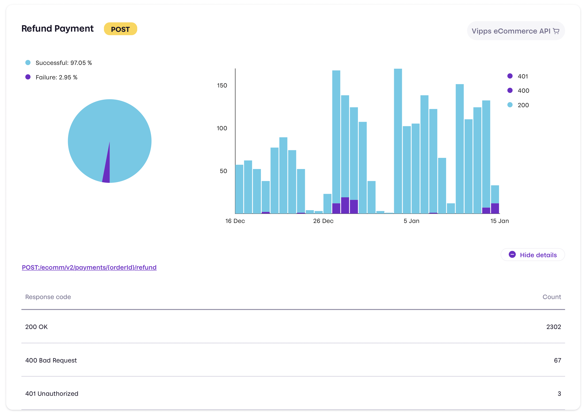

<!-- START_METADATA
---
pagination_next: null
pagination_prev: null
---
END_METADATA -->

# API Dashboard

All merchants have access to an API Dashboard on
[portal.vipps.no](https://portal.vipps.no) under the "Utvikler" tab.

The API Dashboard shows information about your API usage, an overview of errors, etc.
Here's an example for one endpoint:

The API Dashboard is available for both the production and test environments,
and is an easy way to see if you are using the Vipps APIs correctly.
It only gives a high-level overview, so must check the actual API
responses for more details about the errors.
Think of it as a "health check" that you can use to see if there are any
problems you need to investigate.
We strongly recommend that you also monitor your Vipps integration yourself.

**Important:** Partners can ask their merchants to give them access to the
sale unit(s) the partner is making payments for, so the partner can use the
API Dashboard. There is a guide here:
[How to add a user on portal.vipps.no](https://vippsas.github.io/vipps-developer-docs/docs/vipps-partner/add-portal-user)

**Please note:** The API dashboard is not real-time, and events might take up to
10 minutes before they appear.

Keep in mind that the "Utvikler" tab is only available to users with admin or
developer roles.
