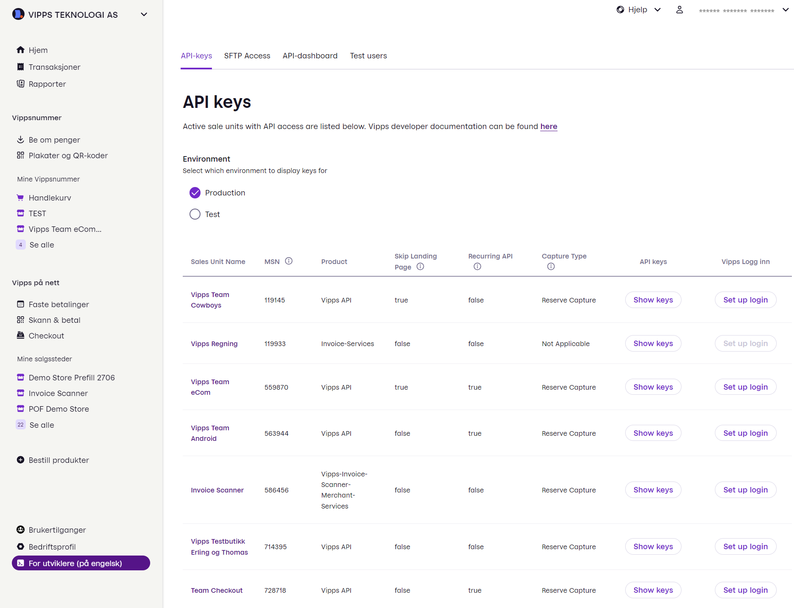
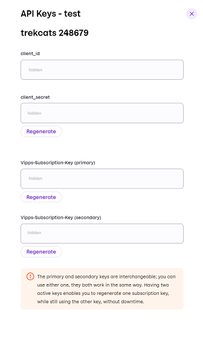
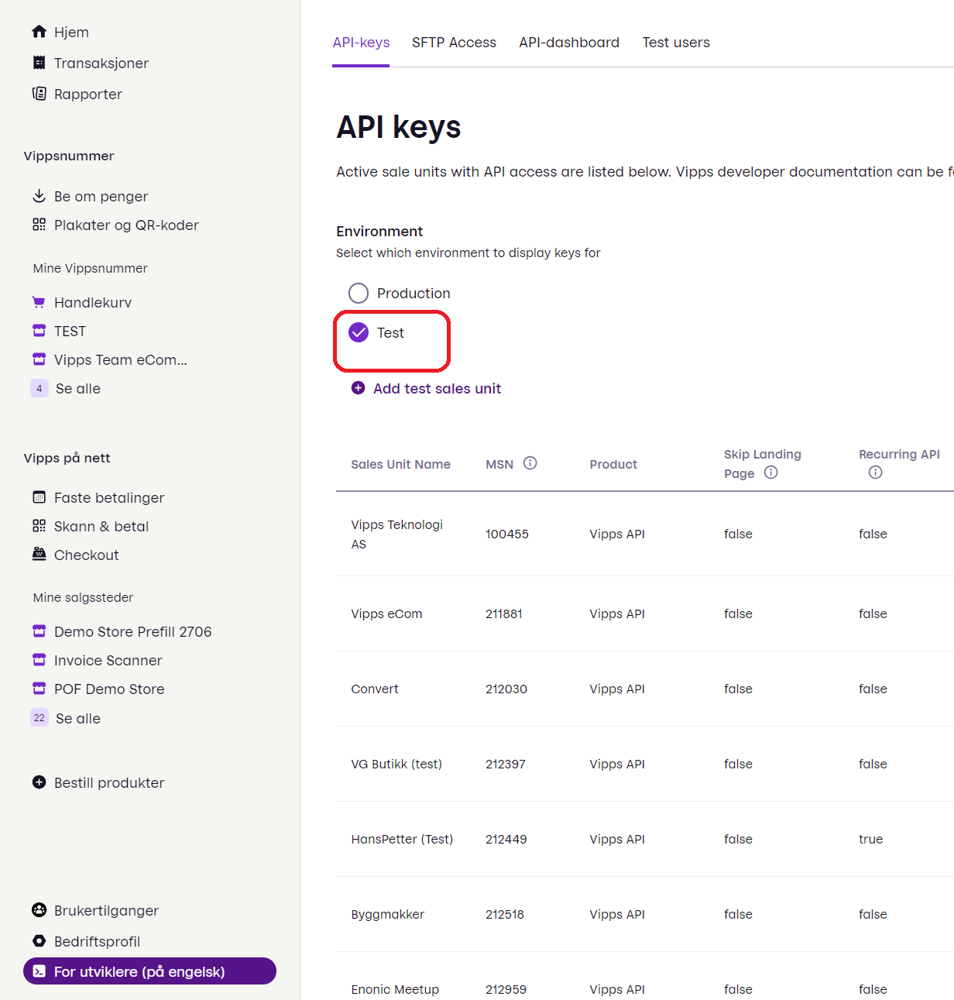
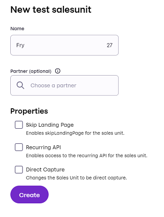
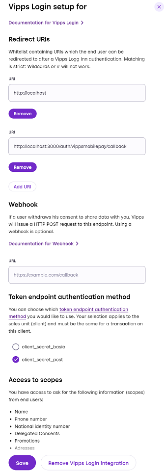

# Merchant portal

<!-- START_COMMENT -->
ℹ️ Please use the website:
[Vipps MobilePay Technical Documentation](https://developer.vippsmobilepay.com/docs/).
<!-- END_COMMENT -->

All merchants with an active customer relationship with Vipps MobilePay have access to the merchant portal at
[portal.vipps.no](https://portal.vipps.no).

Note, merchants using a PSP will only have access if they have an active customer relationship with Vipps MobilePay.

## Logging in

Log-in to [portal.vipps.no](https://portal.vipps.no) using BankID.
If you have problems logging in, check [Permissions and users](#permissions-and-users).

## How to find a sales unit

Select *Utvikler* from the sidebar, and select the *API-keys* tab. You should see all your sales units.

Select either *Production* or *Test*, depending on the type of keys you need.

## How to find the API keys

[Find your desired sales unit](#how-to-find-a-sales-unit) and click the *Show keys* button.

For more information about API keys, see [API keys](../common-topics/api-keys.md).

## How to create a test sales unit

Select *Utvikler* from the sidebar, and select the *API-keys* tab. Select the *test* environment.

Click *Add test sales unit*.

Enter the requested properties and click *Create*.

* Name - The name of your test sales unit.
* Partner - Optional partner data (not usually needed).
* Select optional properties:
  * [Skip Landing Page](../common-topics/landing-page.md#skip-landing-page) - *To use this in production, you will need special permission.*
  * [Recurring API](https://developer.vippsmobilepay.com/docs/APIs/recurring-api)
  * [Direct Capture](../common-topics/reserve-and-capture.md#direct-capture)

After a couple of minutes, your new test sales unit will appear in the bottom of the list (possibly after some browser refreshes).
Then, you can [get the API keys](../common-topics/api-keys.md#getting-the-api-keys) and begin testing.

**Please note:** It is not possible to *change* an existing sales unit in the test environment,
but you can create as many as you need.

## How to set up Login for your sales unit

1. [Find your desired sales unit](#how-to-find-a-sales-unit).
   * You can't update an existing test sales unit, but you can
     [create a new test sales unit](#how-to-create-a-test-sales-unit).
1. Click the *Set up login* button corresponding to your sales unit.
1. If this is the first time, click *Activate Vipps Login* and fill out the fields:
    * Redirect URIs - Specify the URI that will be used with
      the query parameter, `redirect_uri`, on the initial request to the `authentication`
      endpoint. You can register as many URIs as you want.
      This creates a list of accepted URIs.

      See [Login API FAQ: What are the requirements for redirect URIs](https://developer.vippsmobilepay.com/docs/APIs/login-api/vipps-login-api-faq#what-are-the-requirements-for-redirect-uris) for details.
      1. Enter the URI. It must be *exactly* the same URI that you use when making API requests.
        Take care to notice if the actual URI is specified with a trailing slash `/` or not.
        For testing, you can use `http://localhost`.
      2. Click *Add URI* for each URI you add.
      3. Click *Save*.

## How to create additional users on portal.vipps.no

Merchants may create additional users, both for their own colleagues,
accountants, etc. - and also for their partner's employees.
Or anyone else they want to give access to their sales units.

See:
[How to add a user on portal.vipps.no](https://developer.vippsmobilepay.com/docs/partner/add-portal-user).

## How to use the API dashboard

Please see a detailed description on the [API dashboard](api-dashboard.md) page.

## Permissions and users

*This is in the process of being expanded to allow more users, as part of the [Vipps MobilePay joint platform launch](https://www.vippsmobilepay.com/#about).*

Logging into [portal.vipps.no](https://portal.vipps.no) requires Norwegian BankID.

If you don't have BankID, or you have BankID but not access to the correct merchant,
you will need the merchant's administrator to log in on
[portal.vipps.no](https://portal.vipps.no)
and provide the API keys to you securely.

If you don't know who the administrator is, you can check the
[Brønnøysund Register](https://www.brreg.no)
and see who has the right to sign for the business or organization.

The merchant's administrator can also create additional users on
[portal.vipps.no](https://portal.vipps.no).

If you can log in to [portal.vipps.no](https://portal.vipps.no), but you can't see
the *Utvikler*  section in the sidebar, ask the
merchant's administrator to grant you developer access for the sales unit.

For
[reseller partners](https://developer.vippsmobilepay.com/docs/partner):
You will need the merchant's administrator to either:

* Log in to
  [portal.vipps.no](https://portal.vipps.no)
  and grant you developer access for the necessary sales unit, or
* Provide the API keys to you securely

For more information, see:

* [Developer Information: Vipps Partners](https://developer.vippsmobilepay.com/docs/partner)
* [User permissions on vipps.no (in Norwegian)](https://vipps.no/hjelp/vipps/kundeforholdet-mitt/hvilke-tilganger-kan-vi-opprette-i-vippsportalen/).

## How can I change my name and logo?

The sales unit's name and logo is shown to users in several places, both in
the app and elsewhere.

You can change the name and logo on
[portal.vipps.no](https://portal.vipps.no).
Under *Mine salgssteder* (*My sales units*), select your sales unit.

From the next page, you can see the MSN for this sales unit

Click *Rediger* (*Edit*) in the top section.
You will see a new screen where you both can update your name and ad your logo.

This will be provided in English soon. For now, it is Norwegian, and it says:

*Salgsstedsinfo* (*Sales Unit Info*)

*Legg til eller fjern logo* (*Add or remove the logo*).

 *Velg et annet bilde* (*Select another image*) 

 *Slett bilde* (*Delete the image*).

*Rediger informasjon* (*Edit the information*)

*Navn på salgssted slik det vil vises for kundene i Vipps-appen* (*Name of the sales unit as it should be shown to customers in the Vipps app*) - soon also the MobilePay app. Note that you are not allowed to change the name of a test sales unit.

## For more information

See
[Who can access portal.vipps.no (in Norwegian)](https://vipps.no/hjelp/vipps/kundeforholdet-mitt/hvem-kan-logge-inn-i-vippsportalen/),
for more information about how to use the portal.

See the official
[portal help pages](https://vipps.no/hjelp/vipps/kundeforholdet-mitt/hva-får-jeg-tilgang-til-når-jeg-logger-meg-inn-på-vippsportalen/) for more information.

Contact
[customer service](https://vipps.no/kontakt-oss/)
if you have general questions about the portal.
