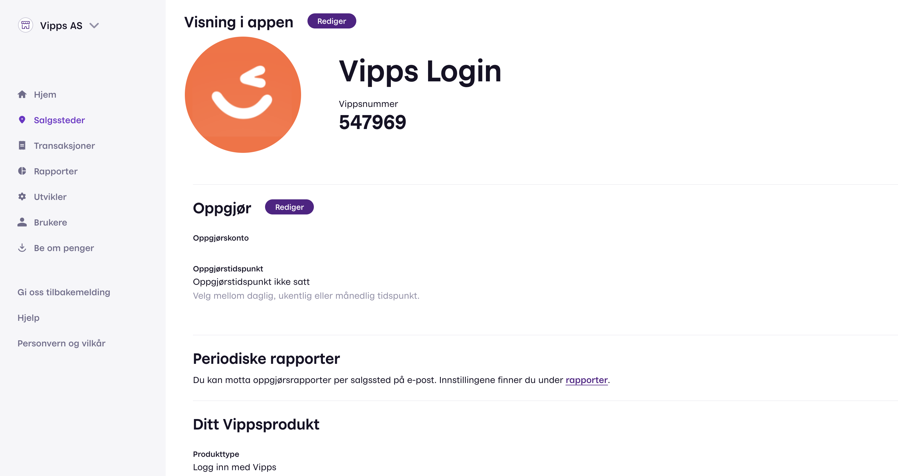
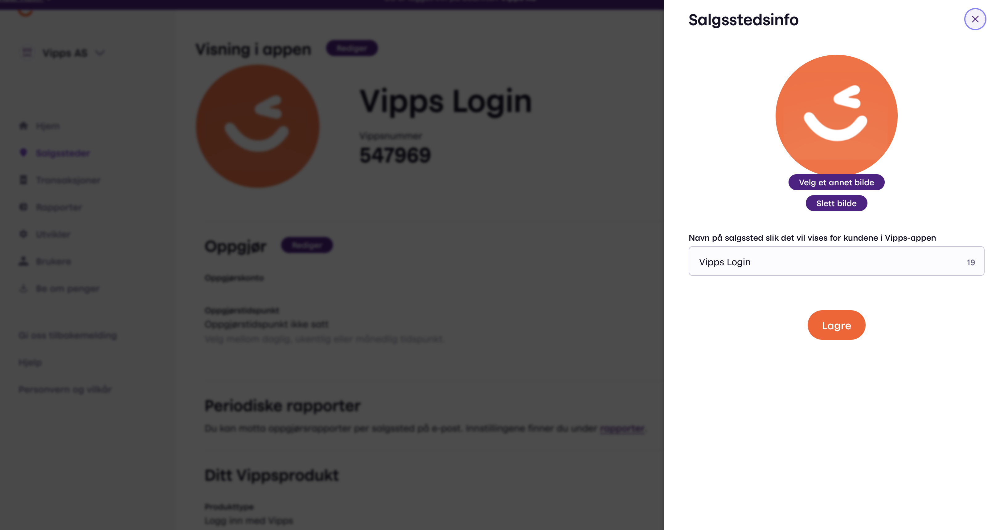

<!-- START_METADATA
---
title: Vipps portal
sidebar_position: 140
pagination_next: null
pagination_prev: null
---
END_METADATA -->

# The Vipps portal

<!-- START_COMMENT -->
ℹ️ Please use the website:
[Vipps MobilePay Technical Documentation](https://developer.vippsmobilepay.com/docs/vipps-developers/).
<!-- END_COMMENT -->

The information about
[portal.vipps.no](https://portal.vipps.no)
on this page is for *developers*.

All merchants with a signed agreement with Vipps MobilePay have access to
[portal.vipps.no](https://portal.vipps.no).
See (in Norwegian):
[Who can access portal.vipps.no](https://vipps.no/hjelp/vipps/kundeforholdet-mitt/hvem-kan-logge-inn-i-vippsportalen/),
and more information about how to use the portal.

**Please note:** Merchants using a PSP will not have access to
[portal.vipps.no](https://portal.vipps.no)
(unless they also have
a direct customer relationship with Vipps MobilePay,
or has had it previously, and not cancelled the agreement).

Contact
[customer service](https://vipps.no/kontakt-oss/)
if you have general questions about the portal.

This page will guide you through the steps to finding API keys and creating
test sales units on
[portal.vipps.no](https://portal.vipps.no).

## How to find the API keys

See [Common topics: Getting the API keys](https://developer.vippsmobilepay.com/docs/vipps-developers/common-topics/api-keys#getting-the-api-keys).

## How to create a test sales unit

1. Under *Vipps På Nett* > *Utvikler*, select *Environment* > *test*.
1. Click *Add test sales unit*.
1. Enter the requested properties and click *Create*.
   * Name - Enter the name of your test sales unit.
   * Partner - Enter optional partner data (not usually needed).
   * Select optional properties:
     * [Skip Landing Page](../faqs/vipps-landing-page-faq.md#is-it-possible-to-skip-the-landing-page)
     * [Recurring API](https://developer.vippsmobilepay.com/docs/APIs/recurring-api)
     * [Direct Capture](../common-topics/reserve-and-capture.md#direct-capture)

After a couple of minutes, your new test sales unit will appear in the bottom of the list (possibly after some browser refreshes).
Then, you can [get the API keys](../common-topics/api-keys.md#getting-the-api-keys) and begin testing.

**Please note:** It is not possible to *change* an existing sales unit in the test environment,
but you can create as many as you need.

## How to set up the Vipps Login API for your sales unit

1. Find your desired sales unit.
   * Under *Vipps På Nett* > *Utvikler*, select *Environment* > *test*, then search for your test sales unit in the list. To create a new test sales unit, see
     [create a new test sales unit](#how-to-create-a-test-sales-unit).
1. Click the *Setup login* button corresponding to your sales unit.
1. If the first time, click *Activate Vipps Login* and fill out fields that follow:
    * Redirect URIs - Specify the URI that will be used with
      the query parameter, `redirect_uri`, on the initial request to the `authentication`
      endpoint. You can register as many URIs as you want.
      This creates a list of accepted URIs.

      See [Login API FAQ: What are the requirements for redirect URIs?](https://developer.vippsmobilepay.com/docs/APIs/login-api/vipps-login-api-faq#what-are-the-requirements-for-redirect-uris) for details.
      1. Enter the URI. It must be *exactly* the same URI that you use when making API requests.
        Take care to notice if the actual URI is specified with a trailing slash `/` or not.
        For testing, you can use `http://localhost`.
      2. Click *Add URI* for each URI you add.
      3. Click *Save*.

## How to create additional users on portal.vipps.no

Merchants may create additional users, both for their own colleagues,
accountants, etc. - and also for their partner's employees.
Or anyone else they want to give access to their sales units.

See:
[How to add a user on portal.vipps.no](https://developer.vippsmobilepay.com/docs/vipps-partner/add-portal-user).

## How to use the API dashboard

See [API dashboard](api-dashboard.md).

## Permissions and users

Logging into [portal.vipps.no](https://portal.vipps.no) requires Norwegian BankID.

If you don't have BankID, or you have BankID but not access to the correct merchant,
you will need the merchant's administrator to log in on
[portal.vipps.no](https://portal.vipps.no)
and provide the API keys to you securely.

If you don't know who the administrator is, you can check
[Brønnøysundregistrene](https://www.brreg.no)
and see who has the right to sign for the company.

The merchant's administrator can also create additional users on
[portal.vipps.no](https://portal.vipps.no).

If you can log in to [portal.vipps.no](https://portal.vipps.no), but cannot see
the *Utvikler* (developer) option in the menu, you need to have the
merchant's administrator grant you with developer access for the sales unit.

For
[reseller partners](https://developer.vippsmobilepay.com/docs/vipps-partner):
You will need the merchant's administrator to either:

* Log in to
  [portal.vipps.no](https://portal.vipps.no)
  and grant you developer access for the necessary sales unit, or
* Provide the API keys to you securely

For more information, see:

* [Developer Information: Vipps Partners](https://developer.vippsmobilepay.com/docs/vipps-partner)
* [User permissions on vipps.no (in Norwegian)](https://vipps.no/hjelp/vipps/kundeforholdet-mitt/hvilke-tilganger-kan-vi-opprette-i-vippsportalen/).

## How can I change my name and logo?

The sales unit's name and logo is shown to users in several places, both in
the app and elsewhere.

You can administer the name and logo on
[portal.vipps.no](https://portal.vipps.no).

To change your display name you go to *salgssteder* ("sales units") in the
left menu and select the correct unit.

Select the sales unit under *salgssted*.
From the page that opens, you can see the key information for this sales unit

By clicking *Rediger* ("Edit") next to the *Visning i appen* ("View in the app") heading, you will come to a
screen where you both can update your name and ad your logo:

**Please note:** You cannot change the name used for the
[test environment](https://developer.vippsmobilepay.com/docs/vipps-developers/test-environment/).

## Questions

For more information about the Vipps Portal, see the
[help pages on vipps.no](https://vipps.no/hjelp/vipps/kundeforholdet-mitt/hva-får-jeg-tilgang-til-når-jeg-logger-meg-inn-på-vippsportalen/).
