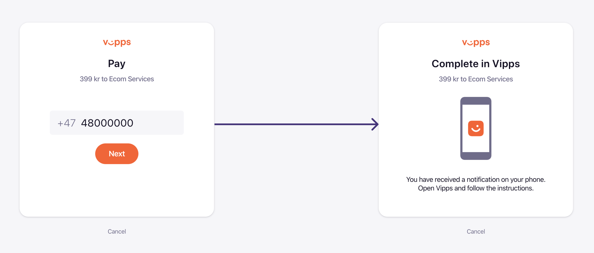
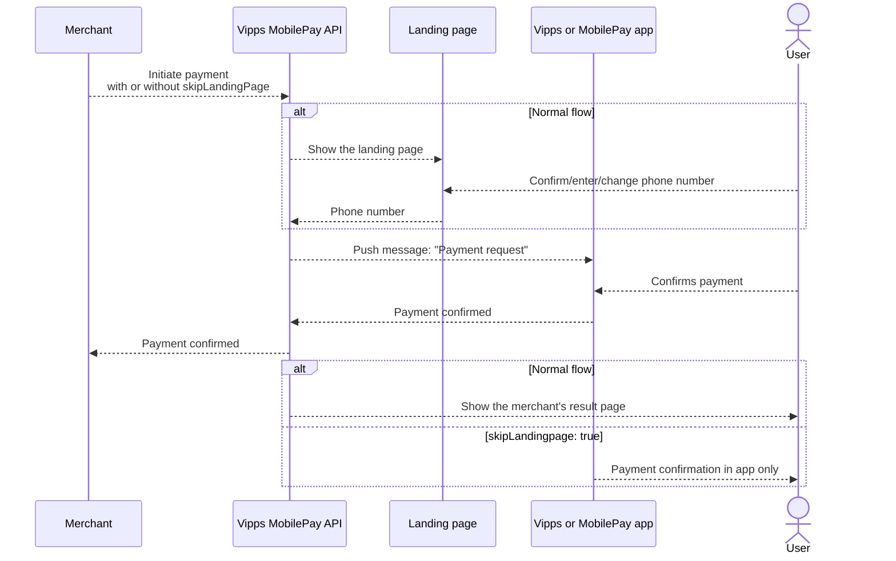

# Landing page

The landing page enables you to log in or authorize a payment from your desktop computer.
It's a webpage that opens when you select to pay or log in with Vipps MobilePay.
From the landing page, enter your phone number and then go to your Vipps or MobilePay app
to authorize the operation.
If you initiated this operation from another website, you should see the status updated there.

The landing page is mandatory for payments initiated on a different device than the user's phone.
It provides a consistent and recognizable user experience
that helps guide the user through the payment flow.

Our data shows that the landing page gives a higher success rate and lower drop-off,
because the users get a familiar user experience and know the payment flow.
In this way, we take responsibility for helping the user from the browser to the app,
and to complete the payment in a familiar way.

## Important notes

* Users should never see the landing page on a device where the Vipps or MobilePay
  app is installed.
* Any *optimization* of the normal payment flow may break the payment
  flow - if not today, then later.
* The default behavior and our recommendations are based on years of experience and data,
  and we continuously monitor and improve it.

## User flow

When a payment is initiated, the user is directed to a `url` which will either open
the Vipps or MobilePay app, MobilePay app, or the landing page:

* In a mobile browser, the app will automatically be opened with app-switch.
  The result is the same for the `vipps://` and the `https://` URLs.
  This is done by the phone's operating system. It recognizes that the `https://`
  URL for the landing page is a Vipps URL, and knows that it should open the
  Vipps or MobilePay app instead of the opening it in a web browser.
* In a desktop browser, the landing page will prompt the user for the phone number.
  The number may be pre-filled, as described in the
  [User phone number](#user-phone-number) section.
  The user enters or confirms the phone number.
  It is also possible to enter another user's number, to have that
  person complete the payment.

## User phone number

The user's phone number can be set in the payment initiation call. It is
stored by the user's browser, eliminating the need for re-typing it on
subsequent purchases.

In some cases, one user will start the payment process, but the actual payment
will be made by another user. The landing page makes this possible, since
the phone number can be changed.
A typical example is one user that is below
15 years old, and therefore cannot pay to businesses, will let another
user complete the payment.

See:
[Is it possible to prevent the user from editing the phone number?​](landing-page.md#is-it-possible-to-prevent-the-user-from-editing-the-phone-number)

## Never display the landing page in an iframe

**Important:** Never show the landing page inside an iframe. See:
[Can I show the landing page in an iframe?​](landing-page.md#can-i-show-the-landing-page-in-an-iframe)

This is applicable to all APIs.

## Generating a QR code to the landing page

If you have user-facing display, you may want to generate a QR code based on the
landing page URL, instead of asking the user for their phone number. Scanning
the QR code will take the user directly to the payment in the Vipps or MobilePay app.

This is done in cooperation with the QR API. See
[One-time payment QR](https://developer.vippsmobilepay.com/docs/APIs/qr-api/qr-api-guide#one-time-payment-qr-codes)
for more details about this and other QR services.

## Skip landing page

**Please note:** This functionality is only available for special cases.
Skipping the landing page is only allowed when it is not possible to show it.

Skipping the landing page is reserved for when the payment is initiated on a
device that the user does not own or control:

* Not on the user's phone
* Not on the user's computer
* On a device that has no user-facing display where the landing page can be
  shown, such as physical points of sale (POS) solutions, vending machines, etc.

This `skipLandingpage` functionality must be specially enabled by Vipps MobilePay for each
sales unit that needs it.
If you need to skip the landing page, contact your
Key Account Manager. If you do not have a KAM, please log in on
[portal.vipps.no](https://portal.vipps.no),
find the right sales unit and click the email link under the "i" information
bubble. Include a detailed description of why it is not possible to display
the landing page.

The landing page is more than just a web page, it is an entire
application, and it plays an important role in our payment process.

**Please note:** When using `skipLandingPage`, the user is not sent to a URL
after completion of the payment. The "result page" is just the confirmation in
the Vipps or MobilePay app. The required parameter `returnUrl` (called `fallback` for the eCom API)
is not used, so you can provide any URL as that value.

**Important:** When using `"skipLandingPage": true` in the API request that
initiates the payment:

* We will send a push notification immediately to the Vipps or MobilePay app
  for the user with the specified phone number, without showing the landing page.
* It is crucial to use the correct format for the user's phone number.
  If not, the payment will fail.
* The user is not able to provide a different phone number for completing the
  payment. This means someone under the age of 15 (that cannot pay
  businesses) cannot have someone else pay for them.
* The user is not sent to a return URL (the result page) after completion
  of the payment.
  Instead of the "result page", the user will just get a confirmation in
  the Vipps or MobilePay app.
* If the sales unit is not whitelisted, the request will fail and an error
  message will be returned.

If you need to skip the landing page in a Point of Sale (POS) solution, follow
the steps in:
[What is the process to go live in production?](./pos-integrations.md#the-process-to-go-live-in-production).

If you need to skip the landing page for a different reason:
Contact your Key Account Manager. If you do not have a KAM:
Please log in on
[portal.vipps.no](https://portal.vipps.no),
open the *Utvikler* (*Developer*) section,
find the right sales unit and
click the email link under the "i" information bubble.
Include a detailed description of why it is not possible to display the landing page.

### How to check if skip landing page is active

All merchants can log in to the
[merchant portal](https://portal.vipps.no)
and check if a sales unit has `skipLandingPage` enabled.
You can also find information on how to activate `skipLandingPage` there.

If you are a partner and want to check for a merchant:

* Use the
[Management API](https://developer.vippsmobilepay.com/docs/APIs/management-api/).
* Ask the merchant to [create a portal user](https://developer.vippsmobilepay.com/docs/partner/add-portal-user), so you can check on behalf of them.
* Make a trial attempt with a small payment.
    If you are not able to log in to the merchant portal, you can initiate a small payment request where `skipLandingPage` is true. If you don't get an error, it's active; otherwise, it's not active.

If you are a partner and want to check for a merchant, see the
[Management API](https://developer.vippsmobilepay.com/docs/APIs/management-api/).

If you are a partner and do not yet use the Management API, you can ask the
merchant to create a user for you on
[portal.vipps.no](https://portal.vipps.no), so you can check on behalf of the merchant as
[described in detail with screenshots](https://developer.vippsmobilepay.com/docs/partner/add-portal-user).

If you are not able to log in on
[portal.vipps.no](https://portal.vipps.no)
you can make a small payment (2 NOK)
with `skipLandingPage`.
If you do not get an error, it's active.
If you get an error, it's not active.

## Sequence diagram

This sequence diagram shows the difference between the normal flow and
the flow with `"skipLandingPage": true`:

## Landing page FAQ

### Is it possible to skip the landing page?

Only in special cases, where displaying it is not possible.

We must enable this feature for eligible sales units, which will be whitelisted.
Skipping the landing page is typically used at physical points of sale
where there is no display available.

See [Skip landing page](#skip-landing-page) for more details.

### How can I check if I have `skipLandingPage` activated?

All merchants can log in on
[portal.vipps.no](https://portal.vipps.no)
and check if a sales unit has `skipLandingPage` enabled
for all their sales units in the *Utvikler* section.

See [How to check if skip landing page is active](#how-to-check-if-skip-landing-page-is-active)
for more details.

### Can I show the landing page in an iframe?

No. Never show the landing page inside an iframe.

Displaying the landing page inside an iframe makes it impossible for the
user to reliably be redirected back to the merchant's website, and result in a
lower success rate.

When the phone's operating system is instructed to open the `fallBack` URL (the
result page for the payment) and our app is installed, the
`https://vipps.no?token... [truncated]` URL is recognized
by the phone's operating system as "owned" by Vipps MobilePay. Then, instead of opening a browser,
the Vipps or MobilePay app is automatically opened. This is called an *app-switch*.

However, if the landing page is displayed inside an iframe, the logic above does
not work. This results in the user gets a bad user experience, and the success rate for
completing the payment drops.

Also: The `fallBack` URL is opened in the default browser, since it's opened
by the phone's operating system. It cannot be opened inside an embedded
browser, or in an iframe. Any session cookies or similar will be gone, so it
is crucial that the `fallBack` URL is able to correctly show the correct state
for the payment.

### Is it possible to prevent the user from editing the phone number?

In special cases, it may be a requirement to always specify the user's
phone number and to make the phone number impossible to edit on the landing page.

This will of course make it impossible for a user to start the payment process,
but have another user (a parent, for instance) complete the payment.

If you need to make the user's phone number impossible to edit on the landing page:
Contact your Key Account Manager. If you do not have a KAM:
[contact us](../contact.md)
and include a detailed description of why this is needed.

**Important:**

* Users should never see the landing page on a device where the Vipps or MobilePay
  is installed.
* Any *optimization* of the normal payment flow may break the Vipps payment
  flow - if not today, then later.
* The default behavior and our recommendations
  are based on years of experience and data, and we continuously monitor and improve it.