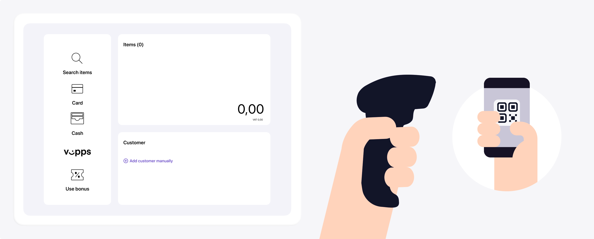

# Personal QR

 *Available for Vipps now.*

 *Available for MobilePay in selected markets at the [Vipps MobilePay joint platform launch](https://www.vippsmobilepay.com/about).*

Every Vipps user has a personal QR code that is available in their app.
From the home screen, the user taps the *Show QR* button, and they are presented with a page showing their
personal QR.

When you scan this QR, they will get the user's identity.
This is called *Merchant Scan*.

The QR currently contains a URL like this:
`https://qr.vipps.no/28/2/01/031/4791234567?v=1`, where `4791234567` is their phone number in
[MSISDN](https://en.wikipedia.org/wiki/MSISDN) format.
However, in December 2023, the phone number will be replaced by a token which can be used for initiating payments.

If your Point of Sale (POS) is equipped with a QR scanner, then your customers scan the code, get exactly where they need to go and pay on their own.
Alternatively, your cashier can scan the QR to get their phone number into your system instantly. You can then prepare and initiate payments using the
[ePayment API](https://developer.vippsmobilepay.com/docs/APIs/epayment-api/).

See [In-store payments](https://developer.vippsmobilepay.com/docs/solutions/in-store/) for an example flow.
