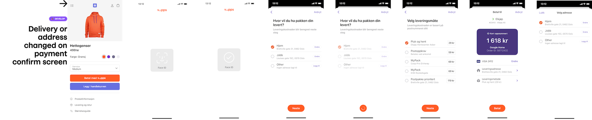

# Technical newsletter for developers 2020-11

💥 DRAFT! 💥

This newsletter was sent in November 2020.

# Vipps Hurtigkasse improvements

It will be easier to select the right address and shipping method, and the
backend is based on the same Userinfo functionality used by the
[Vipps eCom API v2](https://github.com/vippsas/vipps-ecom-api/blob/master/vipps-ecom-api.md#userinfo)
and the
[Vipps Recurring API](https://github.com/vippsas/vipps-recurring-api/blob/master/vipps-recurring-api.md#userinfo).

Hurtigkasse flow (not final, may change slightly):

# Optional HTTP Headers

We recommend using the following _optional_ HTTP headers for all requests to the
[Vipps eCom API v2](https://github.com/vippsas/vipps-ecom-api/)
and the
[Vipps Recurring API](https://github.com/vippsas/vipps-recurring-api/).
These headers provide useful metadata about the merchant's system,
which help Vipps improve our services, and also help in investigating problems.   

| Header                        | Description                                  | Example value        |
| ----------------------------- | -------------------------------------------- | -------------------- |
| `Merchant-Serial-Number`      | The merchant serial number                   | `123456`             |
| `Vipps-System-Name`           | The name of the ecommerce solution           | `woocommerce`        |
| `Vipps-System-Version`        | The version number of the ecommerce solution | `5.4`                |
| `Vipps-System-Plugin-Name`    | The name of the ecommerce plugin             | `vipps-woocommerce`  |
| `Vipps-System-Plugin-Version` | The version number of the ecommerce plugin   | `1.4.1`              |

# API Dashboard

We are working on an API Dashboard that will be available under "Utvikler" on
[portal.vipps.no](https://portal.vipps.no).
The API Dashboard will make it easier for integrators to find errors and
possible improvements in the use of the Vipps APIs.

The MVP will show the statuses for the most recent API calls, making it possible
to see trends and areas to investigate.

Once the initial version is available, we are very interested in
suggestions for improvement. You can even start suggesting features now:
Please create one issue per suggestion/wish in the
[vipps-developers](https://github.com/vippsas/vipps-developers)
repo on GitHUb.

# Reminders

We have mentioned some things before, and take this opportunity to remind you:

## API lifecycle

Our API lifecycle policy is
[available on GitHub](https://github.com/vippsas/vipps-developers/blob/master/vipps-api-lifecycle.md).

## Status pages for test and production environments

* Test: https://vipps-test.statuspage.io
* Production: https://vipps.statuspage.io

## How to get help quickly

Please see
[this page](https://github.com/vippsas/vipps-developers/blob/master/contact.md).

## Newsletter archive

Please see: https://github.com/vippsas/vipps-developers/tree/master/newsletters

# Questions or comments?

We're always happy to help with code or other questions you might have!
Please create [GitHub issues or pull requests](https://github.com/vippsas)
for the relevant API,
or [contact us](https://github.com/vippsas/vipps-developers/blob/master/contact.md).
