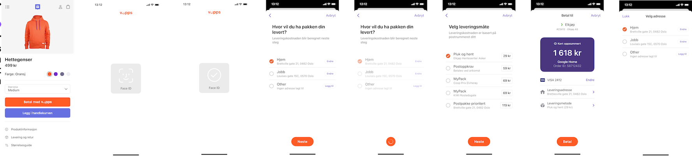

# Technical newsletter for developers 2020-11

This newsletter was sent in November 2020.

# Vipps Hurtigkasse improvements 💸

The latest versions of Vipps make it easier for users to select the right address and shipping method, and the
backend is based on the same _Userinfo_ functionality used by the
[Vipps eCom API v2](https://github.com/vippsas/vipps-ecom-api/blob/master/vipps-ecom-api.md#userinfo)
and the
[Vipps Recurring API](https://github.com/vippsas/vipps-recurring-api/blob/master/vipps-recurring-api.md#userinfo).

Hurtigkasse flow (not final, may change slightly):

**Please note:** Users will now have to select address and shipping method.
Merchants that do not ship anything should use the
[Userinfo](https://github.com/vippsas/vipps-ecom-api/blob/master/vipps-ecom-api.md#userinfo)
functionality instead of Vipps Hurtigkasse.

# Vipps Login improvements 🎉

Vipps Login now lets merchants to control the login experience on phones: The
merchant can choose whether the user should be automatically taken back to the
browser after completing an authentication in the Vipps app.
We have also added a specific flow for integrations with apps.
More information, and screenshots of the new flows, can be found in the
[documentation](https://github.com/vippsas/vipps-login-api/blob/master/vipps-login-api.md#mobile-flow---app-switch-based-flow).

To have a unified way of providing user information across Vipps services
we are standardising the data formats, both within Vipps and with the OIDC standard.
To do this we have been required to introduce a new version of our Vipps login API.
**The previous version (Version 1) of the Vipps login API will have end of life on February 28th 2021**.
See
[the API migration guide](https://github.com/vippsas/vipps-login-api/blob/master/vipps-login-migrate-api-1.0-to-2.0.md)
for details on moving from version 1 to 2.

# Optional HTTP Headers ℹ️

We recommend using the following _optional_ HTTP headers for all requests to the
[Vipps eCom API](https://github.com/vippsas/vipps-ecom-api/)
and the
[Vipps Recurring API](https://github.com/vippsas/vipps-recurring-api/).

| Header                        | Description                                  | Example value        |
| ----------------------------- | -------------------------------------------- | -------------------- |
| `Merchant-Serial-Number`      | The merchant serial number                   | `123456`             |
| `Vipps-System-Name`           | The name of the ecommerce solution           | `woocommerce`        |
| `Vipps-System-Version`        | The version number of the ecommerce solution | `5.4`                |
| `Vipps-System-Plugin-Name`    | The name of the ecommerce plugin             | `vipps-woocommerce`  |
| `Vipps-System-Plugin-Version` | The version number of the ecommerce plugin   | `1.4.1`              |

These headers provide useful metadata about the merchant's system,
which help Vipps improve our services, and also help in investigating problems.   

# API Dashboard 🚦

We are working on an API Dashboard that will be available under "Utvikler" on
[portal.vipps.no](https://portal.vipps.no).
The API Dashboard will make it easier for integrators to find errors and
possible improvements in the use of the Vipps APIs.

The MVP will show the statuses for the most recent API calls, making it possible
to see trends and areas to investigate.

Once the initial version is available, we are very interested in
suggestions for improvement. You can even start suggesting features now:
Please create one issue per suggestion/wish in the
[vipps-developers](https://github.com/vippsas/vipps-developers)
repo on GitHUb.

# Suggest improvements, get a pair of Vipps socks 🧦

We appreciate all suggestions for improvement to our development platform,
including complaints! To encourage this, we will send two (2) Vipps socks to
everyone that creates a (somewhat meaningful) issue or PR for our API
documentation in November.

What do do:
1. Create an issue or PR in the appropriate GitHub repo.
2. Wait for our comment (it may not be immediate).
3. If we think it's "OK", we will ask you to send an email to us with your address.

While we are keen to fix even the tiniest typos, we hope to get as many
"real" improvements as possible and not drown in microscopic issues, so:
Be smart. Thanks!

If we get more improvements than the number of socks we have,
we will do a scientifically randomized drawing.

# Do you want a Slack channel? 📢

We can set up a dedicated, temporary Slack channel to help fast-track your
Vipps development. Send an email to integration@vipps.no with a list of
email addresses to invite, with the same people on CC. We fix the rest.

This does, unfortunately, not apply to customers using one of our
[plugins](https://github.com/vippsas/vipps-developers#plugins), or
customers using Vipps through a partner.

# Do you want a technical workshop? 🛠

We can set up a dedicated video workshop to help fast-track your
Vipps development. Send an email to integration@vipps.no with a list of
email addresses to invite, with the same people on CC. We fix the rest.

This does, unfortunately, not apply to customers using one of our
[plugins](https://github.com/vippsas/vipps-developers#plugins), or
customers using Vipps through a partner.

# Reminders

We have mentioned some things before, and take this opportunity to remind you:

## API lifecycle

Our API lifecycle policy is
[available on GitHub](https://github.com/vippsas/vipps-developers/blob/master/vipps-api-lifecycle.md).

## Status pages for test and production environments

* Test: https://vipps-test.statuspage.io
* Production: https://vipps.statuspage.io

## How to get help quickly

Please see
[this page](https://github.com/vippsas/vipps-developers/blob/master/contact.md).

## Newsletter archive

Please see: https://github.com/vippsas/vipps-developers/tree/master/newsletters

# Questions or comments?

We're always happy to help with code or other questions you might have!
Please create [GitHub issues or pull requests](https://github.com/vippsas)
for the relevant API,
or [contact us](https://github.com/vippsas/vipps-developers/blob/master/contact.md).
