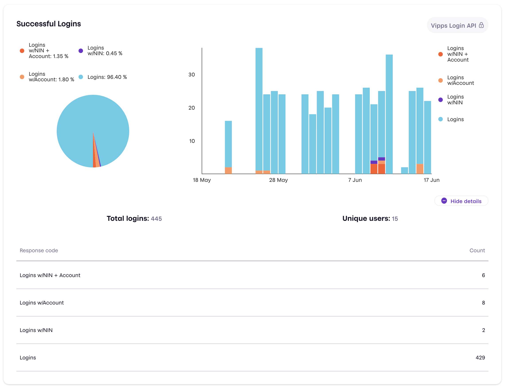

# Technical newsletter for developers 2021-04

💥 DRAFT 💥

This newsletter was sent in June 2021.

# Recognize your loyal customers

With Vipps you can always know who your customers are, and optionally connect
them to your loyalty program.

Use _Userinfo_ to ask for the user's details, such as:
phone number, name, email address, postal address, birth date, national identity number and bank accounts.

The user must of course consent to sharing the information.

You can then automatically give your loyal customers benefits such as
discounts, freebies, etc.

See
[Userinfo for eCom](https://github.com/vippsas/vipps-ecom-api/blob/master/vipps-ecom-api.md#userinfo)
and
[Userinfo for Recurring](https://github.com/vippsas/vipps-recurring-api/blob/master/vipps-recurring-api.md#userinfo).

# API Dashboard for Vipps Login API

The API Dashboard now also shows data for the Login API.
See it on
[portal.vipps.no](https://portal.vipps.no)
under the "Utvikler" ("Developer") tab.
Here's an example:

# Reminders

We have mentioned some things before, and take this opportunity to remind you:

## Manage "everything" on portal.vipps.no

All customers can now log in on
[portal.vipps.no](https://portal.vipps.no)
and order new products, which automatically creates a new sale unit:

- [Vipps på Nett](https://vipps.no/produkter-og-tjenester/bedrift/ta-betalt-paa-nett/ta-betalt-paa-nett/)
  ([eCom API](https://github.com/vippsas/vipps-ecom-api),
  for both
  [webshops and apps](https://vipps.no/produkter-og-tjenester/bedrift/ta-betalt-paa-nett/ta-betalt-paa-nett/))
- [Vipps rett i Kassa](https://vipps.no/produkter-og-tjenester/bedrift/ta-betalt-i-butikk/vipps-i-kassa/)
  ([eCom API](https://github.com/vippsas/vipps-ecom-api))
- [Vipps Faste betalinger](https://vipps.no/produkter-og-tjenester/bedrift/faste-betalinger/faste-betalinger/)
  ([Recurring API](https://github.com/vippsas/vipps-recurring-api))
- [Vipps Logg inn](https://vipps.no/produkter-og-tjenester/bedrift/logg-inn-med-vipps/logg-inn-med-vipps/)
  ([Login API](https://github.com/vippsas/vipps-login-api))

You can create also new sale units in the
[test environment](https://github.com/vippsas/vipps-developers/blob/master/vipps-test-environment.md)
on
[portal.vipps.no](https://portal.vipps.no):
On the page with the API keys for the test environment there is a button
for creating additional sale units, and you can then select
"direct capture" or "reserve capture", and also `skipLandingPage`.
This is available for all customers, also those that do not yet have any API access.

## Please update your plugins

Several of our plugins have been updated to use the newest versions of
our APIs. Please make sure you have the newest version of the plugins
you use, and keep them up to date. See the
[the plugin overview](https://github.com/vippsas/vipps-plugins).

## How to get help quickly

Please see
[this page](https://github.com/vippsas/vipps-developers/blob/master/contact.md).

## Newsletter archive

Please see: https://github.com/vippsas/vipps-developers/tree/master/newsletters

# Questions or comments?

We're always happy to help with code or other questions you might have!
Please create [GitHub issues or pull requests](https://github.com/vippsas)
for the relevant API,
or [contact us](https://github.com/vippsas/vipps-developers/blob/master/contact.md).
