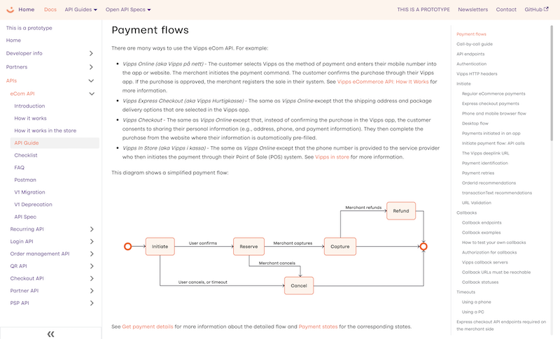

<!-- START_METADATA
---
sidebar_position: 69
title: 2022-10
---
END_METADATA -->

# Technical newsletter for developers 2022-10

This newsletter was sent in October 2022.

<!-- START_TOC -->

- [Technical newsletter for developers 2022-10](#technical-newsletter-for-developers-2022-10)
  - [New developer documentation](#new-developer-documentation)
  - [Recurring API: New v3 API coming this fall](#recurring-api-new-v3-api-coming-this-fall)
  - [Recurring API: Rollback of UI changes on Android](#recurring-api-rollback-of-ui-changes-on-android)
  - [Recurring API: Rollback of new charge business rules](#recurring-api-rollback-of-new-charge-business-rules)
  - [Inform customers that there are no fees when paying with Vipps](#inform-customers-that-there-are-no-fees-when-paying-with-vipps)
  - [Vipps on-site messaging](#vipps-on-site-messaging)
  - [Partner API: Pre-fill applications](#partner-api-pre-fill-applications)
  - [Settlement API: In progress](#settlement-api-in-progress)
  - [Reminders](#reminders)
    - [Please check your API calls for errors](#please-check-your-api-calls-for-errors)
    - [Use the API Dashboard to find problems with your integration](#use-the-api-dashboard-to-find-problems-with-your-integration)
    - [How to get help quickly](#how-to-get-help-quickly)
    - [Newsletter archive](#newsletter-archive)
  - [Questions or comments?](#questions-or-comments)

<!-- END_TOC -->

## New developer documentation

We have a completely new, in-progress, website for all
[developer documentation](https://vippsas.github.io/vipps-developer-docs/):

Examples:
* [API Guide](https://vippsas.github.io/vipps-developer-docs/docs/APIs/ecom-api)
* [API Reference](https://vippsas.github.io/vipps-developer-docs/api/ecom)
* [FAQ](https://vippsas.github.io/vipps-developer-docs/docs/APIs/ecom-api/vipps-ecom-api-faq)

## Recurring API: New v3 API coming this fall

The
[Recurring API](https://vippsas.github.io/vipps-developer-docs/docs/APIs/recurring-api)
v3 will include new and much improved Campaign functionality,
the opportunity to use "reserve capture" (first reserve the payment, then capture it),
partial capture recurring charges, and more.

Estimated release is in October.

## Recurring API: Rollback of UI changes on Android

As part of the improvements on our Campaign functionality we rolled out a new UI
on campaign agreements on Android. However, we have gotten some feedback that
this is not ideal for all merchants due to differences in "campaign logic".

In Vipps we take feedback and insight seriously and have therefore decided to
roll back the UI changes on Android on v2 to meet the needs from our merchants.

The UI changes will be included in the Recurring API v3, together with the
Campaign improvements.

## Recurring API: Rollback of new charge business rules

Due to feedback from merchants we have decided not to enforce the stricter charge rules we enabled September 13. See the [vipps statuspage](https://vipps.statuspage.io/incidents/n5xlxwz1yvbr) for more information about when this happened.

Going forward we will look into how we can implement charge limits in a better way, that takes care of the merchants needs. This will be communicated well in advance before we enforce any new rules.

## Inform customers that there are no fees when paying with Vipps

It can help your conversion if you remind your users that:

* There are no Vipps fees when paying a business
* Users get all the benefits of the card when using the card in Vipps (bonus points, etc)

We recommend using this text where users select payment method:
"Husk: Vipps er alltid gebyrfritt når du betaler til bedrifter."

Roughly translated, this means, "Remember: Vipps is always free from fees when you pay to companies".

If you use Klarna Checkout, here are our
[tips](https://github.com/vippsas/vipps-ecom-api/blob/master/vipps-ecom-api-faq.md#can-i-use-vipps-with-klarna-checkout).

## Vipps on-site messaging

[Vipps on-site-messaging](https://github.com/vippsas/vipps-checkout-api/blob/main/vipps-checkout-on-site-messaging.md)
contains a badges in different variants that can be used to let your customers
know that Vipps payment is accepted.

## Partner API: Pre-fill applications

Partners can now use the
[Partner API](https://github.com/vippsas/vipps-partner-api)
to pre-fill applications and
[submit a product order for a merchant](https://github.com/vippsas/vipps-partner-api/blob/main/vipps-partner-api.md#submit-a-product-order-for-a-merchant).

## Settlement API: In progress

We are in the early planning phase of developing an API for
[settlements](https://github.com/vippsas/vipps-developers/tree/master/settlements).

If you are interested in this and want to be kept up to date when we have
something to share, please send an email to integraton@vipps.no.

## Reminders

### Please check your API calls for errors

We are working on eliminating incorrect API use. Although we always respond to
incorrect API calls with a sensible HTTP status (usually `HTTP 400 Bad Request`)
and an informative error message in the response body, we see that some merchants
and partners keep making incorrect API calls.

Please:
- Monitor the responses you get when making API calls
- Log all errors
- Fix errors as quickly as possible
- Use the API Dashboard
- Contact us if there is anything we can help with

### Use the API Dashboard to find problems with your integration

The
[API Dashboard](https://github.com/vippsas/vipps-developers#api-dashboard)
is available to all merchants for both the production and test environments,
and is an easy way to see if you are using the Vipps APIs correctly.
Think of it as a "health check", that you can use to see if there are any
problems you need to investigate.

Here's an example for the Vipps eCom API's `/refund` endpoint:

### How to get help quickly

Please see
[this page](https://github.com/vippsas/vipps-developers/blob/master/contact.md).

### Newsletter archive

Please see: https://vippsas.github.io/vipps-developer-docs/docs/vipps-developers/newsletters/

## Questions or comments?

We're always happy to help with code or other questions you might have!
Please create [GitHub issues or pull requests](https://github.com/vippsas)
for the relevant API,
or [contact us](https://github.com/vippsas/vipps-developers/blob/master/contact.md).
