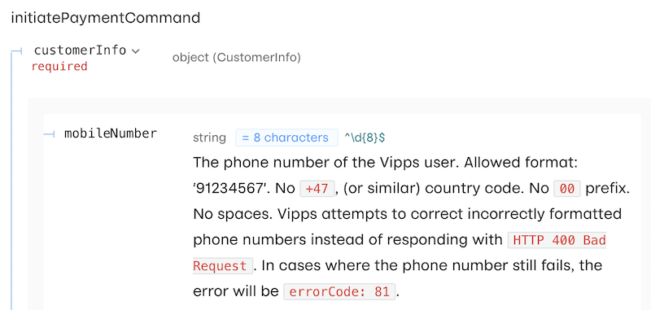

# Technical newsletter for developers 2022-11

This newsletter was sent in November 2022.

## Specify amounts in øre without decimals

Vipps requires amounts to be specified in øre, without decimals:
"Amounts are specified in minor units.
For Norwegian kroner (NOK) that means 1 NOK = 100 øre. Example: 499 NOK = 49900 øre."

We still see that some attempts at specifying payments with amounts that
end in `.0000001`.

API requests til incorrect amounts will fail: Both initiate, capture and refund.

Please check for rounding errors, and of course: Always monitor the responses
to your API requests:
[Please check your API calls for errors](#please-check-your-api-calls-for-errors).

## Get ready for "black week"

Let your customers pay with
[Vipps Hurtigkasse](/docs/APIs/ecom-api/vipps-ecom-api#express-checkout-payments)
with the new and improved user experience by specifying
[`useExplicitCheckoutFlow": true`](/docs/APIs/ecom-api/vipps-ecom-api#how-to-specify-the-old-or-new-express-checkout-flow)
to reduce drop-off, left shopping carts, etc.

Make sure your use of Vipps is as good as it can be, without errors.
See: [Please check your API calls for errors](#please-check-your-api-calls-for-errors).

Monitor the Vipps Status Page:
[vipps.statuspage.io]( https://vipps.statuspage.io/).

The FAQ entry
[Why do payments fail?](../faqs/common-problems-faq.md#why-do-payments-fail)
may also be useful.

## eCom API: Don't rely 100 % on callbacks

Callback offers a faster user experience than polling, but you
cannot rely on callbacks alone. You must also poll
[`GET:/ecomm/v2/payments/{orderId}/details`](/api/ecom#tag/Vipps-eCom-API/operation/getPaymentDetailsUsingGET)
as described in the
[Polling guidelines](../common-topics/polling-guidelines.md).

See:
[Callbacks](/docs/APIs/ecom-api/vipps-ecom-api#callbacks)

## Report API

The
[Report API](/docs/APIs/report-api)
gives you or a third-party acting on your behalf the ability to
fetch information about payment events that have been processed by Vipps.

## Documentation improvements

We are working hard to improve the
[Vipps Technical Documentation](/):

* The documentation is now
  [searchable](/search).
* We have a new
  [Solutions](/docs/vipps-solutions)
  section to highlight combinations of Vipps APIs, such as
  [Loyalty in physical stores](/docs/vipps-solutions/loyalty-in-pos)
  and
  [Electric vehicle charging](/docs/vipps-solutions/ev-charging).
* All APIs now have a
  [Quick start](../quick-start-guides.md)
  with Postman collection. We also have a global Postman environment to make it
  easier to test all APIs without doing any development.

Please
[tell us what you think](https://forms.office.com/pages/responsepage.aspx?id=XcJbgGSO1k6NJDiDyQaMWuRWudsvYRxEorAi1xx_iqJUQzg4QzExTVhHM1UzMDIwM1lINkpaNTdWUC4u)
in this short, 3-minute survey - thanks!

## Check your phone number format

Far too many Vipps payments fail because of badly formatted phone numbers.
We try to silently correct them, but can not fix all errors.

This is especially important when using
[Skip landing page](../common-topics/vipps-landing-page.md#skip-landing-page),
as it's impossible to send a push message to a user if the specified phone number is incorrect.

Please see the API specification:
[`POST:/ecomm/v2/payments`](/api/ecom#tag/Vipps-eCom-API/operation/initiatePaymentV3UsingPOST)

## Reminders

### Please check your API calls for errors

We are working on eliminating incorrect API use. Please:

* Monitor the responses you get when making API calls
* Log all errors
* Fix errors as quickly as possible
* Use the
  [API Dashboard](../developer-resources/api-dashboard.md)
  to find problems with your integration.

## Questions or comments?

We're always happy to help with code or other questions you might have!
Please create [GitHub issues or pull requests](https://github.com/vippsas)
for the relevant API,
or [contact us](/docs/vipps-developers/contact).
