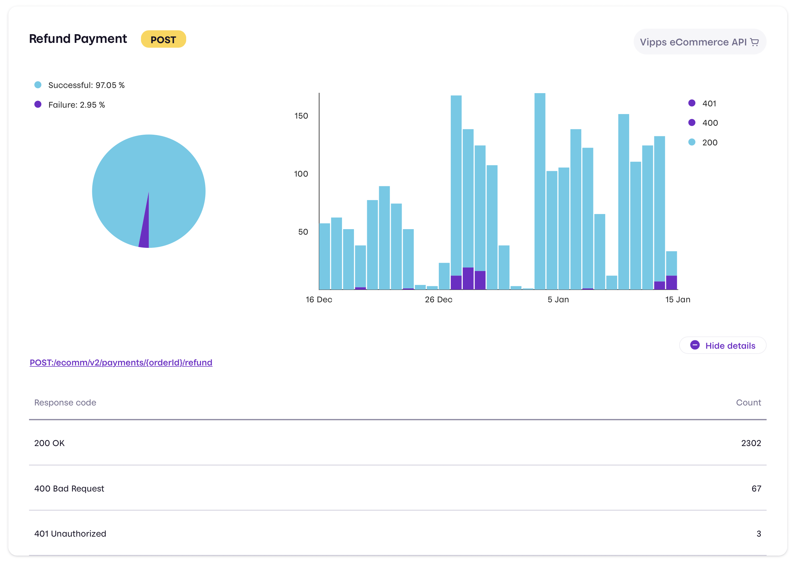

# Technical newsletter for developers 2022-12

This newsletter was sent in December 2022.

## Checkout API v3

The [Vipps Checkout API v3](https://developer.vippsmobilepay.com/docs/APIs/checkout-api) is available. Checkout v3 improves upon v2 through alignment of polling and callback responses, improvement of field names and expanding models related to logistics options to permit more advanced features.

For more information, check out our [migration guide](https://developer.vippsmobilepay.com/docs/APIs/checkout-api/vipps-checkout-api-migration-v3)

## Recurring API v3

The
[Vipps Recurring API v3](https://developer.vippsmobilepay.com/docs/APIs/recurring-api)
is available. This version includes new and improved functionality for campaigns
(for example "10 weeks for 10 NOK" or "1 NOK until Christmas"),
the possibility to reserve and capture (or partially capture) a charge
(specially important for physical subscriptions) and several technical improvements.

Upgrading to v3 requires some technical changes, but the overall flow and logic
is the same as in v2. We have made it as easy as possible to upgrade.
See the
[migration guide](https://developer.vippsmobilepay.com/docs/APIs/recurring-api/v2-to-v3-migration-guide)
and the [quick start](https://developer.vippsmobilepay.com/docs/APIs/recurring-api/vipps-recurring-api-quick-start)
for more details. For now the Recurring API v2 will continue to work, but will not support the new functionality.

Improvements in button text for agreements without initial charge:

* When an agreement **does not have** an initial charge,
  the button text will be *Bekreft og start* ("Confirm and start").
* The button text for agreements **with** initial charge is
  *Betal og start* ("Pay and start").

**Important:** The Recurring API v2 API will be phased out and will not be available from June 1, 2023.

## ePayment API

The
[API specification for the Vipps ePayment API](https://developer.vippsmobilepay.com/api/epayment)
is now available.

**Please note:** While the API *functionality* is implemented, the
[API documentation](https://developer.vippsmobilepay.com/docs/APIs/epayment-api)
is still a work in progress.
We aim to have the API guide, etc. ready in early January.

## Solutions

The new
[Solutions](https://developer.vippsmobilepay.com/docs/solutions)
section of our developer documentation describes best practice for
combining Vipps APIs for specific use cases, like:

* Loyalty at the point of sale (POS)
* Electric vehicle charging
* Parking

## Updated emails to new merchants (and partners)

We have updated and improved all emails sent as part of becoming a Vipps
merchant (the onboarding process). They all use the Vipps design, and
contain:

* The merchant's organization number
* The merchant's name
* The sales unit's MSN
* The sales unit's name

## Reminders

### Please check your API calls for errors

We are working on eliminating incorrect API use. Please:

* Monitor the responses you get when making API calls
* Log all errors
* Fix errors as quickly as possible
* Use the
  [API Dashboard](../developer-resources/api-dashboard.md)
  to find problems with your integration.

## Questions or comments?

We're always happy to help with code or other questions you might have!
Please create [GitHub issues or pull requests](https://github.com/vippsas)
for the relevant API,
or [contact us](https://developer.vippsmobilepay.com/docs/vipps-developers/contact).
