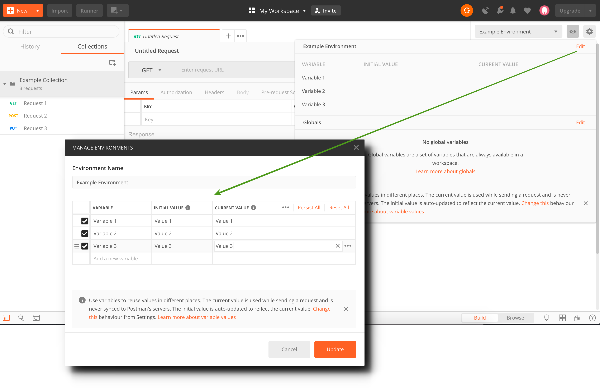

# Postman guide

A guide on how to set up a Postman collection and environment for Vipps APIs.

Go to [Github](https://github.com/vippsas) and download the JSON files for the API that you want to test (or `copy raw text`).

## Import files

Start by importing the JSON files into Postman (or `paste raw text`).

The Postman collection will appear in the left sidebar. 
Select the associated environment from the drop-down menu. 

Click the eye to see all variables. 

## Insert values

Click `Edit`and paste in values for each variable. Some variables will be set/updated automatically throughout the calls. 

Read the documentation to find out which [variables](https://github.com/vippsas/vipps-developers/blob/master/vipps-developer-portal-getting-started.md#step-3) that must be set manually.

## Tabs

Some methods requires a `body` with information that gets sent with the request. Vipps provide pre-populated test data, but this can be modified. 

You might want to make the same request from your own application. You can generate snippets of code in various languages that will help you do this. Click the Code link to open the "Generate code snippets" modal. 

