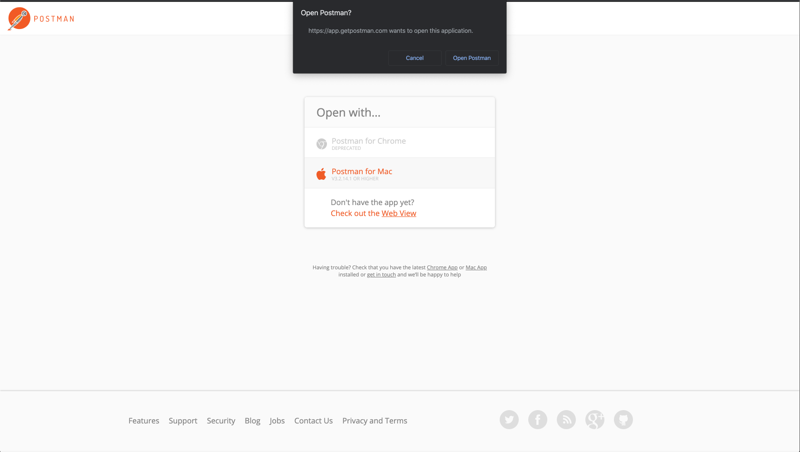
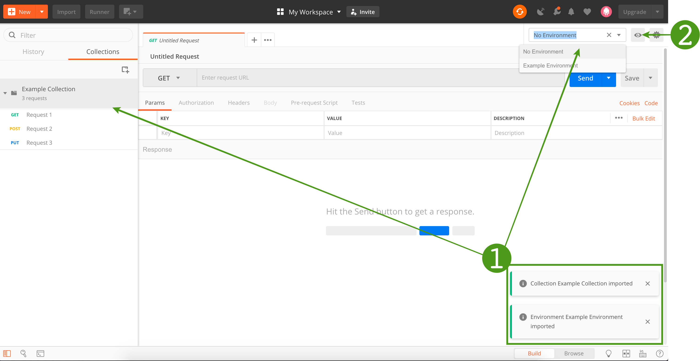

# Postman guide

[Postman](https://www.getpostman.com/) is a common tool for working with REST APIs.
We offer [Postman Collections](https://www.getpostman.com/collection) for some APIs.

With Postman you can make calls to all the API endpoints and see the full
request and response for each call, including headers.

When contacting us about API issues, we are usually able to help faster if you send us
the complete request and response.

## Select Postman resource
Click the `Run in Postman` button for the API which you wish to integrate to import both collection and environment directly into Postman.

| API                | Postman Resource                                                                                                                                                                                                                                                                                                                                                                                                                                                                                                                                                                                                                                                                                                                                                                                                                                                                                                                                                                                                                                                                                                                                                                                                                                                                                                                                                                                                                                                                                                                                                                                                                                                                                                                                                                                                                                                                                                                                                                                                                                                                                                                                                                                                                                                                                                                                                                                                                                                                                                                                                                                                                                                                                                                                                                                                                                                                                                                                                                                                                                                                                                                                                                                                                                                                                                                                                                                                                                                                                                             |
| ------------------ | ---------------------------------------------------------------------------------------------------------------------------------------------------------------------------------------------------------------------------------------------------------------------------------------------------------------------------------------------------------------------------------------------------------------------------------------------------------------------------------------------------------------------------------------------------------------------------------------------------------------------------------------------------------------------------------------------------------------------------------------------------------------------------------------------------------------------------------------------------------------------------------------------------------------------------------------------------------------------------------------------------------------------------------------------------------------------------------------------------------------------------------------------------------------------------------------------------------------------------------------------------------------------------------------------------------------------------------------------------------------------------------------------------------------------------------------------------------------------------------------------------------------------------------------------------------------------------------------------------------------------------------------------------------------------------------------------------------------------------------------------------------------------------------------------------------------------------------------------------------------------------------------------------------------------------------------------------------------------------------------------------------------------------------------------------------------------------------------------------------------------------------------------------------------------------------------------------------------------------------------------------------------------------------------------------------------------------------------------------------------------------------------------------------------------------------------------------------------------------------------------------------------------------------------------------------------------------------------------------------------------------------------------------------------------------------------------------------------------------------------------------------------------------------------------------------------------------------------------------------------------------------------------------------------------------------------------------------------------------------------------------------------------------------------------------------------------------------------------------------------------------------------------------------------------------------------------------------------------------------------------------------------------------------------------------------------------------------------------------------------------------------------------------------------------------------------------------------------------------------------------------------------------------- |
| Vipps eCommerce v2 | [](https://app.getpostman.com/run-collection/9acc9e08a2d312fa7dc6#?env%5BeCommerce%20API%20v2%20-%20Environment%5D=W3sia2V5IjoiY2xpZW50X2lkIiwidmFsdWUiOiIiLCJlbmFibGVkIjp0cnVlfSx7ImtleSI6ImNsaWVudF9zZWNyZXQiLCJ2YWx1ZSI6IiIsImVuYWJsZWQiOnRydWV9LHsia2V5IjoibWVyY2hhbnRTZXJpYWxOdW1iZXIiLCJ2YWx1ZSI6IiIsImVuYWJsZWQiOnRydWV9LHsia2V5IjoiT2NwLUFwaW0tU3Vic2NyaXB0aW9uLUtleSIsInZhbHVlIjoiIiwiZW5hYmxlZCI6dHJ1ZX0seyJrZXkiOiJhbW91bnQiLCJ2YWx1ZSI6IjEwMDAiLCJlbmFibGVkIjp0cnVlfSx7ImtleSI6ImFtb3VudF9jYXB0dXJlIiwidmFsdWUiOiIwIiwiZW5hYmxlZCI6dHJ1ZX0seyJrZXkiOiJtb2JpbGVOdW1iZXIiLCJ2YWx1ZSI6IiIsImVuYWJsZWQiOnRydWV9LHsia2V5IjoiY2FsbGJhY2tQcmVmaXgiLCJ2YWx1ZSI6IiIsImVuYWJsZWQiOnRydWV9LHsia2V5IjoiZmFsbEJhY2siLCJ2YWx1ZSI6IiIsImVuYWJsZWQiOnRydWV9LHsia2V5Ijoic2hpcHBpbmdEZXRhaWxzUHJlZml4IiwidmFsdWUiOiIiLCJlbmFibGVkIjp0cnVlfSx7ImtleSI6ImNvbnNlbnRSZW1vdmFsUHJlZml4IiwidmFsdWUiOiIiLCJlbmFibGVkIjp0cnVlfSx7ImtleSI6ImFjY2Vzc190b2tlbiIsInZhbHVlIjoiPFRoaXMgdmFsdWUgd2lsbCBiZSBvdmVyd3JpdHRlbiB3aGVuIHlvdSBjYWxsIHRoZSBHZXQgQWNjZXNzIFRva2VuIEFQSSB3aGVuIGhhdmluZyBzZWxlY3RlZCBlQ29tbWVyY2UgdjIgLSBNVEUgZW52aXJvbm1lbnQ+IiwiZW5hYmxlZCI6dHJ1ZX0seyJrZXkiOiJvcmRlcklkIiwidmFsdWUiOiI8VGhpcyB2YWx1ZSB3aWxsIGJlIG92ZXJ3cml0dGVuIG9uIGVhY2ggSW5pdGlhdGUgUGF5bWVudCBjYWxsIHdpdGggTVNOICsgdGltZXN0YW1wICsgcmFuZG9tIGludD4iLCJlbmFibGVkIjp0cnVlfSx7ImtleSI6InNoaXBwaW5nQ29zdDEiLCJ2YWx1ZSI6IjMwIiwiZW5hYmxlZCI6dHJ1ZX0seyJrZXkiOiJzaGlwcGluZ0Nvc3QyIiwidmFsdWUiOiIxMDAiLCJlbmFibGVkIjp0cnVlfSx7ImtleSI6InNoaXBwaW5nTWV0aG9kMSIsInZhbHVlIjoiUG9zdG1hbiBNZXRob2QgMSIsImVuYWJsZWQiOnRydWV9LHsia2V5Ijoic2hpcHBpbmdNZXRob2QyIiwidmFsdWUiOiJQb3N0bWFuIE1ldGhvZCAyIiwiZW5hYmxlZCI6dHJ1ZX0seyJrZXkiOiJiYXNlX3VybCIsInZhbHVlIjoiaHR0cHM6Ly9hcGl0ZXN0LnZpcHBzLm5vIiwiZW5hYmxlZCI6dHJ1ZX0seyJrZXkiOiJ0cmFuc2FjdGlvblRleHRJbml0aWF0ZSIsInZhbHVlIjoiVHJhbnNhY3Rpb24gaW5pdGlhdGVkIHRocm91Z2ggUG9zdG1hbiIsImVuYWJsZWQiOnRydWV9LHsia2V5IjoidHJhbnNhY3Rpb25UZXh0Q2FwdHVyZSIsInZhbHVlIjoiVHJhbnNhY3Rpb24gY2FwdHVyZWQgdGhyb3VnaCBQb3N0bWFuIiwiZW5hYmxlZCI6dHJ1ZX0seyJrZXkiOiJ0cmFuc2FjdGlvblRleHRSZWZ1bmQiLCJ2YWx1ZSI6IlRyYW5zYWN0aW9uIHJlZnVuZGVkIHRocm91Z2ggUG9zdG1hbiIsImVuYWJsZWQiOnRydWV9LHsia2V5IjoidHJhbnNhY3Rpb25UZXh0Q2FuY2VsIiwidmFsdWUiOiJUcmFuc2FjdGlvbiBjYW5jZWxsZWQgdGhyb3VnaCBQb3N0bWFuIiwiZW5hYmxlZCI6dHJ1ZX1d)                                                                                                                                                                                                                                                                                                                                                                                                                                                                                                                                                                                                                                                                                                                                                                                                                                                                                                                                                                                                                                                                                                                                                                     |
| Vipps Login        | [](https://app.getpostman.com/run-collection/d8195eabdaaff2c6270c#?env%5BLogin%20API%20-%20Environment%5D=W3sia2V5Ijoid2VsbC1rbm93bl91cmkiLCJ2YWx1ZSI6IiIsImVuYWJsZWQiOnRydWV9LHsia2V5IjoiY2xpZW50X2lkIiwidmFsdWUiOiIiLCJlbmFibGVkIjp0cnVlfSx7ImtleSI6ImNsaWVudF9zZWNyZXQiLCJ2YWx1ZSI6IiIsImVuYWJsZWQiOnRydWV9LHsia2V5IjoicmVkaXJlY3RfdXJpIiwidmFsdWUiOiIiLCJlbmFibGVkIjp0cnVlfSx7ImtleSI6InJlc3BvbnNlX3R5cGUiLCJ2YWx1ZSI6ImNvZGUiLCJlbmFibGVkIjp0cnVlfSx7ImtleSI6InNjb3BlIiwidmFsdWUiOiJvcGVuaWQiLCJlbmFibGVkIjp0cnVlfSx7ImtleSI6ImNvZGUiLCJ2YWx1ZSI6IiIsImVuYWJsZWQiOnRydWV9XQ==)                                                                                                                                                                                                                                                                                                                                                                                                                                                                                                                                                                                                                                                                                                                                                                                                                                                                                                                                                                                                                                                                                                                                                                                                                                                                                                                                                                                                                                                                                                                                                                                                                                                                                                                                                                                                                                                                                                                                                                                                                                                                                                                                                                                                                                                                                                                                                                                                                                                                                                                                                                                                                                                                                                                                                                                                                                                                                              |
| Vipps Recurring    | [](https://app.getpostman.com/run-collection/7b739ddccacdd234ed38#?env%5BRecurring%20API%20v2%20-%20Environment%5D=W3sia2V5IjoiY2xpZW50X2lkIiwidmFsdWUiOiIiLCJlbmFibGVkIjp0cnVlfSx7ImtleSI6ImNsaWVudF9zZWNyZXQiLCJ2YWx1ZSI6IiIsImVuYWJsZWQiOnRydWV9LHsia2V5IjoiT2NwLUFwaW0tU3Vic2NyaXB0aW9uLUtleSIsInZhbHVlIjoiIiwiZW5hYmxlZCI6dHJ1ZX0seyJrZXkiOiJjdXN0b21lclBob25lTnVtYmVyIiwidmFsdWUiOiIiLCJlbmFibGVkIjp0cnVlfSx7ImtleSI6Im1lcmNoYW50UmVkaXJlY3RVcmwiLCJ2YWx1ZSI6IiIsImVuYWJsZWQiOnRydWV9LHsia2V5IjoibWVyY2hhbnRBZ3JlZW1lbnRVcmwiLCJ2YWx1ZSI6IiIsImVuYWJsZWQiOnRydWV9LHsia2V5IjoicHJpY2UiLCJ2YWx1ZSI6IjEwMDAiLCJlbmFibGVkIjp0cnVlfSx7ImtleSI6InByaWNlX3VwZGF0ZWQiLCJ2YWx1ZSI6IjcwMDAiLCJlbmFibGVkIjp0cnVlfSx7ImtleSI6ImFtb3VudF9pbml0aWFsIiwidmFsdWUiOiI1MDAiLCJlbmFibGVkIjp0cnVlfSx7ImtleSI6ImNhbXBhaWduUHJpY2UiLCJ2YWx1ZSI6IjUwMCIsImVuYWJsZWQiOnRydWV9LHsia2V5IjoiYW1vdW50X2NoYXJnZSIsInZhbHVlIjoiMTAwMCIsImVuYWJsZWQiOnRydWV9LHsia2V5IjoiYW1vdW50X3JlZnVuZCIsInZhbHVlIjoiMjAwIiwiZW5hYmxlZCI6dHJ1ZX0seyJrZXkiOiJpbnRlcnZhbCIsInZhbHVlIjoiV0VFSyIsImVuYWJsZWQiOnRydWV9LHsia2V5IjoiaW50ZXJ2YWxDb3VudCIsInZhbHVlIjoiMiIsImVuYWJsZWQiOnRydWV9LHsia2V5IjoicmV0cnlEYXlzIiwidmFsdWUiOiIwIiwiZW5hYmxlZCI6dHJ1ZX0seyJrZXkiOiJzdGF0dXNfYWdyZWVtZW50cyIsInZhbHVlIjoiQUNUSVZFIiwiZW5hYmxlZCI6dHJ1ZX0seyJrZXkiOiJzdGF0dXNfY2hhcmdlcyIsInZhbHVlIjoiQ0hBUkdFRCIsImVuYWJsZWQiOnRydWV9LHsia2V5Ijoic3RhdHVzX3VwZGF0ZWQiLCJ2YWx1ZSI6IkFDVElWRSIsImVuYWJsZWQiOnRydWV9LHsia2V5IjoiaGFzUHJpY2VDaGFuZ2VkIiwidmFsdWUiOiJmYWxzZSIsImVuYWJsZWQiOnRydWV9LHsia2V5IjoidHJhbnNhY3Rpb25UeXBlIiwidmFsdWUiOiJESVJFQ1RfQ0FQVFVSRSIsImVuYWJsZWQiOnRydWV9LHsia2V5IjoiZHVlIiwidmFsdWUiOiIyMDQwLTAxLTAxIiwiZW5hYmxlZCI6dHJ1ZX0seyJrZXkiOiJiYXNlX3VybCIsInZhbHVlIjoiaHR0cHM6Ly9hcGl0ZXN0LnZpcHBzLm5vIiwiZW5hYmxlZCI6dHJ1ZX0seyJrZXkiOiJhZ3JlZW1lbnRJZCIsInZhbHVlIjoiPFRoaXMgdmFsdWUgd2lsbCBiZSBvdmVyd3JpdHRlbiB3aGVuIHlvdSBjYWxsIERyYWZ0IEFncmVlbWVudD4iLCJlbmFibGVkIjp0cnVlfSx7ImtleSI6ImNoYXJnZUlkIiwidmFsdWUiOiI8VGhpcyB2YWx1ZSB3aWxsIGJlIG92ZXJ3cml0dGVuIHdoZW4geW91IGNhbGwgQ3JlYXRlIENoYXJnZT4iLCJlbmFibGVkIjp0cnVlfSx7ImtleSI6IklkZW1wb3RlbnQtS2V5LUNyZWF0ZSIsInZhbHVlIjoiPFRoaXMgdmFsdWUgd2lsbCBiZSBvdmVyd3JpdHRlbiB3aGVuIHlvdSBjYWxsIENyZWF0ZSBDaGFyZ2U+IiwiZW5hYmxlZCI6dHJ1ZX0seyJrZXkiOiJJZGVtcG90ZW50LUtleS1SZWZ1bmQiLCJ2YWx1ZSI6IjxUaGlzIHZhbHVlIHdpbGwgYmUgb3ZlcndyaXR0ZW4gd2hlbiB5b3UgY2FsbCBSZWZ1bmQgQ2hhcmdlPiIsImVuYWJsZWQiOnRydWV9LHsia2V5IjoiZGVzY3JpcHRpb25faW5pdGlhbCIsInZhbHVlIjoiVHJhbnNhY3Rpb24gaW5pdGlhdGVkIHRocm91Z2ggUG9zdG1hbiIsImVuYWJsZWQiOnRydWV9LHsia2V5IjoiZGVzY3JpcHRpb25fY2hhcmdlIiwidmFsdWUiOiJDaGFyZ2VkIHRocm91Z2ggUG9zdG1hbiIsImVuYWJsZWQiOnRydWV9LHsia2V5IjoicHJvZHVjdERlc2NyaXB0aW9uX3VwZGF0ZWQiLCJ2YWx1ZSI6IlVwZGF0ZWQgcHJvZHVjdCBjcmVhdGVkIHRocm91Z2ggUG9zdG1hbiIsImVuYWJsZWQiOnRydWV9LHsia2V5IjoicHJvZHVjdERlc2NyaXB0aW9uIiwidmFsdWUiOiJQcm9kdWN0IGNyZWF0ZWQgdGhyb3VnaCBQb3N0bWFuIiwiZW5hYmxlZCI6dHJ1ZX0seyJrZXkiOiJkZXNjcmlwdGlvbl9yZWZ1bmQiLCJ2YWx1ZSI6IkNoYXJnZSByZWZ1bmRlZCB0aHJvdWdoIFBvc3RtYW4iLCJlbmFibGVkIjp0cnVlfSx7ImtleSI6InByb2R1Y3ROYW1lX3VwZGF0ZWQiLCJ2YWx1ZSI6IlVwZGF0ZWQgcG9zdG1hbiB0ZXN0IHByb2R1Y3QiLCJlbmFibGVkIjp0cnVlfSx7ImtleSI6InByb2R1Y3ROYW1lIiwidmFsdWUiOiJQb3N0bWFuIHRlc3QgcHJvZHVjdCIsImVuYWJsZWQiOnRydWV9LHsia2V5IjoiYWdyZWVtZW50UmVzb3VyY2UiLCJ2YWx1ZSI6IjxUaGlzIHZhbHVlIHdpbGwgYmUgb3ZlcndyaXR0ZW4gd2hlbiB5b3UgY2FsbCBHZXQgQWdyZWVtZW50PiIsImVuYWJsZWQiOnRydWV9LHsia2V5IjoiYWNjZXNzX3Rva2VuIiwidmFsdWUiOm51bGwsImVuYWJsZWQiOnRydWV9XQ==) |
| Vipps Invoice IPP  | [](https://app.getpostman.com/run-collection/e68590a938c5a965a75d#?env%5BInvoice%20IPP%20API%20%20-%20Environment%5D=W3sidHlwZSI6InRleHQiLCJlbmFibGVkIjp0cnVlLCJrZXkiOiJhY2Nlc3MtdG9rZW4ta2V5IiwidmFsdWUiOiIifSx7InR5cGUiOiJ0ZXh0IiwiZW5hYmxlZCI6dHJ1ZSwia2V5IjoiY2xpZW50LWlkIiwidmFsdWUiOiIifSx7InR5cGUiOiJ0ZXh0IiwiZW5hYmxlZCI6dHJ1ZSwia2V5IjoiY2xpZW50LXNlY3JldCIsInZhbHVlIjoiIn0seyJ0eXBlIjoidGV4dCIsImVuYWJsZWQiOnRydWUsImtleSI6InN1YnNjcmlwdGlvbi1rZXkiLCJ2YWx1ZSI6IiJ9LHsidHlwZSI6InRleHQiLCJlbmFibGVkIjp0cnVlLCJrZXkiOiJhY2Nlc3MtdG9rZW4iLCJ2YWx1ZSI6IiJ9LHsidHlwZSI6InRleHQiLCJlbmFibGVkIjp0cnVlLCJrZXkiOiJyZWNpcGllbnQtdG9rZW4iLCJ2YWx1ZSI6IiJ9LHsidHlwZSI6InRleHQiLCJlbmFibGVkIjp0cnVlLCJrZXkiOiJldGFnIiwidmFsdWUiOiIifSx7InR5cGUiOiJ0ZXh0IiwiZW5hYmxlZCI6dHJ1ZSwia2V5IjoiaW52b2ljZS1pZCIsInZhbHVlIjoiIn0seyJ0eXBlIjoidGV4dCIsImVuYWJsZWQiOnRydWUsImtleSI6Im1pbWUtdHlwZSIsInZhbHVlIjpbImFwcGxpY2F0aW9uL3BkZiJdfSx7InR5cGUiOiJ0ZXh0IiwiZW5hYmxlZCI6dHJ1ZSwia2V5IjoiYXR0YWNobWVudC1pZCIsInZhbHVlIjpbIjAiXX0seyJ0eXBlIjoidGV4dCIsImVuYWJsZWQiOnRydWUsImtleSI6ImlkZW1wb3RlbmN5LWtleSIsInZhbHVlIjoicG9zdG1hbi12aXBwczMwODczNCJ9LHsidHlwZSI6InRleHQiLCJlbmFibGVkIjp0cnVlLCJrZXkiOiJURVNULVVSTCIsInZhbHVlIjoiaHR0cHM6Ly9hcGl0ZXN0LnZpcHBzLm5vL3ZpcHBzLWlwcC92MS8ifSx7InR5cGUiOiJ0ZXh0IiwiZW5hYmxlZCI6dHJ1ZSwia2V5IjoiSldLLVVSTCIsInZhbHVlIjoiaHR0cHM6Ly9pbnZvaWNlLWFwaS52aXBwcy5uby92aXBwcy1pbnZvaWNlL3B1YmxpYy8ifV0=)                                                                                                                                                                                                                                                                                                                                                                                                                                                                                                                                                                                                                                                                                                                                                                                                                                                                                                                                                                                                                                                                                                                                                                                                                                                                                                                                                                                                                                                                                                                                                                                                                                                                                                                                                                                                                                                                                                                                                                                                                                                       |
| Vipps Invoice ISP  | [](https://app.getpostman.com/run-collection/3332d018e85fef2bffe7#?env%5BInvoice%20ISP%20API%20-%20Environment%5D=W3sidHlwZSI6InRleHQiLCJlbmFibGVkIjp0cnVlLCJrZXkiOiJhY2Nlc3MtdG9rZW4ta2V5IiwidmFsdWUiOiIifSx7InR5cGUiOiJ0ZXh0IiwiZW5hYmxlZCI6dHJ1ZSwia2V5IjoiY2xpZW50LXNlY3JldCIsInZhbHVlIjoiIn0seyJ0eXBlIjoidGV4dCIsImVuYWJsZWQiOnRydWUsImtleSI6ImNsaWVudC1pZCIsInZhbHVlIjoiIn0seyJ0eXBlIjoidGV4dCIsImVuYWJsZWQiOnRydWUsImtleSI6InN1YnNjcmlwdGlvbi1rZXkiLCJ2YWx1ZSI6IiJ9LHsidHlwZSI6InRleHQiLCJlbmFibGVkIjp0cnVlLCJrZXkiOiJhY2Nlc3MtdG9rZW4iLCJ2YWx1ZSI6IiJ9LHsidHlwZSI6InRleHQiLCJlbmFibGVkIjp0cnVlLCJrZXkiOiJyZWNpcGllbnQtdG9rZW4iLCJ2YWx1ZSI6IiJ9LHsidHlwZSI6InRleHQiLCJlbmFibGVkIjp0cnVlLCJrZXkiOiJldGFnIiwidmFsdWUiOiIifSx7InR5cGUiOiJ0ZXh0IiwiZW5hYmxlZCI6dHJ1ZSwia2V5IjoiaWRlbXBvdGVuY3kta2V5IiwidmFsdWUiOiJwb3N0bWFuLXZpcHBzODI0ODE1In0seyJ0eXBlIjoidGV4dCIsImVuYWJsZWQiOnRydWUsImtleSI6IlRFU1QtVVJMIiwidmFsdWUiOiJodHRwczovL2FwaXRlc3QudmlwcHMubm8vdmlwcHMtaXNwL3YxLyJ9LHsidHlwZSI6InRleHQiLCJlbmFibGVkIjp0cnVlLCJrZXkiOiJKV0stVVJMIiwidmFsdWUiOiJodHRwczovL2ludm9pY2UtYXBpLnZpcHBzLm5vL3ZpcHBzLWludm9pY2UvcHVibGljLyJ9XQ==)                                                                                                                                                                                                                                                                                                                                                                                                                                                                                                                                                                                                                                                                                                                                                                                                                                                                                                                                                                                                                                                                                                                                                                                                                                                                                                                                                                                                                                                                                                                                                                                                                                                                                                                                                                                                                                                                                                                                                                                                                                                                                                                                                                                                                                                                                                                                          |
| Vipps PSP          | [](https://app.getpostman.com/run-collection/f4ba35070d950f013c94#?env%5BPSP%20API%20v2%20-%20Environment%5D=W3sia2V5IjoiY2xpZW50X2lkIiwidmFsdWUiOiIiLCJlbmFibGVkIjp0cnVlfSx7ImtleSI6ImNsaWVudF9zZWNyZXQiLCJ2YWx1ZSI6IiIsImVuYWJsZWQiOnRydWV9LHsia2V5IjoiT2NwLUFwaW0tU3Vic2NyaXB0aW9uLUtleSIsInZhbHVlIjoiIiwiZW5hYmxlZCI6dHJ1ZX0seyJrZXkiOiJtYWtlUGF5bWVudFVybCIsInZhbHVlIjoiIiwiZW5hYmxlZCI6dHJ1ZX0seyJrZXkiOiJtZXJjaGFudFNlcmlhbE51bWJlciIsInZhbHVlIjoiIiwiZW5hYmxlZCI6dHJ1ZX0seyJrZXkiOiJjdXN0b21lck1vYmlsZU51bWJlciIsInZhbHVlIjoiIiwiZW5hYmxlZCI6dHJ1ZX0seyJrZXkiOiJQU1AtSUQiLCJ2YWx1ZSI6IiIsImVuYWJsZWQiOnRydWV9LHsia2V5IjoiYmFzZV91cmwiLCJ2YWx1ZSI6Imh0dHBzOi8vYXBpdGVzdC52aXBwcy5ubyIsImVuYWJsZWQiOnRydWV9LHsia2V5IjoiYW1vdW50IiwidmFsdWUiOiIyMDAiLCJlbmFibGVkIjp0cnVlfSx7ImtleSI6InBzcFRyYW5zYWN0aW9uSWQiLCJ2YWx1ZSI6IjxVc2VkIGFzIGEgZ2xvYmFsbHkgdW5pcXVlIHRyYW5zYWN0aW9uIHJlZmVyZW5jZSBmb3IgdGhlIFBTUCBzeXN0ZW1zPiIsImVuYWJsZWQiOnRydWV9LHsia2V5IjoicHNwUmVkaXJlY3RVcmwiLCJ2YWx1ZSI6IiIsImVuYWJsZWQiOnRydWV9LHsia2V5Ijoic3RhdHVzIiwidmFsdWUiOiJDQVBUVVJFRCIsImVuYWJsZWQiOnRydWV9LHsia2V5IjoicGF5bWVudFRleHRJbml0IiwidmFsdWUiOiJUcmFuc2FjdGlvbiBpbml0aWF0ZWQgdGhyb3VnaCBQb3N0bWFuIiwiZW5hYmxlZCI6dHJ1ZX0seyJrZXkiOiJwYXltZW50VGV4dFVwZGF0ZSIsInZhbHVlIjoiVHJhbnNhY3Rpb24gdXBkYXRlZCB0aHJvdWdoIFBvc3RtYW4iLCJlbmFibGVkIjp0cnVlfSx7ImtleSI6Im1ha2VQYXltZW50VG9rZW4iLCJ2YWx1ZSI6IjxBdXRob3JpemF0aW9uIGhlYWRlciBmb3IgTWFrZVBheW1lbnQgY2FsbD4iLCJlbmFibGVkIjp0cnVlfSx7ImtleSI6Im1lcmNoYW50T3JkZXJJZCIsInZhbHVlIjoiPFVuaXF1ZWx5IGlkZW50aWZpZXMgYSBwYXltZW50IG9yZGVyIGZvciBhIG1lcmNoYW50PiIsImVuYWJsZWQiOnRydWV9LHsia2V5Ijoib3JkZXJJZCIsInZhbHVlIjoiIiwiZW5hYmxlZCI6dHJ1ZX0seyJrZXkiOiJhY2Nlc3NfdG9rZW4iLCJ2YWx1ZSI6IjxUaGlzIHZhbHVlIHdpbGwgYmUgb3ZlcndyaXR0ZW4gd2hlbiB5b3UgY2FsbCB0aGUgR2V0IEFjY2VzcyBUb2tlbiBBUEkgd2hlbiBoYXZpbmcgc2VsZWN0ZWQgZUNvbW1lcmNlIHYyIC0gTVRFIGVudmlyb25tZW50PiIsImVuYWJsZWQiOnRydWV9XQ==)                                                                                                                                                                                                                                                                                                                                                                                                                                                                                                                                                                                                                                                                                                                                                                                                                                                                                                                                                                                                                                                                                                                                                                                                                                                                                                                                                                                                                                                                                                                                                           |

*Note:* 
If you prefer to download the collection and environment separately, each of our API [repos](https://github.com/vippsas) contains a `tools` folder with collection and environment.

## Import files

After clicking `Run in Postman` above, follow the steps in the Postman landing page to open the Postman application.

1. The Postman collection will appear in the left sidebar. 
Select the associated environment from the drop-down menu. 

2. Click the eye to see all variables. 

## Insert values

The Postman environments comes pre-filled with some values, but there are still some required values which have to be manually entered. 
For a complete overview over which values has to be entered and where to find them, see [Postman variable overview](#postman-variables-overview).

Click `Edit` and paste in values for each variable.

## Tabs

Some methods requires a `body` with information that gets sent with the request. Vipps provide pre-populated test data, but this can be modified. 

You might want to make the same request from your own application. You can generate snippets of code in various languages that will help you do this. Click the Code link to open the "Generate code snippets" modal. 

## Postman variables overview
This is an overview of where to obtain Postman values for each of our APIs. Please read our [Get started guide](vipps-getting-started.md) for information about access to VippsPortal and credentials.

### Common variables
These variables are required for all Vipps APIs

| Variable                  | Located                                                                           |
| ------------------------- | --------------------------------------------------------------------------------- |
| client-id                 | [VippsPortal](https://portal.vipps.no/) -> Utvikler -> Show keys -> client_id     |
| client-secret             | [VippsPortal](https://portal.vipps.no/) -> Utvikler -> Show keys -> client_secret |
| Ocp-Apim-Subscription-Key | [VippsPortal](https://portal.vipps.no/) -> Utvikler -> Show keys -> client_id     |

### eCommerce API specific variables

| Variable              | Description                                                                                                                                                                                                                             |
| --------------------- | --------------------------------------------------------------------------------------------------------------------------------------------------------------------------------------------------------------------------------------- |
| merchantSerialNumber  | [VippsPortal](https://portal.vipps.no/) -> Utvikler -> Merchant Serial Number row in table.                                                                                                                                             |
| mobileNumber          | Mobile number which the payment is sent to. See [Vipps test environment](vipps-test-environment.md) for details about test profiles.                                                                                                    |
| fallback              | URL for redirecting user after approving/rejecting the payment.                                                                                                                                                                         |
| callbackPrefix        | Merchant hosted endpoint where Vipps will send transaction updates. [Details](https://vippsas.github.io/vipps-ecom-api/#/Endpoints%20required%20by%20Vipps%20from%20the%20merchant/transactionUpdateCallbackForRegularPaymentUsingPOST) |
| shippingDetailsPrefix | Merchant hosted endpoint where Vipps will fetch shipping cost and method. [Details](https://vippsas.github.io/vipps-ecom-api/#/Endpoints%20required%20by%20Vipps%20from%20the%20merchant/fetchShippingCostUsingPOST)                    |
| consentRemovalPrefix  | Merchant hosted endpoint where Vipps send consent removal requests. [Details](https://vippsas.github.io/vipps-ecom-api/#/Endpoints%20required%20by%20Vipps%20from%20the%20merchant/fetchShippingCostUsingPOST)                          |

### Recurring API specific variables

| Variable             | Description                                                                                                                                                                                                         |
| -------------------- | ------------------------------------------------------------------------------------------------------------------------------------------------------------------------------------------------------------------- |
| customerPhoneNumber  | Mobile number of Vipps profile which the agreement is sent to. See [Vipps test environment](vipps-test-environment.md) for details about test profiles.                                                             |
| merchantRedirectUrl  | URL for redirecting user after approving/rejecting the agreement.                                                                                                                                                   |
| merchantAgreementUrl | URL to a "My page", where the customer can manage the agreement: Change, pause, cancel, etc. [Details](https://github.com/vippsas/vipps-recurring-api/blob/master/vipps-recurring-api.md#step-1-draft-an-agreement) |

### Login API specific variables

| Variable       | Description                                                                                                                                                                                                                                                                         |
| -------------- | ----------------------------------------------------------------------------------------------------------------------------------------------------------------------------------------------------------------------------------------------------------------------------------- |
| well-known_uri | Used to retrieve configuration information for OpenID Connect clients.         [Details](https://vippsas.github.io/vipps-login-api/#/Vipps%20Log%20In%20API/discoverOpenIDConfiguration)                                                                                            |
| redirect_uri   | Redirect URL which the user is redirected to after completing a login. [Details](https://github.com/vippsas/vipps-login-api/blob/master/vipps-login-api.md#oauth-20-authorize)  This URL has to be registered in [VippsPortal](https://portal.vipps.no/) -> Utvikler -> Setup login |
| code           | Authorization code generated by the authorization server. [Details](https://github.com/vippsas/vipps-login-api/blob/master/vipps-login-api.md#oauth-20-authorize)                                                                                                                   |

### PSP API specific variables

| Variable             | Description                                                                                                                                           |
| -------------------- | ----------------------------------------------------------------------------------------------------------------------------------------------------- |
| customerMobileNumber | Mobile number of Vipps profile which the payment is sent to. See [Vipps test environment](vipps-test-environment.md) for details about test profiles. |
| makePaymentUrl       | URL used by Vipps to send the card data.         [Details](https://github.com/vippsas/vipps-psp-api/blob/master/vipps-psp-api.md#makepaymenturl)      |
| pspRedirectUrl       | Redirect URL which the user is redirected to after approving/rejecting the payment.                                                                   |
| merchantSerialNumber | Provided by Vipps via email.                                                                                                                          |
| PSP-ID               | Provided by Vipps via email.                                                                                                                          |
