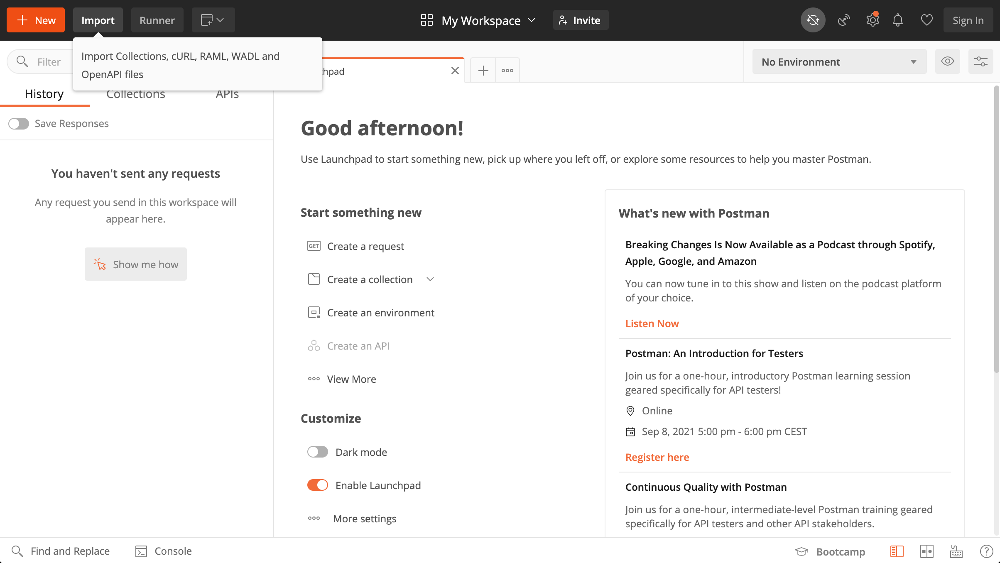
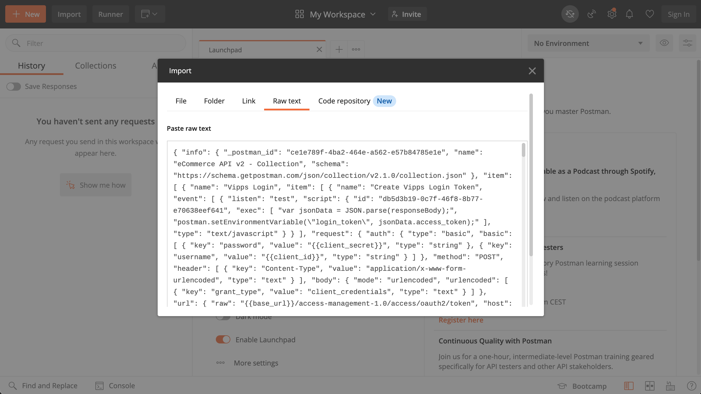
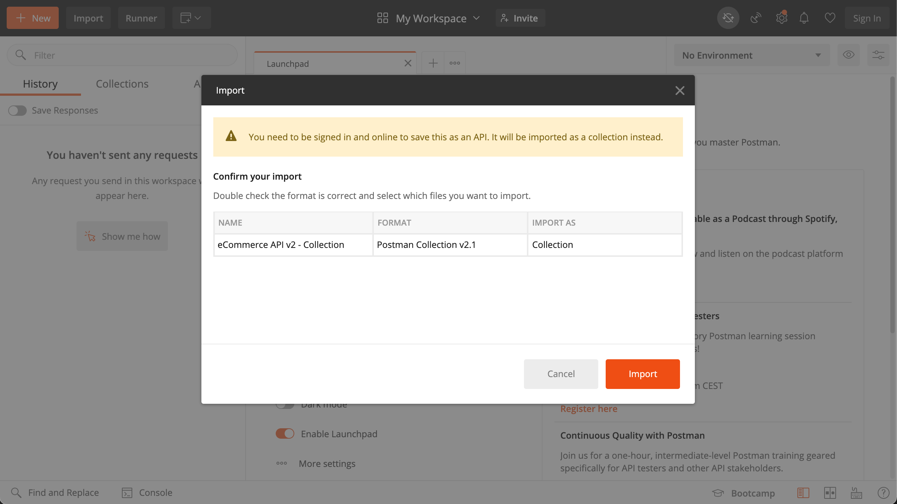
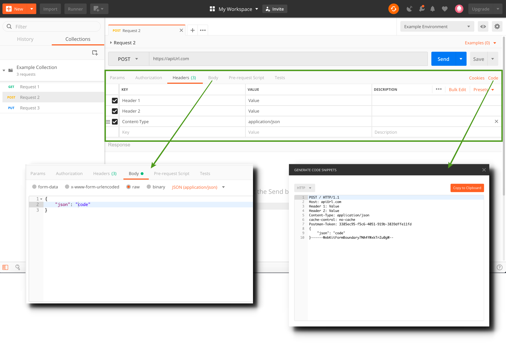

<!-- START_METADATA
---
title: Postman guide
sidebar_position: 15
---
END_METADATA -->

# Postman guide

<!-- START_TOC -->
## Table of Contents

* [Table of Contents](#table-of-contents)
* [Postman guide](#postman-guide)
  * [Select Postman resource](#select-postman-resource)
  * [Import files](#import-files)
  * [Insert values](#insert-values)
  * [Tabs](#tabs)
  * [Postman variables overview](#postman-variables-overview)
    * [Common variables](#common-variables)
    * [eCommerce API specific variables](#ecommerce-api-specific-variables)
    * [Recurring API specific variables](#recurring-api-specific-variables)
    * [Login API specific variables](#login-api-specific-variables)
    * [PSP API specific variables](#psp-api-specific-variables)
  * [Questions?](#questions)

<!-- END_TOC -->

Document version: 3.3.6.

[Postman](https://www.getpostman.com/) is a common tool for working with REST APIs.
We offer [Postman Collections](https://www.getpostman.com/collection) for some APIs.

With Postman, you can make calls to all the API endpoints and see the full
request and response for each call, including headers.

When contacting us about API issues, we are usually able to help faster if you send us
the complete request and response.

## Select Postman resource

Find the collection and environment for the relevant APIs, copy the contents for both, and import into the Postman app.

Each API has (or will have) a step-by-step postman guide. See this guide for examples applicable to that API.

For example:

* [eCom API Postman Guide](https://github.com/vippsas/vipps-ecom-api/blob/master/vipps-ecom-postman.md)
* [Recurring API Postman Guide](https://github.com/vippsas/vipps-recurring-api/blob/master/vipps-recurring-postman.md)
* [Login API Postman Guide](https://github.com/vippsas/vipps-login-api/blob/master/vipps-login-postman.md)
* [Partner API Postman Guide](https://github.com/vippsas/vipps-partner-api/blob/main/vipps-partner-postman.md)
* [PSP API Postman Guide](https://github.com/vippsas/vipps-psp-api/blob/master/vipps-psp-postman.md)
* [QR API Postman Guide](https://github.com/vippsas/vipps-qr-api/blob/main/vipps-qr-api-postman.md)

## Import files

1. To import the collection or environment, copy the contents for the relevant resources in the table above and click the Import button in the postman interface:
   
2. Select "Raw text" and paste the contents and click continue:
   
3. Lastly, confirm the import:
   

## Insert values

The Postman environments comes pre-filled with some values, but there are still some required values which have to be manually entered.
For a complete overview over which values must be entered and where to find them, see [Postman variable overview](#postman-variables-overview).

Click `Edit` and paste in values for each variable.

## Tabs

Some methods require a `body` with information that is sent with the request. Vipps provides pre-populated test data, but this can be modified.

You might want to make the same request from your own application. You can generate snippets of code in various languages that will help you do this. Click the Code link to open the "Generate code snippets" modal.

## Postman variables overview

This is an overview of where to obtain Postman values for each of our APIs. Please read our [Get started guide](vipps-getting-started.md) for information about access to VippsPortal and credentials.

### Common variables

These variables are required for all Vipps APIs

| Variable                  | Located                                                                              |
|---------------------------|--------------------------------------------------------------------------------------|
| client_id                 | [VippsPortal](https://portal.vipps.no/) -> Utvikler -> Show keys -> Client id        |
| client_secret             | [VippsPortal](https://portal.vipps.no/) -> Utvikler -> Show keys -> Client secret    |
| Ocp-Apim-Subscription-Key | [VippsPortal](https://portal.vipps.no/) -> Utvikler -> Show keys -> Subscription Key |

### eCommerce API specific variables

| Variable              | Description                                                                                                                                                                                                                             |
|-----------------------|-----------------------------------------------------------------------------------------------------------------------------------------------------------------------------------------------------------------------------------------|
| merchantSerialNumber  | [VippsPortal](https://portal.vipps.no/) -> Utvikler -> Merchant Serial Number row in table.                                                                                                                                             |
| mobileNumber          | Mobile number which the payment is sent to. See [Vipps test environment](vipps-test-environment.md) for details about test profiles.                                                                                                    |
| fallback              | URL for redirecting user after approving/rejecting the payment.                                                                                                                                                                         |
| callbackPrefix        | Merchant hosted endpoint where Vipps will send transaction updates. [Details](https://vippsas.github.io/vipps-ecom-api/#/Endpoints%20required%20by%20Vipps%20from%20the%20merchant/transactionUpdateCallbackForRegularPaymentUsingPOST) |
| shippingDetailsPrefix | Merchant hosted endpoint where Vipps will fetch shipping cost and method. [Details](https://vippsas.github.io/vipps-ecom-api/#/Endpoints%20required%20by%20Vipps%20from%20the%20merchant/fetchShippingCostUsingPOST)                    |
| consentRemovalPrefix  | Merchant hosted endpoint where Vipps send consent removal requests. [Details](https://vippsas.github.io/vipps-ecom-api/#/Endpoints%20required%20by%20Vipps%20from%20the%20merchant/fetchShippingCostUsingPOST)                          |

### Recurring API specific variables

| Variable             | Description                                                                                                                                                                                                         |
|----------------------|---------------------------------------------------------------------------------------------------------------------------------------------------------------------------------------------------------------------|
| customerPhoneNumber  | Mobile number of Vipps profile which the agreement is sent to. See [Vipps test environment](vipps-test-environment.md) for details about test profiles.                                                             |
| merchantRedirectUrl  | URL for redirecting user after approving/rejecting the agreement.                                                                                                                                                   |
| merchantAgreementUrl | URL to a "My page", where the customer can manage the agreement: Change, pause, cancel, etc. [Details](https://github.com/vippsas/vipps-recurring-api/blob/master/vipps-recurring-api.md#step-1-draft-an-agreement) |

### Login API specific variables

| Variable       | Description                                                                                                                                                                                                                                                                         |
|----------------|-------------------------------------------------------------------------------------------------------------------------------------------------------------------------------------------------------------------------------------------------------------------------------------|
| well-known_uri | Used to retrieve configuration information for OpenID Connect clients. [Details](https://vippsas.github.io/vipps-login-api/#/Vipps%20Log%20In%20API/discoverOpenIDConfiguration)                                                                                                    |
| redirect_uri   | Redirect URL which the user is redirected to after completing a login. [Details](https://github.com/vippsas/vipps-login-api/blob/master/vipps-login-api.md#oauth-20-authorize)  This URL has to be registered in [VippsPortal](https://portal.vipps.no/) -> Utvikler -> Setup login |
| code           | Authorization code generated by the authorization server. [Details](https://github.com/vippsas/vipps-login-api/blob/master/vipps-login-api.md#oauth-20-authorize)                                                                                                                   |

### PSP API specific variables

| Variable             | Description                                                                                                                                           |
|----------------------|-------------------------------------------------------------------------------------------------------------------------------------------------------|
| customerMobileNumber | Mobile number of Vipps profile which the payment is sent to. See [Vipps test environment](vipps-test-environment.md) for details about test profiles. |
| makePaymentUrl       | URL used by Vipps to send the card data. [Details](https://github.com/vippsas/vipps-psp-api/blob/master/vipps-psp-api.md#makepaymenturl)              |
| pspRedirectUrl       | Redirect URL which the user is redirected to after approving/rejecting the payment.                                                                   |
| merchantSerialNumber | Provided by Vipps via email.                                                                                                                          |
| PSP-ID               | Provided by Vipps via email.                                                                                                                          |

## Questions?

We're always happy to help with code or other questions you might have!
Please create an [issue](https://github.com/vippsas/vipps-developers/issues),
a [pull request](https://github.com/vippsas/vipps-developers/pulls),
or [contact us](https://github.com/vippsas/vipps-developers/blob/master/contact.md).

Sign up for our [Technical newsletter for developers](https://github.com/vippsas/vipps-developers/tree/master/newsletters).
