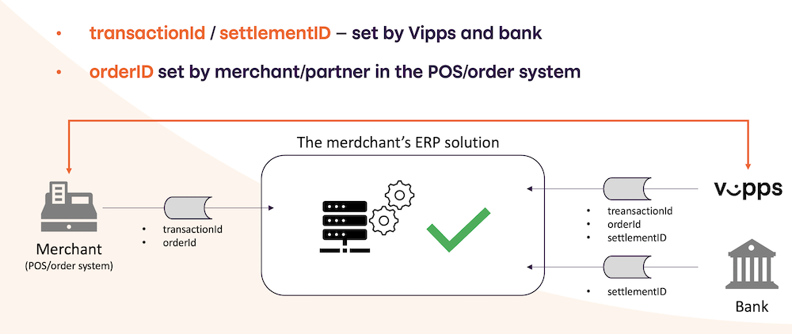

<!-- START_METADATA
---
title: Settlements
sidebar_position: 60
---
END_METADATA -->

# Vipps Settlements

<!-- START_COMMENT -->

ℹ️ Please use the new documentation:
[Vipps Technical Documentation](https://vippsas.github.io/vipps-developer-docs/).

<!-- END_COMMENT -->

<!-- START_TOC -->

## Table of contents

* [Settlement flow](#settlement-flow)
  * [Reconciliation](#reconciliation)
* [Frequency](#frequency)
* [Net and gross settlements](#net-and-gross-settlements)
* [Settlement report formats](#settlement-report-formats)
  * [Additional info for recurring payments](#additional-info-for-recurring-payments)
  * [GDPR](#gdpr)
* [How to get settlement files](#how-to-get-settlement-files)
  * [portal.vipps.no](#portalvippsno)
  * [Email](#email)
  * [SFTP](#sftp)
  * [API](#api)
* [Availability](#availability)
  * [Daily reports](#daily-reports)
  * [Weekly reports](#weekly-reports)
  * [Monthly reports](#monthly-reports)
* [Questions?](#questions)

<!-- END_TOC -->

Document version 2.3.2.

## Settlement flow

Settlements are done as quickly as possible, and depend on banks.

The settlement flow is as follows:

1. Day 1: A customer makes a purchase and the transaction is completed.
   This is when the merchant captures the money.
   Since a merchant should not capture the amount, i.e. charge the customer,
   until the purchased product is shipped, the "day 1" is normally the day that
   the product is shipped and the customer's account is charged.
2. Day 2: Settlement files are available (
   [email](#email),
   [portal.vipps.no](#portalvippsno),
   [SFTP](#sftp)).
3. Day 3: Payments are made from Vipps' bank account to the merchant's bank
   account. Money is _normally_ available in the account before noon.

Settlement process will always adhere to
[Vipps' terms and conditions](https://vipps.no/vilkar/vilkar-bedrift/),
section 5, "OPPGJØR OG FORHOLD TIL VIPPS INNLØSER" (i.e., _SETTLEMENT AND RELATIONSHIP WITH VIPPS REDEEMER_).

Days are bank days, Monday - Friday, excluding banking holidays. In other words,
a capture made on Monday will be on merchant's account on Wednesday, while a
capture made on Friday will be on merchant's account on Tuesday.

A day starts and ends at midnight, Oslo time: Start `00:00:00`, end `23:59:59` (subseconds not specified).
Please make sure your servers' clocks are correct, e.g. by using [NTP](https://en.wikipedia.org/wiki/Network_Time_Protocol).

Settlement files are generated every day including bank days and weekends (one file every day).
Payout for Friday, Saturday and Sunday arrives on Tuesday (three separate transactions).
There is one settlement file per payout.

**Please note:** There is only one payment per settlement period: Even if there
have been thousands Vipps payments in one week, there will still only be one
payment from Vipps to the merchant. A "lump sum", if you want.
The settlement reports have all the details for each of the thousands of payments.
Also: There is one payment per sale unit, with its corresponding settlement file.

### Reconciliation

A simple illustration showing where each id is set, and how it all fits together.

## Frequency

Vipps merchants can log in on
[portal.vipps.no](https://portal.vipps.no)
and select daily, weekly or monthly settlement frequency.

Vipps pays merchants every Monday for weekly settlements,
and on the first day of the month for monthly settlements.

See [the FAQ](https://www.vipps.no/sporsmal#bedriftspm) for more details.

## Net and gross settlements

Merchants with a "net settlement" contract receive the users' payments
excluding the Vipps fees. On other words: The Vipps fees are deducted
from the settlement amount.

Merchants with a "gross settlement" contract receive the _full amount_
of the users' payments
_including_ the Vipps fees, and are then invoiced for the Vipps fees.

For gross settlements: If the merchant's organization number is registered as an EHF recipient,
Vipps sends invoices as EHF. If not, the invoices are sent by email.
To change invoice recipient, please
[contact customer service](https://vipps.no/kontakt-oss/bedrift/vipps/).

See [Availability](#availability) for information about settlement files
when the balance is negative.

## Settlement report formats

Settlement reports are provided in these formats:

| Format | Example            | Specification      |
| ------ | ------------------ | ------------------ |
| XML    | [Example-Gross.xml](xml/Example-Gross.xml), [Example-Net.xml](xml/Example-Net.xml) | [SettlementReport-3.0.xsd](xml/SettlementReport-3.0.xsd) |
| CSV    | [settlement-report.csv](csv/settlement-report.csv) | - |
| PDF    | [PDF](pdf/Vipps-oppgjørsrapport-16655-2018-09-23.pdf) | - |
| XLSX   | [XLSX](xlsx/vipps-settlement-example.xlsx) | - |

More details:

* XML: See the [xml](xml/) folder.
* CSV: See the [csv](csv/) folder.
* PDF: See the [pdf](pdf/) folder.
* OCR: Not available.

Payments made with
[Vippsnummer](https://vipps.no/produkter-og-tjenester/bedrift/ta-betalt-i-butikk/ta-betalt-med-vipps/)
do not have an `orderId`.
If you need an `orderId` to identify a payment, you need to use
[Vipps på nett](https://vipps.no/produkter-og-tjenester/bedrift/ta-betalt-paa-nett/ta-betalt-paa-nett/).
See also the Vipps eCom API.

### Additional info for recurring payments

For recurring payments the `orderID` is an optional field.
If `orderID` is not specified by the merchant when making a charge,
the settlement report shows the automatically generated `chargeID` in the `orderID` field.
If `orderID` is in use, that is also used in the settlement report.

See the
[Recurring API](https://github.com/vippsas/vipps-recurring-api/blob/master/vipps-recurring-api.md#create-a-charge)
for more details.

### GDPR

Vipps needs the customer's consent before sharing personal information with the merchant.

The settlement reports do not contain personal information - except for payments made with Vippsnummer.

See the eCom API FAQ:
[Why are the customer names not shown on the transaction overview?](https://github.com/vippsas/vipps-ecom-api/blob/master/vipps-ecom-api-faq.md#why-are-the-customer-names-not-shown-on-the-transaction-overview).

## How to get settlement files

### portal.vipps.no

Customers can log in to [portal.vipps.no](https://portal.vipps.no), choose "Rapporter" (i.e., *Reports*) and download reports
in the formats mentioned above.

Reports with personal details of the customers are also available, see
[GDPR](#gdpr).

### Email

Merchants can log in on
[portal.vipps.no](https://portal.vipps.no)
and specify email addresses that Vipps will send settlement reports to.
Reports are available in xlsx, xml.zip and csv format.

Reports with personal details of the customers cannot be sent by email, see
[GDPR](#gdpr).

### SFTP

The SFTP report service is used for downloading settlement reports.
SFTP-users are created, associated with a public key, and given access to the
reports of one or more merchants.
The reports are generated dynamically upon request.

See [Availability](#availability) for information about when the files
and directories are available.

Reports with personal details of the customers cannot be sent with SFTP, see
[GDPR](#gdpr).

Details: See the [sftp-report-service](sftp-report-service/) folder.

### API

There is no API for retrieving settlement data.
[SFTP](#sftp) is the closest alternative.

But:
[We are in the early planning phase of developing an API]https://vippsas.github.io/vipps-developer-docs/docs/vipps-developers/newsletters/2022-10-newsletter#settlement-api-in-progress).

## Availability

Settlements are created every day, but only as long as the balance is positive.

In other words, if the balance for a day is zero (e.g. due to lack of
transaction) or negative (e.g. due to refunds), a settlement will not be created
until the balance becomes positive. This means that a settlement report may in
some cases include transactions spanning several days back in time.

Settlement reports are available by 12:00 noon. The reports are generated around
01:00-03:00 at night, but may be delayed due to technical changes, maintenance in
various systems, etc.

**Please note:** There will be no settlement reports for dates without completed
payments. In these cases, neither the settlement files nor the directories that
should have contained settlement files will exist.

**Important:** If a merchant has refunded more money than the sum of payments,
so that the balance is negative, Vipps will not create settlement reports.
Vipps covers the negative balance for a (short) while, but if it persists,
Vipps will send an invoice to the merchant to settle the balance.

There are no settlement reports for the
[test environment](https://github.com/vippsas/vipps-developers/blob/master/vipps-test-environment.md).

### Daily reports

The settlement reports are available by 12:00 noon.

### Weekly reports

The settlement report is generated on Mondays, by 12:00 noon.

### Monthly reports

The settlement report is generated on the 1st of the month, by 12:00 noon.

## Questions?

We're always happy to help with code or other questions you might have!

For customer-specific questions about settlements, please contact operations@vipps.no.

For general questions: Please create an [issue](https://github.com/vippsas/vipps-ecom-api/issues),
a [pull request](https://github.com/vippsas/vipps-ecom-api/pulls),
or [contact us](https://github.com/vippsas/vipps-developers/blob/master/contact.md).
