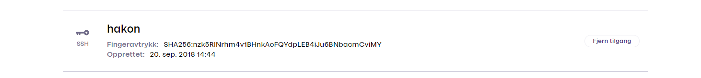

# Vipps SFTP Report Service

This service allows for retrieval of settlement files with SFTP.

SFTP is secure file transfer using SSH (Secure Shell), a cryptographic network
protocol for operating network services securely over an unsecured network.
SFTP can be used manually (interactively), or automatically/programmatically
by using SFTP as part of an integration.

See
[Settlements](https://github.com/vippsas/vipps-developers/tree/master/settlements)
for more information about settlements.

- [Reports](#reports)
  * [Availability](#availability)
- [SFTP Service](#sftp-service)
  * [Security](#security)
  * [SFTP users](#sftp-users)
  * [Add SFTP users](#add-sftp-users)
  * [Partner SFTP access](#partner-sftp-access)
- [How to use it](#how-to-use-it)
  * [Connecting to the SFTP server](#connecting-to-the-sftp-server)
  * [Directory structure](#directory-structure)
  * [Example SFTP session](#example-sftp-session)
- [Questions?](#questions-)

Document version: 4.0.0.

# Reports

Each MSN (Merchant Serial Number, the unique id of a sale unit) merchant has
its own settlement reports.
It is not possible to aggregate reports from multiple sale units into one report.

There will never be more than one new file per sales unit each
day (and there may be none).

**Please note:** There will be no settlement reports for dates without completed
payments and a positive balance. In these cases, neither the settlement files
nor the directories that should have contained settlement files will exist.
Please see
[Availability](https://github.com/vippsas/vipps-developers/tree/master/settlements#availability)
for details.

## Availability

Settlements are created every day, but only as long as the balance is positive.

See [Availability](https://github.com/vippsas/vipps-developers/tree/master/settlements#availability)
for more details.

# SFTP Service

Vipps can not help with SFTP basics, but recommend this for an overview:
[SFTP File Transfer Protocol - get SFTP client & server](https://www.ssh.com/ssh/sftp/).

The SFTP report service is used for downloading settlement reports in
[several formats](https://github.com/vippsas/vipps-developers/tree/master/settlements#settlement-report-formats).

## Security

For Vipps' SFTP service the public SSH key must be added by logging in with BankID on
[portal.vipps.no](https://portal.vipps.no).

More information about SFTP:
[SSH File Transfer Protocol](https://en.wikipedia.org/wiki/SSH_File_Transfer_Protocol).

## SFTP users

SFTP users are created, associated with a public SSH key, and given access to the reports of
one or more MSNs (Merchant Serial Numbers, typically "sale units").

It possible to use the same public SSH key for multiple merchants and multiple MSNs.

Partners may provide all their merchants with a common public SSH key
that the merchants can use to give the partner access their settlements.

One merchant may have multiple MSNs, and give several partners access to
one or more of them independently.

See: [How to let a partner import settlement reports automatically](#how-to-let-a-partner-import-settlement-reports-automatically).

## dd SFTP users

All merchants can set up SFTP on portal.vipps.no.
A public SSH key must be provided.

### Generate a public SSH key

We support RSA (minimum 2048-bit), EdDSA and Ed25519 keys in OpenSSH format.
We reject DSA keys.

A key is easily created with this command (replace `user@example.com`
with your real email address):

```
ssh-keygen -t ed25519 -C "user@example.com"
```

For help creating SSH keys, the GitHub documentation may be helpful:
[Generating a new SSH key](https://docs.github.com/en/authentication/connecting-to-github-with-ssh/generating-a-new-ssh-key-and-adding-it-to-the-ssh-agent#generating-a-new-ssh-key).

If you want to give a partner, like an accounting partner or your ERP partner,
access to the reports: See:
[How to let a partner import settlement reports automatically](#how-to-let-a-partner-import-settlement-reports-automatically).

A public SSH key is normally stored in the user's home directory:
`~/.ssh/id_ed25519.pub`):

Example:
```
ssh-ed25519 AAAAC3NzaC1lZDI1NTE5AAAAIOu1WvDcTWwZumZZwTvfqUKMA4ouG3mniNsvpNWorm5m user@example.com
```

### Add the SSH key on portal.vipps.no

1. Log in with BankID on
   [portal.vipps.no](https://portal.vipps.no)
   and select the `Utvikler` menu item.

   If you only have "Vippsnummer", you will find a link to SFTP setup under
   "Rapporter og tall".
2. Click the tab `SFTP Access` to add users for SFTP access.
3. Add the public key(s) for the user(s) to give access.
   After this you should see the newly created user.

This is what it looks like on portal.vipps.no:



**Please note:**
* Vipps can not add the SSH key for you.
* Vipps can not test the SSH key for you.
* If you do not have BankID, or you do not have the required permissions
  to add the SSH key, you will need the administrator to do it for you, or
  to update your permissions on
  [portal.vipps.no](https://portal.vipps.no).
* The administrator can create additional users on
  [portal.vipps.no](https://portal.vipps.no).
* If you don't know who the administrator is, you can check
  [Brønnøysundregistrene](https://www.brreg.no)
  and see who has the right to sign for the company.

## How to let an ERP partner import settlement reports automatically

A merchant can give a partner, like an accounting partner or your ERP partner,
access to the SFTP service, so the settlement reports can be automatically imported.

This is the recommended way:

1. The partner provides a public SSH key to the merchant.
2. The merchant


**Please note:** This public SSH key does not have to be secret, but anyone
with the public SSH key can access settlement reports for merchants that
have added that specific SSH key. We strongly recommend that partners
create separate keys for each merchant, otherwise all their merchants
will be able to download everyone's settlement reports.

## Connecting to the SFTP server

This is a standard SFTP service, and the address of the SFTP server is `sftp.vipps.no`.

When connecting to the SFTP server you need to supply the username you created.
In the picture above this is "hakon".

Vipps can not help with SFTP basics, but recommend this for an overview:
https://www.ssh.com/ssh/sftp/

**Please note:** Vipps may change the IP addresses of `sftp.vipps.no`.
To ensure that you are whitelisting the correct IP addresses please use the
hostname and DNS, and automatically update your firewall rules if there are DNS changes.

## Directory structure

This is the directory structure (where `[alternative1|alternative2]` indicates two alternatives):
```
/settlements/[inbox|archive]/[file extension]/[orgno.]/[merchant serial number]/[merchant serial number]-[settlement number].[file extension]
```

The `orgno.` is the company's organization number, nine digits.
The `merchant serial number` (also called MSN) is the unique five or six digit
id for the sale unit.

In the examples on this page, the `orgno.` is 998724341, and the `merchant serial number` is 16655.

Example files, with full path:
```
/settlements/inbox/xml/998724341/16655/16655-2000001.xml
/settlements/inbox/pdf/998724341/16655/16655-2000001.pdf
/settlements/archive/csv/998724341/16655/16655-2000001.csv
```

# How to use it

**Important:** The reports are generated on-demand:
There are no real files on the server, all data is generated dynamically.
When you `get` a file, or `mget` multiple files, the server will automatically
create the requested file(s).
Some SFTP clients check the file size with a `ls` command first.
Since the files do not exist until the `get` or `mget` command is sent, the file size
reported by the server is zero bytes.
The SFTP service can not provide correct size information, since there is no real file.
It is therefore not possible to check the size of a file with `ls`.
If this causes problems for your SFTP client, the solution is to use a different client.

**Please note:** Some SFTP clients do not "see" the directories and require the
full path of the directories to be explicitly provided.

Reports under `/settlements/inbox` can be deleted by using the `rm` command in
SFTP or the "delete" function in your SFTP interface.
The files are not really deleted, but actually hidden, in order to keep track
of already processed reports.

Reports under `/settlements/archive` cannot be removed.

## Example SFTP session

Below is an example of an SFTP session, using the command-line,
with line breaks added for readability.

In this example the organization number is 998724341 and the MSN is 16655.

Connect to the SFTP service:
```
$ sftp sftp.vipps.no
Connected to sftp.vipps.no.
```

Directory listing of the root and `settlements` directories:
```
sftp> ls
settlements  

sftp> ls settlements
settlements/archive   
settlements/inbox     
```

Directory listing of the `inbox/`, `inbox/xml/`, `inbox/xml/998724341/`
and `inbox/xml/998724341/16655` directories:
```
sftp> ls settlements/inbox
settlements/inbox/csv        
settlements/inbox/pdf        
settlements/inbox/xlsx       
settlements/inbox/xml        
settlements/inbox/xml.zip    

sftp> ls settlements/inbox/xml
settlements/inbox/xml/998724341   

sftp> ls settlements/inbox/xml/998724341
settlements/inbox/xml/998724341/16655    

sftp> ls settlements/inbox/xml/998724341/16655
settlements/inbox/xml/998724341/16655/16655-2000001.xml             
settlements/inbox/xml/998724341/16655/16655-2000002.xml            
settlements/inbox/xml/998724341/16655/16655-2000003.xml             
settlements/inbox/xml/998724341/16655/16655-2000004.xml             
```

Using `mget` to get all the files in the `settlements/inbox/xml/998724341/16655` directory:
```
sftp> mget settlements/inbox/xml/998724341/16655/*
Fetching /settlements/inbox/xml/998724341/16655/16655-2000001.xml to 16655-2000001.xml
Fetching /settlements/inbox/xml/998724341/16655/16655-2000002.xml to 16655-2000002.xml
Fetching /settlements/inbox/xml/998724341/16655/16655-2000003.xml to 16655-2000003.xml
Fetching /settlements/inbox/xml/998724341/16655/16655-2000004.xml to 16655-2000004.xml
```

Directory listing in the _local_ directory (using the `!` prefix for the `ls` command),
showing the retrieved files, and the `quit` command to end the SFTP session:

```
sftp> !ls -1
16655-2000001.xml
16655-2000002.xml
16655-2000003.xml
16655-2000004.xml
sftp> quit
```

All of the above is basic SFTP use, and should be straight-forward.
If you use a SFTP client, please refer to its user documentation.

# Questions?

We're always happy to help with code or other questions you might have!
Please create an [issue](https://github.com/vippsas/vipps-developers/issues),
a [pull request](https://github.com/vippsas/vipps-developers/pulls),
or [contact us](https://github.com/vippsas/vipps-developers/blob/master/contact.md).
