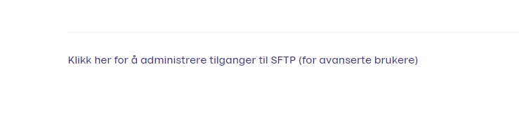

# Vipps SFTP Report Service

The SFTP report service is used for downloading settlement reports in the following formats:
* XML
* CSV
* PDF
* Excel (.xslx)

The files are generated on-demand. 

SFTP-users are created, associated with a public key, and given access to the reports of
one or more merchants. 

More information about SFTP: [SSH File Transfer Protocol](https://en.wikipedia.org/wiki/SSH_File_Transfer_Protocol).

# How to set up users for connecting to the SFTP server

1. Login to https://portal.vipps.no and click `Bedriftsinfo` under your Bedrift and Organization name.


2. Click the link under the information to add users for SFTP-access.



3. In the next window you can add the public keys of the user(s). We support RSA, EdDSA and Ed25519 keys in OpenSSH format (and reject DSA keys). After this you should see the newly created user. For help creating SSH keys, the GitHub documentation may be helpful: https://help.github.com/articles/connecting-to-github-with-ssh/


# Connecting to the SFTP server

The address of the SFTP server is `sftp.vipps.no`.

This is the directory structure:
```
/settlements/[inbox|archive]/[file extension]/[orgnum]/[sales unit serial]/[sales unit serial]-[settlement number].[file extension]
```
## Example SFTP session

Below is an example of an SFTP session, with line breaks added for readability.

```
$ sftp sftp.vipps.no
Connected to sftp.vipps.no.

sftp> ls
settlements  

sftp> ls settlements
settlements/archive   
settlements/inbox     

sftp> ls settlements/inbox
settlements/inbox/csv        
settlements/inbox/pdf        
settlements/inbox/xlsx       
settlements/inbox/xml        
settlements/inbox/xml.zip    

sftp> ls settlements/inbox/xml
settlements/inbox/xml/998724341   

sftp> ls settlements/inbox/xml/998724341
settlements/inbox/xml/998724341/16655    

sftp> ls settlements/inbox/xml/998724341/16655
settlements/inbox/xml/998724341/16655/16655-2000001.xml             
settlements/inbox/xml/998724341/16655/16655-2000002.xml            
settlements/inbox/xml/998724341/16655/16655-2000003.xml             
settlements/inbox/xml/998724341/16655/16655-2000004.xml             

sftp> mget settlements/inbox/xml/998724341/16655/*
Fetching /settlements/inbox/xml/998724341/16655/16655-2000001.xml to 16655-2000001.xml
Fetching /settlements/inbox/xml/998724341/16655/16655-2000002.xml to 16655-2000002.xml
Fetching /settlements/inbox/xml/998724341/16655/16655-2000003.xml to 16655-2000003.xml
Fetching /settlements/inbox/xml/998724341/16655/16655-2000004.xml to 16655-2000004.xml

sftp> !ls -1
16655-2000001.xml
16655-2000002.xml
16655-2000003.xml
16655-2000004.xml
sftp> quit
```

# How to use it

Reports under `/settlements/inbox` can be "deleted" (actually hidden) in order
to keep track of already processed reports. They are deleted by using the `rm`
command in SFTP or the delete function in your SFTP interface. Reports under
`/settlements/archive` cannot be removed.
