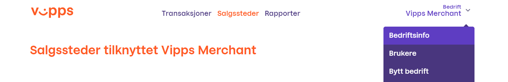
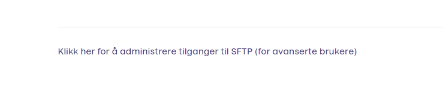

## Getting started guide for integration with SFTP Report Service
#### Product description
The SFTP report service is used for downloading settlement reports. SFTP-users are created, associated with a public key, and given access to the reports of one or more merchants. The reports are generated dynamically upon request.

#### How to configure users for access to the SFTP Report Service

1.	Login to https://portal.vipps.no and click “Bedriftsinfo” under Bedrift and Organization name.

2. Find and click the small hyperlink text under the information to add users for SFTP-access. 

3. In the next window you can add the public keys of the user(s). We support RSA, EdDSA and Ed25519 keys in OpenSSH format (and reject DSA keys). After this you should see the user created.

#### Connecting to the SFTP server
The address of the SFTP server is sftp.vipps.no. 
This is the directory structure:
/settlements/[inbox|archive]/[file extension]/[orgnum]/[sales unit serial]/[sales unit serial]-[settlement number].[file extension]

#### How to use it
The SFTP Report Service works like a regular sftp server, meaning commands like 'get', 'ls', 'cd' and 'rm' are very useful. Reports in /settlements/inbox can be deleted (actually hidden). They are deleted by using the “rm” ssh command or the delete function in your SFTP interface. Reports under /settlements/archive cannot be deleted. The intended use is to delete the report from inbox when they are downloaded to keep track of which reports are read, and then eventually use settlements/archive for historical data.

### Questions
I have you encounter problems integrating with the report servic please don't hesitate to contact us: https://github.com/vippsas/vipps-developers/blob/master/contact.md
