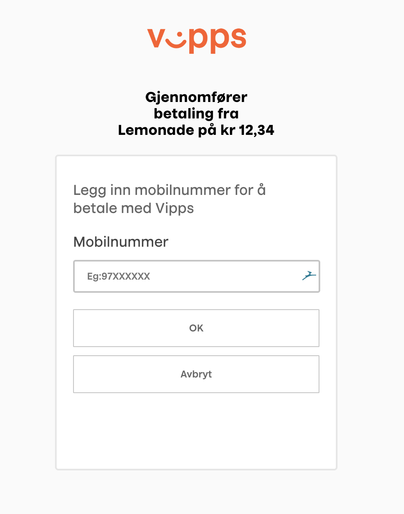

# Disclaimer
This is a work in progress. See the respective documentation for differences.

# Key differences
## Landing page
Universal payment flows are essential for a good user experience. This is why the v2 api has a single landing page for all payments.
The initiate payment response will contain a unique URL to the landing page for each order.


*Note: the landing page is only on regular eCommerce orders. If initiate payment is called from an app, then the user will be taken directly to the Vipps-app*

## Phone number is optional
Initiate payment call no longer requires a phone number. Instead, the user will be asked to fill in the phone number on the landing page. If phone number is included in the initiate payment body, then the landing page wil be "pre-filled" with that number

## Deeplink is automatically generated
If  ```"isApp": true``` in the initiate payment body, then the response will contain a deeplink with a unique token for that specific order.

### Initiate payment example
#### Request Body
```
{
   "customerInfo": {
       "mobileNumber": "48059528"
   },
   "merchantInfo": {
       "callbackPrefix": "https://www.callback.com/",
       "fallBack": "https://fallback.com/",
       "merchantSerialNumber": "210462",
       "isApp": true
   },
   "transaction": {
       "amount": 1234,
       "orderId": "id170",
       "timeStamp":"2020-06-24T08:34:25-07:00",
       "requestId": "1234",
       "transactionText": "Initiate Payment"
   }
}
```

#### Response body
```
{
    "orderId": "id170",
    "url": "vipps://?token=eyJraWQiOiJqd3RrZXkiLCJhbGciOiJSUzI1NiJ9.eyJzdWIiOiJmMDE0MmIxYy02YjIwLTQ1M2MtYTlmMS1lMWUwZGFiNjkzOTciLCJhdWQiOiJmMDE0MmIxYy02YjIwLTQ1M2MtYTlmMS1lMWUwZGFiNjkzOTciLCJhenAiOiJmMDE0MmIxYy02YjIwLTQ1M2MtYTlmMS1lMWUwZGFiNjkzOTciLCJhcHBUeXBlIjoiTEFORElOR1BBR0UiLCJtZXJjaGFudFNlcmlhbE51bWJlciI6IjIxMDQ2MiIsImV4cHJlc3NDaGVja091dCI6Ik4iLCJpc3MiOiJodHRwczpcL1wvVklQUFMtTVQtQ09OLUFHRU5ULWlsYi50ZWNoLTAyLm5ldFwvbXQxXC9kZWVwbGluay1vcGVuaWQtcHJvdmlkZXItYXBwbGljYXRpb25cLyIsImV4cCI6MTU0ODI2NDI3NCwidG9rZW5UeXBlIjoiREVFUExJTksiLCJpYXQiOjE1NDgyNjQwMzQsInV1aWQiOiI0ZTVlYzkyZS03NDYxLTQwNmMtOThmNC0wZmVhYjgxM2E3Y2UiLCJqdGkiOiJkMTE5ODM4Ni1mNjE4LTQ3YWYtYmQ1Ni1kNDk3YTlmNzA4ZGMifQ.NCC90CFchCxgnjXvpl_FOm30KJqqaLgTe2bLi_Td473DL7RKflmopOsMvzvT96jMUr6XmY8f5JUGQxSu_DjRrTOoel3y0GoADXSMBQq5BM12J2RvoJRfBffS2RDkPbW4rbFXDWmZ9A-e1Ym3W02BTPJquFlxi3LiCIFt-eweBBzUEBKghHITWPgi9DBEhYHx6uet_zlM_2CbsylrdPxt6C1S91dLO-MefpsWNCifQ3atdWa5lCWxUzmAFX3CZrIvZKfU5Q-JbDGsrgou_HShy5NhpnF5xGnVppXJ026nnkRmEcxykzTmtveZEZJVWnuZK8KC6HyUl_MrhvTPcXnnQw"
}
```

## Fallback url is required
Initiate payment must contain a fallback URL to redirect after payment. This is set in the initiate payment body. 

For apps, this URL will be the appswitch-URL.

# Migration
If you have already signed an agreement with Vipps, and would like move from v1 to v2, then send a request to ```integration@vipps.no``` with the merchant serial number of the sale unit you want to be moved to v2. 

Keep in mind that the old salesunit will not be affected, and your old integration will still work with the old credentials.

We will create a mirror of the old salesunit in both production and test, and update it with the v2 API. 

## Subscription keys
When you have received confirmation that your new salesunit is created, then you can retrieve the keys in the developer portal.

Test: ```https://apitest-portal.vipps.no/```

Prod: ```https://api-portal.vipps.no```

## New endpoint
The v2 API is available at ```ecomm/v2/payments```

## Documentation
The v2 API documentation is available in markdown on [github](https://github.com/vippsas/vipps-ecom-api/blob/master/vipps-ecom-api.md)

Technical documentation is available in swagger-format [here](https://vippsas.github.io/vipps-ecom-api/)

We highly recommend going through the whole flow using our Postman [collection](https://github.com/vippsas/vipps-ecom-api/blob/master/vipps-ecom-postman.md)