# Vipps Developer Portal: Getting Started

These are the steps after you have received in the onboarding email from Vipps.
You should have received proper credentials with username on email and password on the admin-phonenumber.
Use those credentials to log into Vipps Developer Portal in either Test or Production.

For in-depth information about the Vipps Developer Portal, see the PDF manual: https://github.com/vippsas/vipps-developers

**Please note:** _We have recently updated the colors for the Test (purple) and Production (orange) environments.
The screenshots in the documentation have not yet been updated, but the functionality is unchanged._

# Step 0

Make sure you have an active subscription to the relevant Vipps product(s): https://www.vipps.no/bedrift

We have sign-up pages for those who know what they want (https://vippsbedrift.no/signup/)
and also a "Find your Vipps" product selector: https://www.vipps.no/bedrift/vippshjelper.

For general questions about products, please use the contact form: https://www.vipps.no/bedrift/kontakt-oss

# Step 1

We start with the main page for the Test portal (https://apitest-portal.vipps.no/) and the sign-in screen:

You type in your username and password here:

Please note the difference between the Test and Production environments,
both in appearance and login credentials:

## Test environment: Purple

The test environment has a purple header:

* Vipps Developer Portal URL: https://apitest-portal.vipps.no/
* A username that looks like this: username@**testapivipps**.no
* A default password.

## Production environment: Orange

The test environment has an orange header:

* Vipps Developer Portal URL: https://api-portal.vipps.no/
* A username that looks like this: username@**apivipps**.no`
* A default password.

For password changes in either test or production, please [contact us](contact.md).

## Remember to log out of other Microsoft accounts

If you get an error page similar to the one above:

1. Make sure that you are logged out of any Microsoft accounts, such as Office 365 accounts, _**or**_ make sure you are in "incognito mode" or "private window" in your browser.
2. Make sure you are using the correct URL and credentials for the Vipps Developer Portal: Test or Production.

# Step 2

After an successful log in you will see the account name in the top right corner of the screen ("FIRSTNAME LASTNAME" in this example). On the left you have several tabs.
The **"MANAGE USERS"** tab allows you to add users:

When adding a new developer, note that we don't support non-Latin characters such as
_**æ**_,_**ø**_,_**å**_. Adding a name like "_**Bjørn**_" will result in error.
This can be solved by using "_**Bjorn**_" instead.

# Step 3

## Where are my credentials

| Keys              |  Value                                       |
|-------------------|----------------------------------------------|
| **OCP_Apim_Key Access Token** | Go to Developer Portal -> Click on your name on top right -> select profile -> find subscription named DEFAULT_ACCESSTOKEN and copy the value from Primary key here |
| **Client_Id**  | Go to Developer Portal -> Select the Applications tab -> Select View secret for your application -> Client_Id|
| **Client_secret** | Go to Developer Portal -> Select the Applications tab -> Select View secret for your application -> Client_Secret|
| **orderId**   | Any value to start your sequence - recommend using your ORG Number followed by 00000 and the incremented |
| **Authorization** | "Bearer" followed by the Access Token obtained from the Get Access Token call|
| **Timestamp** | All timestamps need to be in isoTime-format (example: 2018-01-31T16:14:02.715Z)|
| **X-Request-Id** | Any value string limited to 30 characters|
| **merchantSerialNumber** | Go to Developer Portal -> Select the Applications tab -> Copy the Saleunit Serial Number from your application |
| **Ocp_Apim_Key eCommerce product** | Go to Developer Portal -> Click on your name on top right -> Select profile -> find subscription relevant to your eCommerce Product and copy the Primary key across |

# Step 4

## Your first Access Token

The next tab **"PRODUCTS"** shows you the APIs you currently have. As you see from the picture below you can have multiple products:

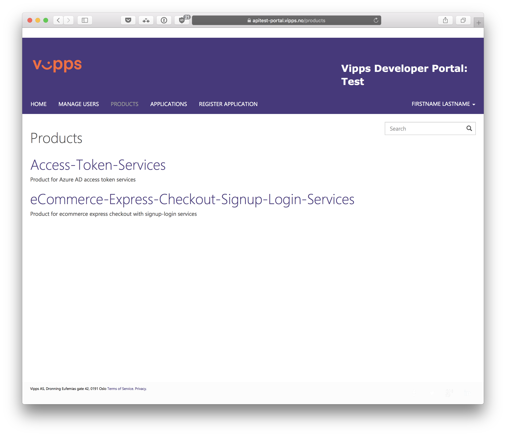

You may have several APIs available.
We are now gonna try to fetch the Access Token, this token is needed for giving Authorization for further API-calls.

You access it by clicking "_**Test the API(S)**_"
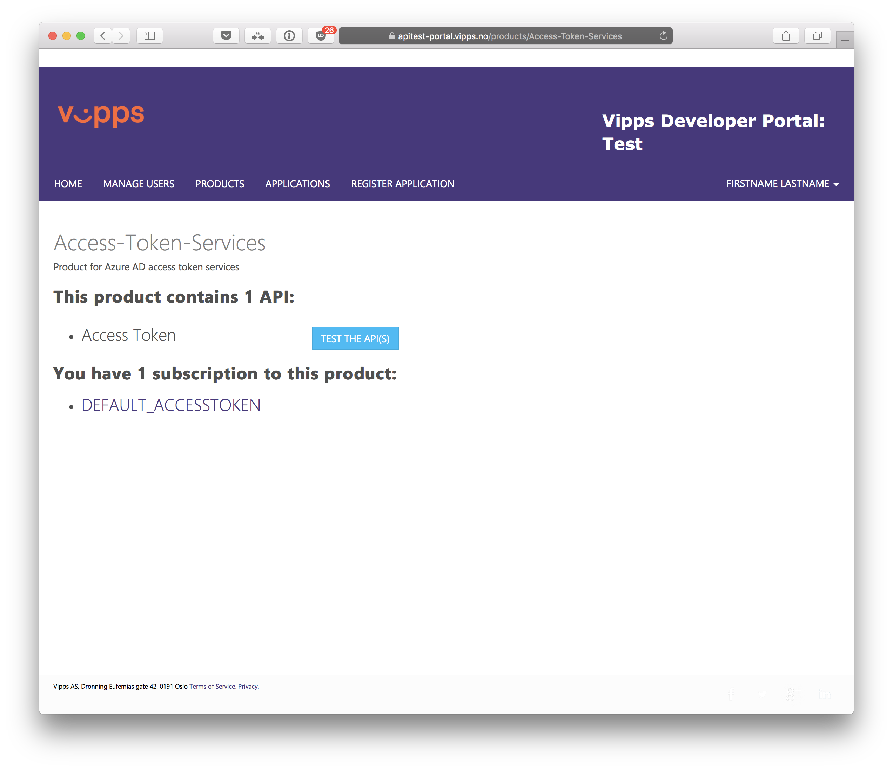

Click the "_**Try**_"-button

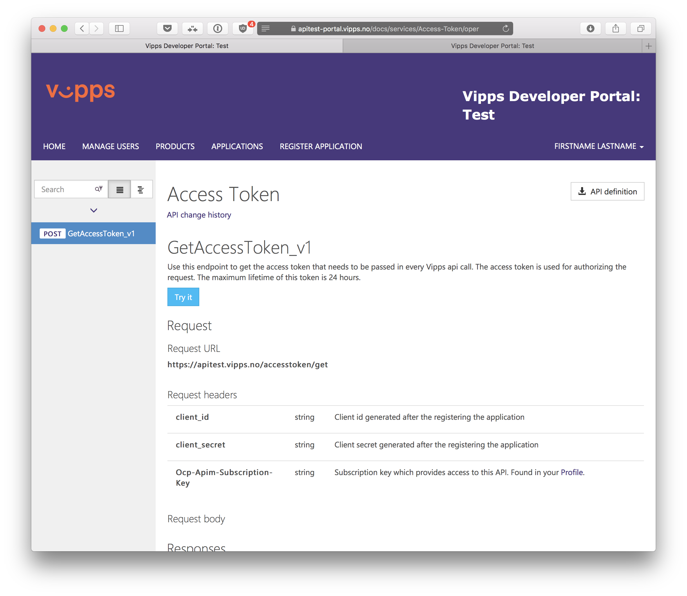

You will then be directed to this site:

Fill in your client_id and client_secret from the tab "_**Applications**_".

This is also shown in Step 5.

Then you will end up with following data:

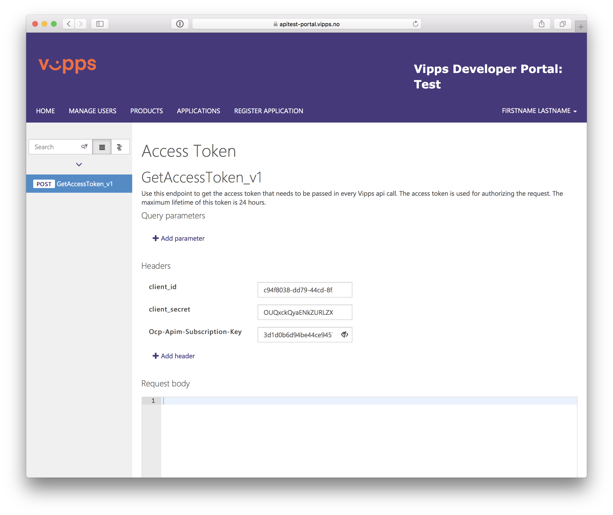

Now push the button "_**Send**_"

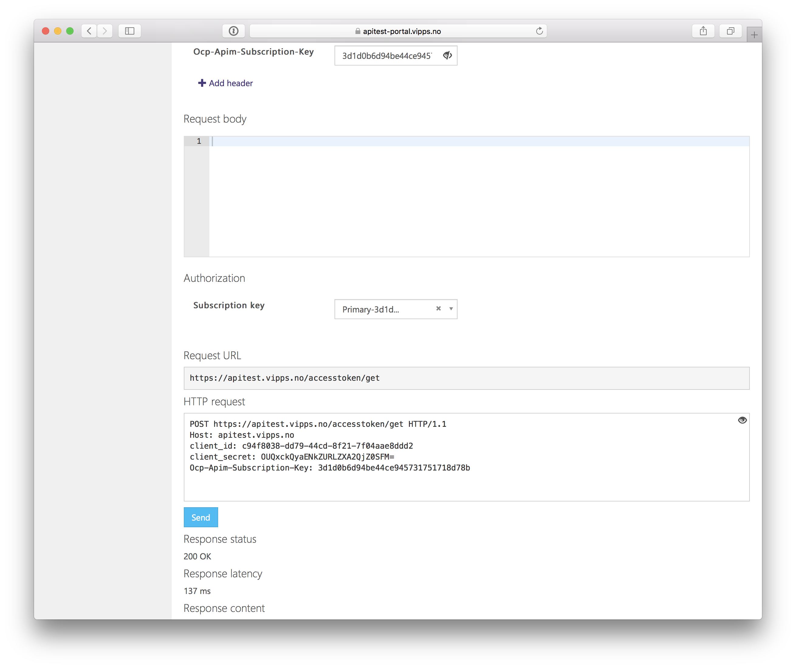

This will result inn a Response status: 200 OK, and you will have generated your first Access Token:

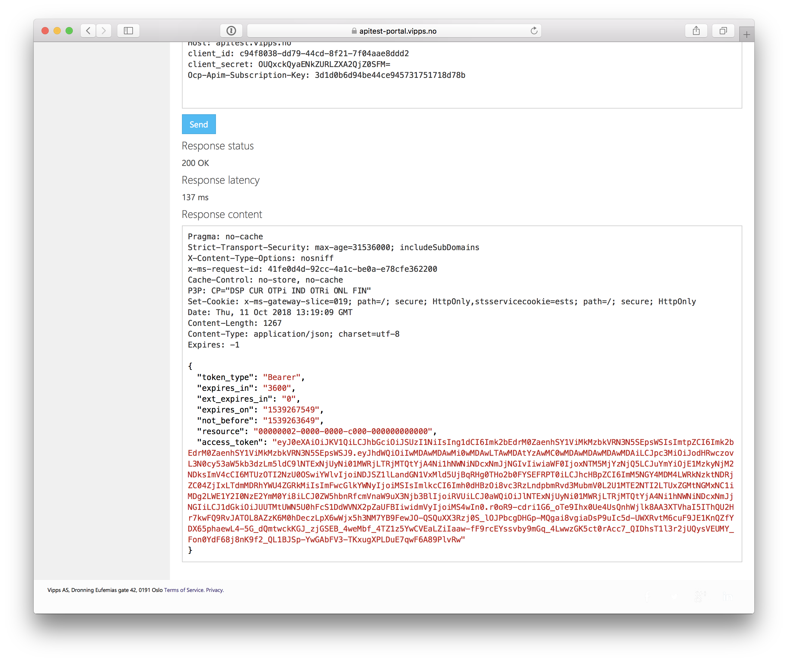

# Step 5

In this example we will use `eCommerce-Express-Checkout-Signup-Login-Services`,
and this page is shown after you click the product name:

Click on the **"Try it"** button:
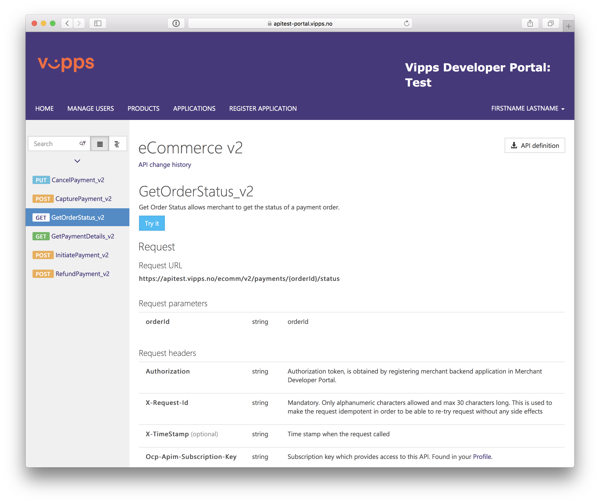

Click on the **"TEST THE API(S)"** button (in this example: `GetOrderStatus_v2`):

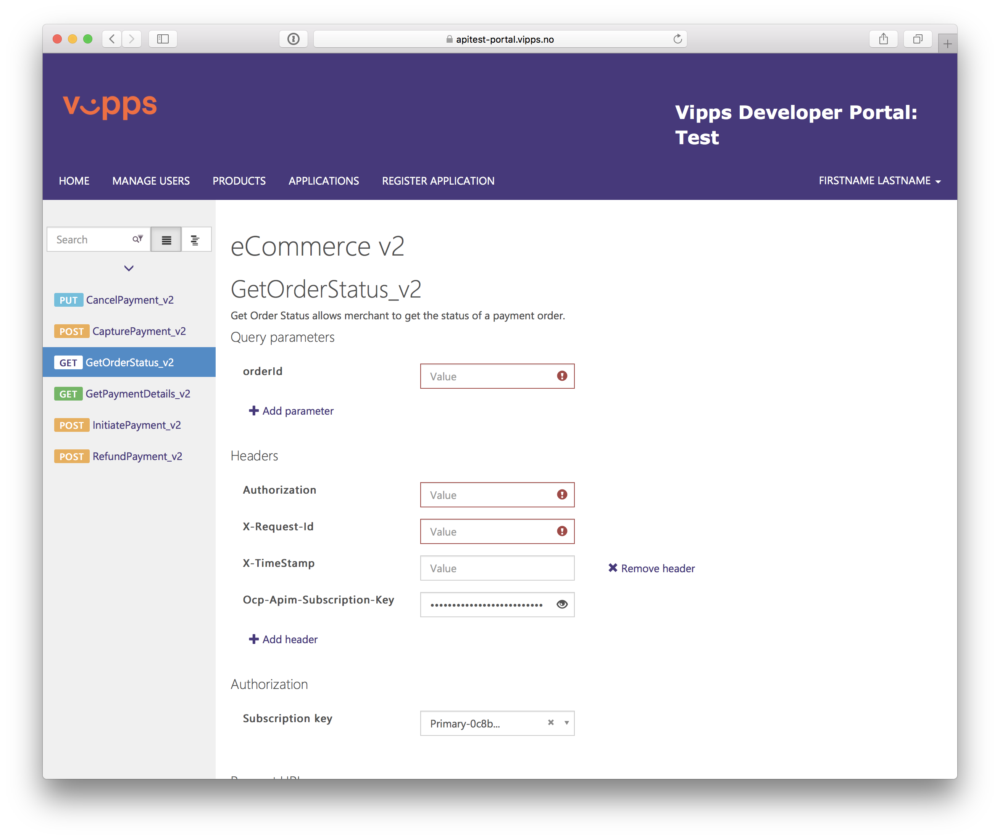

Add the the proper keys to initiate your request:

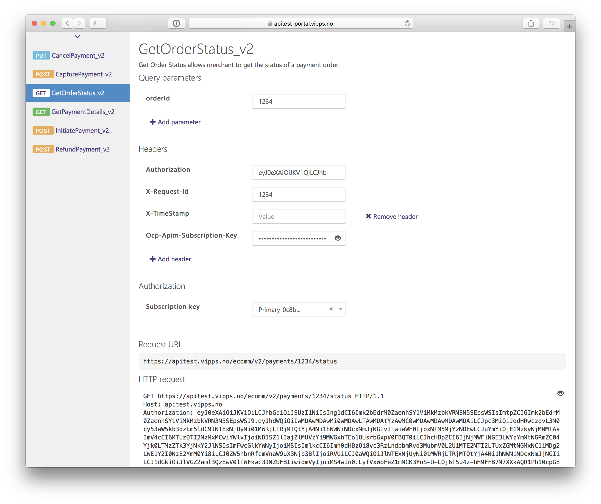

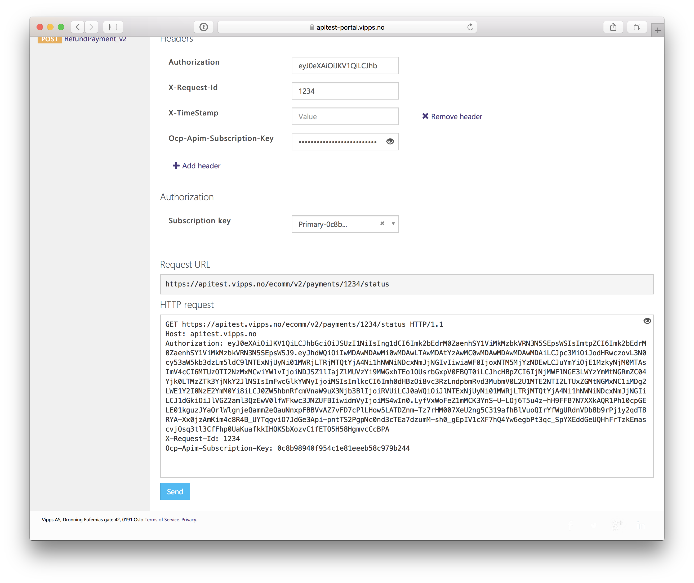

# Step 6

To get your API keys, open the **"APPLICATIONS"** tab (in a new browser tab)
and click on the correct sale unit number (Merchant Serial Number: MSN).
You will find both `client_id` and `client_secret`.

Under the tab **"REGISTER APPLICATION"** it should say, marked in red: 'All existing products have been subscribed':

If you need more Vipps applications, please contact integration@vipps.no.

# Step 7

Under the profile tab (the account name at the top right, "FIRSTNAME LASTNAME" in this example) you will find your two last keys:

* DEFAULT_ACCESSTOKEN
* ECOMMERCE-Vipps Integration XXXX (where XXXX is your MSN):

Click "Show" to view the values:

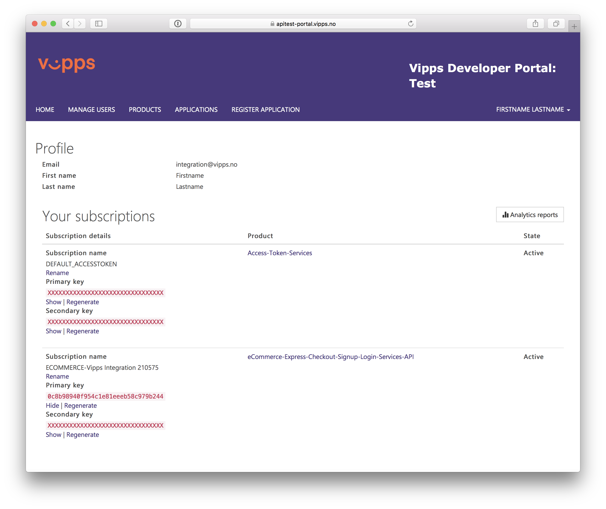

## Access Tokens

You have the `Access Token` key on the top. You have to click "Show" on the right side to make the keys appear.
It is the `Primary key` you are after.
The `Secondary key` is only needed if you are changing installations or regenerating keys. They are normally not used.
If the key for some reason does not work, then you can hit "Regenerate", right next to "Show".

## Subscription keys
The `Ocp-Apim-Subscription-Key` is right below the `Access Token` key. You have to click "Show" on the right side to make the keys appear. And as marked in yellow, you can use
the `Primary key` or the `Secondary key`.

## Merchant serial number

The `MerchantSerialNumber` (MSN) is the number right next to the name of your Salesunit, `210575` in this example.

## Summary

Now you should have `Client_id`, `Client_secret`, `Access Token Subscription Key`, `Product Subscription Key` and `merchantSerialNumber`.

**Important**: While doing payments you will use the `Product Subscription Key` and when getting the access token you will use the `Access Token Subscription Key`.
