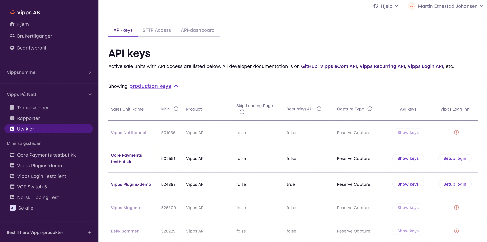
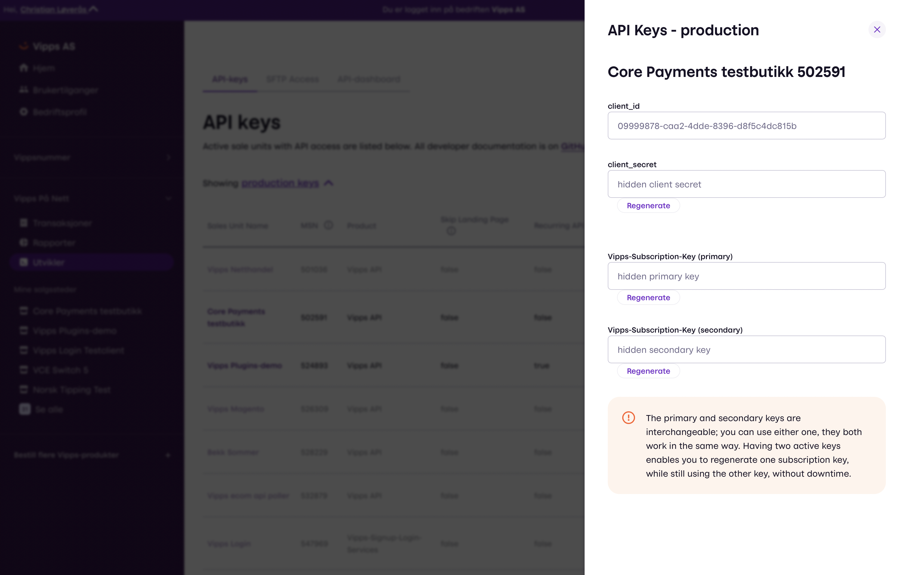

# First of all
This guide only applies to the following APIs: Ecommerce, Recurring and Login. 

If you are using an e-commerce platform, integration partner or PSP, please see the respective resources:

* [Ecommerce platform](https://vipps.no/produkter-og-tjenester/bedrift/ta-betalt-paa-nett/ta-betalt-paa-nett/#kom-i-gang-med-vipps-pa-nett-category-1)
* [Partner](https://vipps.no/produkter-og-tjenester/bedrift/ta-betalt-paa-nett/ta-betalt-paa-nett/#kom-i-gang-med-vipps-pa-nett-category-3)
* [PSP](https://vipps.no/produkter-og-tjenester/bedrift/ta-betalt-paa-nett/ta-betalt-paa-nett/#kom-i-gang-med-vipps-pa-nett-category-2)

## Table of contents
  - [Get credentials](#get-credentials)
  - [Getting the API keys](#getting-the-api-keys)
    - [List of sale units](#list-of-sale-units)
    - [API keys for a salesunit](#api-keys-for-a-salesunit)
    - [API key details](#api-key-details)
  - [API keys for different use](#api-keys-for-different-use)
- [API products](#api-products)
  - [Vipps-API](#vipps-api)
  - [Legacy API products](#legacy-api-products)
- [Quick overview of how to make an API call](#quick-overview-of-how-to-make-an-api-call)
  - [Get an access token](#get-an-access-token)
    - [Request](#request)
    - [Response](#response)
      - [HTTP response codes](#http-response-codes)
  - [Your first Vipps API request](#your-first-vipps-api-request)

## Get credentials
The fastest way to get a Vipps developer account for the test and production
environments, is to apply for a product at [vipps.no](https://vipps.no/produkter-og-tjenester/bedrift/).

*Note: You will need a Norwegian organization number to apply for Vipps services*

Test credentials are normally available 24 hours after we receive the order. When the application has been processed You will receive an email, and the
API keys can be retrieved by logging in to https://portal.vipps.no with BankID.

Please note: If you plan to use Vipps through a Partner or a PSP, you will have to
order the appropriate Vipps solution, and then contact the Partner or PSP
to have _them_ help you with developer access.

## Getting the API keys

API keys are available in the Vipps Portal, under the `Utvikler` menu item in the top menu:
https://portal.vipps.no

The registered admin can log in with BankID and fetch the API keys.

All Vipps customers must have a Norwegian organization number, and the customer
agreements are signed with BankID. Since portal.vipps.no give access to API keys
for both the test and production environment, we require BankID for logging in.
The customer's administrator can create additional users on portal.vipps.no

If you do not have BankID, you will need the admin to log in and provide the
API keys to you.

**Please note:** Vipps can not provide API keys in any other way, such as by
email, as the API keys give access to transferring money.
Vipps will never ask for your API keys, and you should keep them secret.

### List of sale units
Click `Show keys` on the relevant sale unit to display credentials.
 


### API keys for a salesunit


### API key details

| Keys                     | Value                                            |
| ------------------------ | ------------------------------------------------ |
| `Vipps-Subscription-Key` | This is used in the header for all API requests. |
| `client_id`              | The "username"                                   |
| `client_secret`          | The "password". Keep this secret.                |

**Please note:** `Vipps-Subscription-Key` was previously called `Ocp-Apim-Subscription-Key`.
The legacy name `Ocp-Apim-Subscription-Key` _must still be used in requests and code_,
but we are working to make `Vipps-Subscription-Key` work ASAP.

## API keys for different use

The same API keys are used for many types of integration:
Direct integration,
native apps for iOS and Android,
point of sale integrations,
[WooCommerce](https://github.com/vippsas/vipps-woocommerce),
[Magento](https://github.com/vippsas/vipps-magento) (both 1 and 2),
[Episerver](https://github.com/vippsas/vipps-episerver),
[Shopify](https://github.com/vippsas/vipps-shopify),
[Drupal](https://github.com/vippsas/vipps-drupal)
and any other solution based on the Vipps eCom API v2.

# API products

An _API product_ is a "package" consisting of one or more APIs.

Vipps has previously had separate API keys for each API product, and a set of
API keys were directly linked to one sale unit. This meant that customers
needed to keep track of multiple API keys, and that access to a new API
required a new sale unit.

This is no longer the case: New customers now get the `Vipps-API` API product.

The Vipps-API API product give access to all current APIs, and the API keys for
the Vipps eCom v1 and v2 APIs have been “upgraded” to include the same APIs as
Vipps API.

## Vipps-API

This API product includes the following APIs:

| API          | Description                           | Documentation                                    |
| ------------ | ------------------------------------- | ------------------------------------------------ |
| Access Token | Required to obtain a JWT              | See: [Get an access token](#get-an-access-token) |
| eCom v2      | eCommerce, including express checkout | https://github.com/vippsas/vipps-ecom-api        |
| Recurring    | Recurring API                         | https://github.com/vippsas/vipps-recurring-api   |
| Vipps Log In | Identification                        | https://github.com/vippsas/vipps-login-api       |

Vipps-API also includes some _legacy_ APIs:

| API              | Description                                                      | Documentation                                    |
| ---------------- | ---------------------------------------------------------------- | ------------------------------------------------ |
| eCom v1          | eCommerce, legacy version, to be phased out on September 1 2020. | https://github.com/vippsas/vipps-ecom-api-v1     |
| Signup and Login | Legacy API (superseded by Vipps Log In), end of life Dec 31 2019 | https://github.com/vippsas/vipps-signuplogin-api |

See more details about the
[phase-out of eCom API v1](https://github.com/vippsas/vipps-ecom-api/blob/master/v1-deprecation.md)
on September 1 2020.

If you are still using a legacy API, you should upgrade as soon as possible.
The best way to keep up to date of changes is to
[star the API repository on GitHub](https://help.github.com/en/articles/about-stars).

## Legacy API products

Old API products have the `ZZZ` prefix to make them easy to distinguish,
and to always sort them at the bottom of lists.
One example is `ZZZ eCommerce-Classic-Services-API`.

The legacy API products prefixed with `ZZZ` have been updated to also include the
current, corresponding APIs in Vipps-API.
This means that a sale unit that could previously only use eCom v1,
can now also use eCom v2, with the same API keys as before.

The legacy API products still work, and there is no need to "upgrade" to Vipps-API,
unless there are technical problems.

The current APIs offer substantial improvements over the legacy APIs, and
we strongly recommend upgrading to the current version as soon as possible.

# Quick overview of how to make an API call

## Get an access token

The Access Token API provides the JWT bearer token used in the `Authorization`
header, required in all Vipps API calls.

The API keys needed the access token are the same as for the API products:
* client_id: <client_id>
* client_secret: <client_secret>
* Ocp-Apim-Subscription-Key: <Vipps-Subscription-Key>

### Request

```
POST https://apitest.vipps.no/accessToken/get
client_id: <client_id>
client_secret: <client_secret>
Ocp-Apim-Subscription-Key: <Vipps-Subscription-Key>
```

Header details:

| Name                     | Value                  | Description                      |
| ------------------------ | ---------------------- | -------------------------------- |
| `client_id`              | A GUID value           | Client ID for the merchant       |
| `client_secret`          | Base 64 encoded string | Client Secret for the merchant   |
| `Vipps-Subscription-Key` | Base 64 encoded string | Subscription key for the product |

### Response

```
HTTP 200 OK
{
  "token_type": "Bearer",
  "expires_in": "86398",
  "ext_expires_in": "0",
  "expires_on": "1495271273",
  "not_before": "1495184574",
  "resource": "00000002-0000-0000-c000-000000000000",
  "access_token": "eyJ0eXAiOiJKV1QiLCJhbGciOiJSUzI1Ni <snip>"
}
```

JWT properties:

| Name             | Description                                                                      |
| ---------------- | -------------------------------------------------------------------------------- |
| `token_type`     | It’s a `Bearer` token. The word `Bearer` should be added before the token        |
| `expires_in`     | Token expiry duration in seconds.                                                |
| `ext_expires_in` | Extra expiry time. Not used.                                                     |
| `expires_on`     | Token expiry time in epoch time format.                                          |
| `not_before`     | Token creation time in epoch time format.                                        |
| `resource`       | For the product for which token has been issued.                                 |
| `access_token`   | The actual access token that needs to be used in `Authorization` request header. |

**Please note:** The JWT (access token) is valid for 1 hour in MT (test) and 24 hours in Production.
To be sure that you are using correct time please use `expires_in` or `expires_on`.

#### HTTP response codes

This API returns the following HTTP statuses in the responses:

| HTTP status        | Description                                             |
| ------------------ | ------------------------------------------------------- |
| `200 OK`           | Request successful.                                     |
| `400 Bad Request`  | Invalid request, see the `error` for details.           |
| `401 Unauthorized` | Invalid authorization.                                  |
| `403 Forbidden`    | Authentication ok, but credentials lacks authorization. |
| `500 Server Error` | An internal Vipps problem.                              |

*Note:* Vipps-Subscription-Key was previously called Ocp-Apim-Subscription-Key. The legacy name Ocp-Apim-Subscription-Key must still be used in request headers.

## Your first Vipps API request

We reccomend getting familiar with the Vipps APIs using Postman. We have a guide, complete with resources for all Vipps APIs available [here](https://github.com/vippsas/vipps-developers/blob/master/postman-guide.md)

We're always happy to help with code or other questions you might have!
Please create an [issue](https://github.com/vippsas/vipps-developers/issues),
a [pull request](https://github.com/vippsas/vipps-developers/pulls),
or [contact us](https://github.com/vippsas/vipps-developers/blob/master/contact.md).

Sign up for our [Technical newsletter for developers](https://github.com/vippsas/vipps-developers/tree/master/newsletters).
