# Vipps: Getting Started

These are the steps after you have received in the onboarding email from Vipps.
You should have received proper credentials with username on email and password on the admin-phonenumber.
Use those credentials to log into Vipps Developer Portal in either Test or Production.

For in-depth information about the Vipps Developer Portal, see the PDF manual: https://github.com/vippsas/vipps-developers

# Step 0

Make sure you have an active subscription to the relevant Vipps product(s): https://www.vipps.no/bedrift

We have sign-up pages for those who know what they want (https://vippsbedrift.no/signup/)
and also a "Find your Vipps" product selector: https://www.vipps.no/bedrift/vippshjelper.

For general questions about products, please use the contact form: https://www.vipps.no/bedrift/kontakt-oss

# Step 1

We start with the main page for the Test portal (https://apitest-portal.vipps.no/) and the sign-in screen:

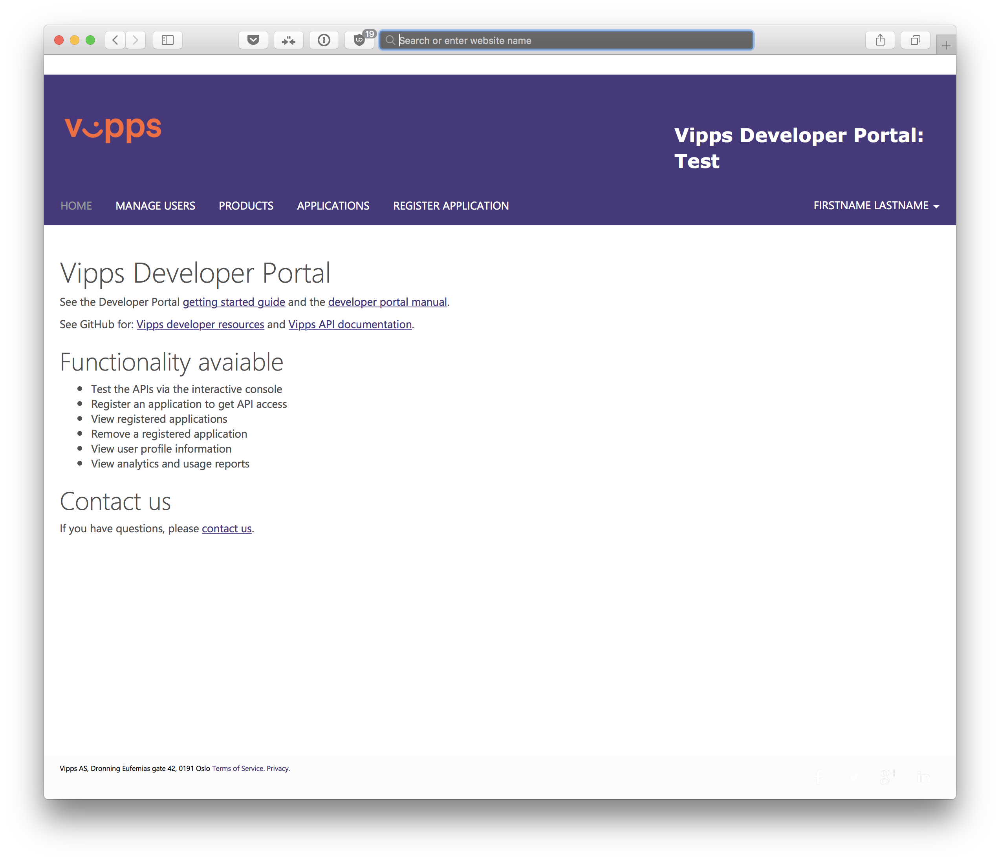

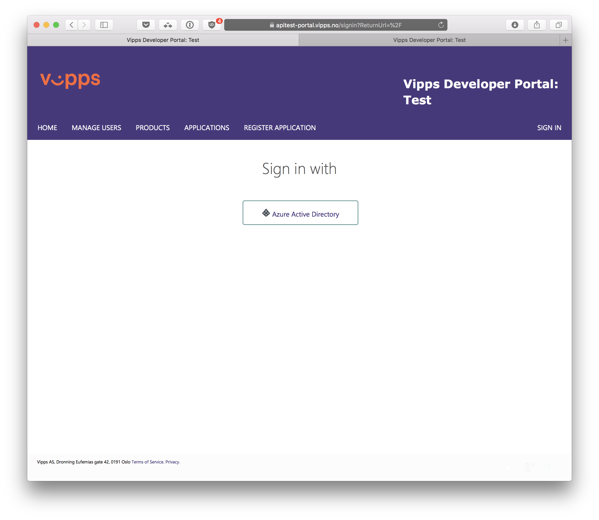

You type in your username and password here:

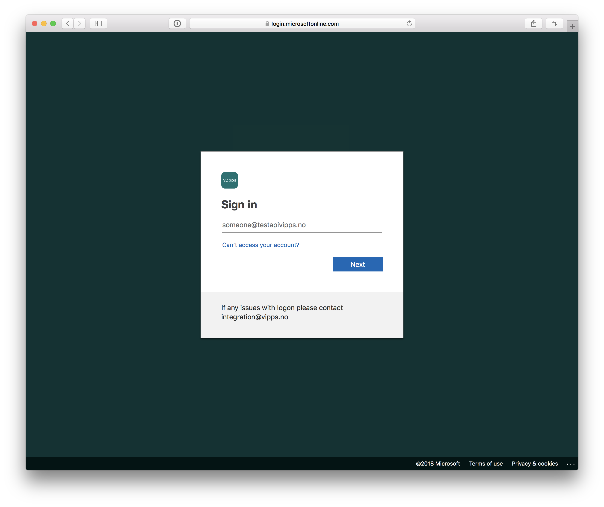

On first sign-in to the test-developer portal, you will be asked for verification. You can skip this process by clicking the "Cancel" button. (This only works for test)

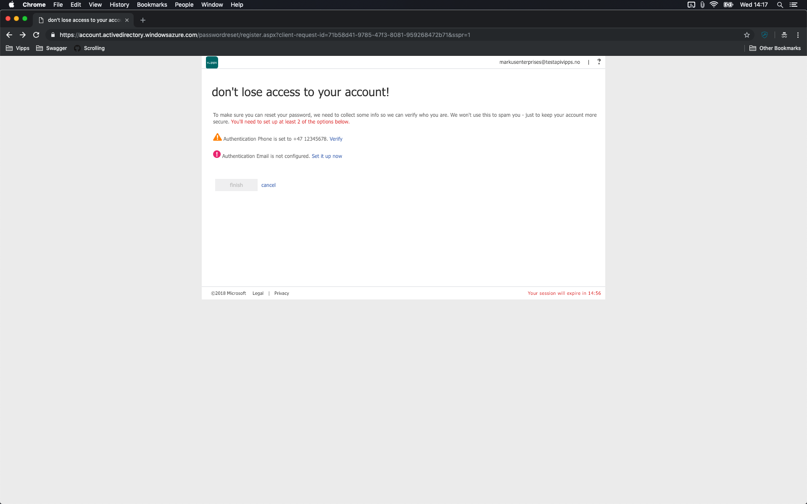


Please note the difference between the Test and Production environments,
both in appearance and login credentials:

## Test environment: Purple

The test environment has a purple header:


* Vipps Developer Portal URL: https://apitest-portal.vipps.no/
* A username that looks like this: username@**testapivipps**.no
* A default password.

## Production environment: Orange

The production environment has an orange header:

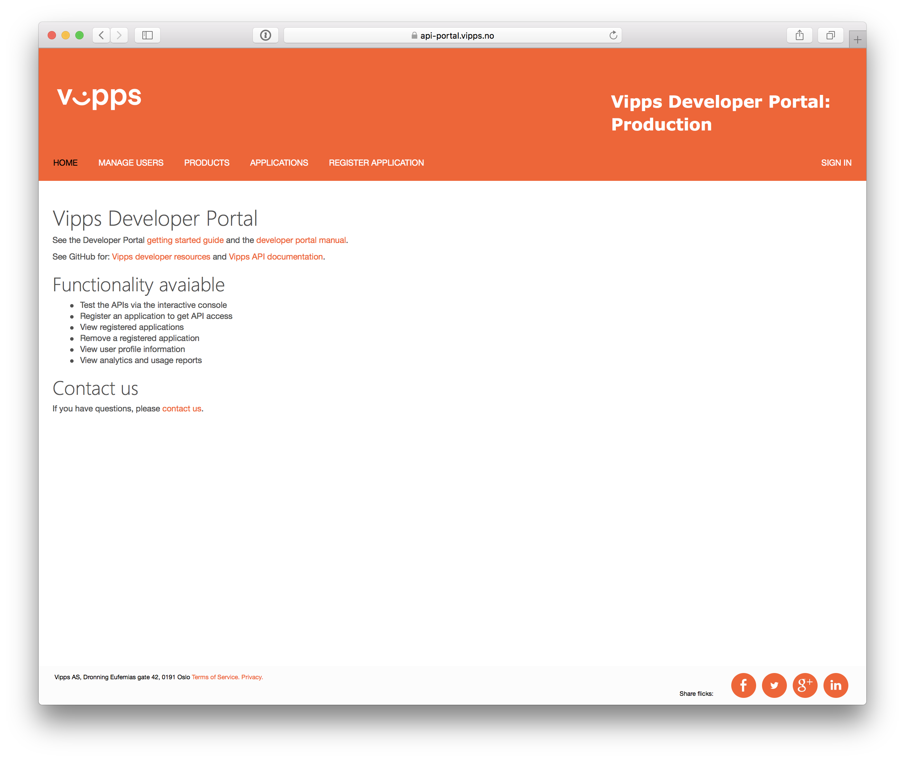

* Vipps Developer Portal URL: https://api-portal.vipps.no/
* A username that looks like this: username@**apivipps**.no`
* A default password.

For password changes in either test or production, please [contact us](contact.md).

## Remember to log out of other Microsoft accounts


If you get an error page similar to the one above:

1. Make sure that you are logged out of any Microsoft accounts, such as Office 365 accounts, _**or**_ make sure you are in "incognito mode" or "private window" in your browser.
2. Make sure you are using the correct URL and credentials for the Vipps Developer Portal: Test or Production.

# Step 2

After an successful log in you will see the account name in the top right corner of the screen ("FIRSTNAME LASTNAME" in this example). On the left you have several tabs.
The **"MANAGE USERS"** tab allows you to add users:

When adding a new developer, note that we don't support non-Latin characters such as
_**æ**_,_**ø**_,_**å**_. Adding a name like "_**Bjørn**_" will result in error.
This can be solved by using "_**Bjorn**_" instead.

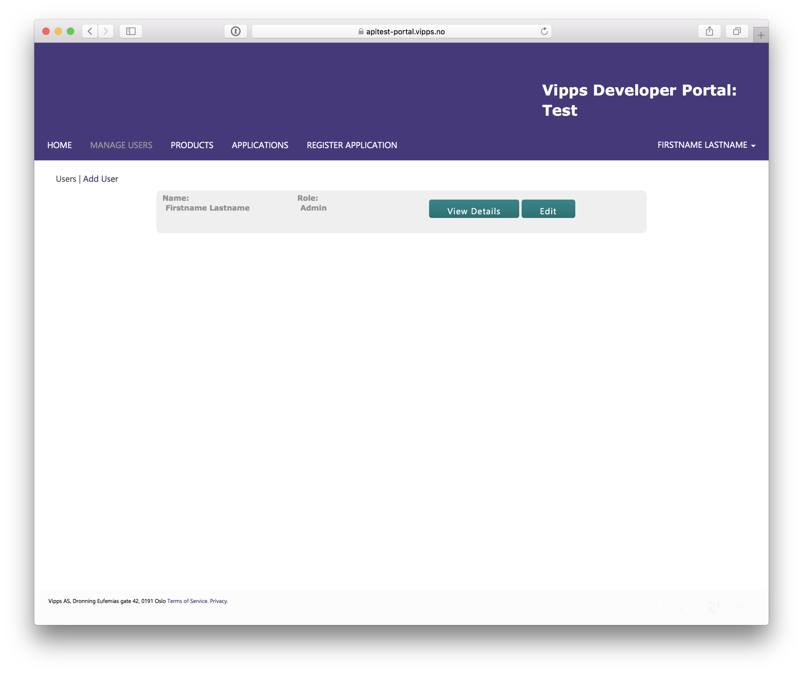

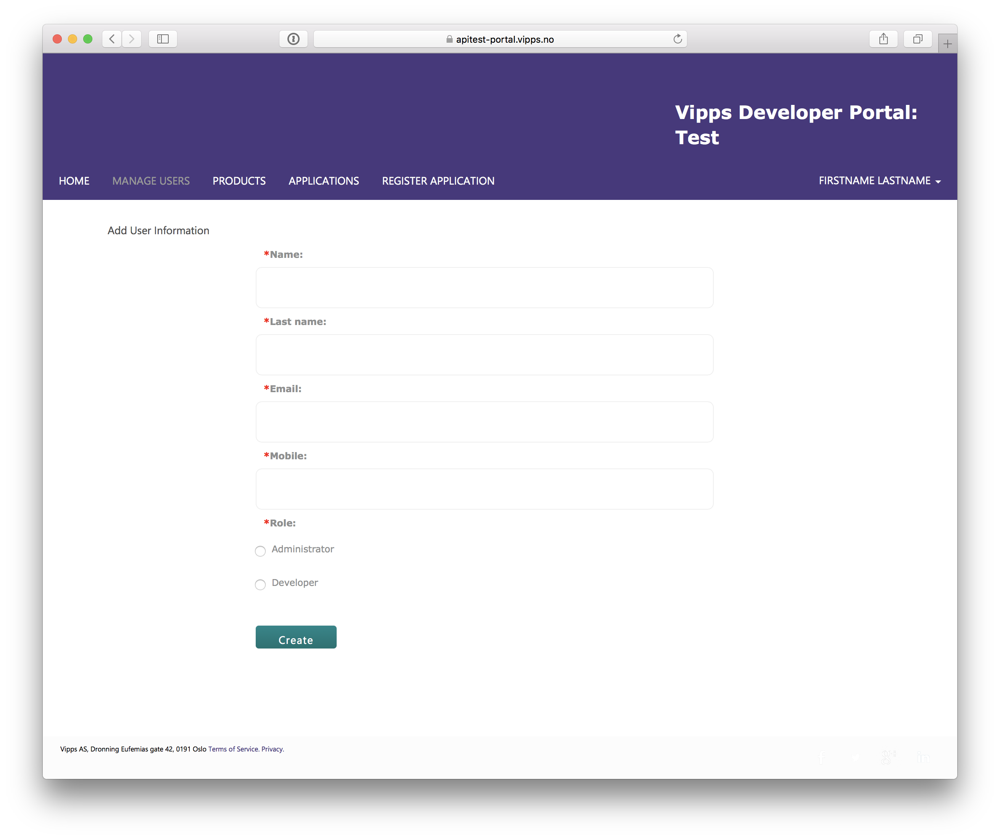

# Step 3

## Your first Access Token
This guide will use Postman as the guiding tool, but the reader may use other RESTful request solutions to follow this guide. The API documentation for each product is accessible from that products API github page found on the [Vipps organization](https://github.com/vippsas/) page. The documentation for a Access Token request may be acquired from the [Access Token documentation](https://vippsas.github.io/vipps-ecom-api/#/Authorization_Service/fetchAuthorizationTokenUsingPost), or as a part of other API documentations.

## Where are my credentials?
To get your two first API keys, open the **"APPLICATIONS"** tab (in a new browser tab)
and click on the correct sale unit number (`merchantSerialNumber`).
You will find both `client_id` and `client_secret`.

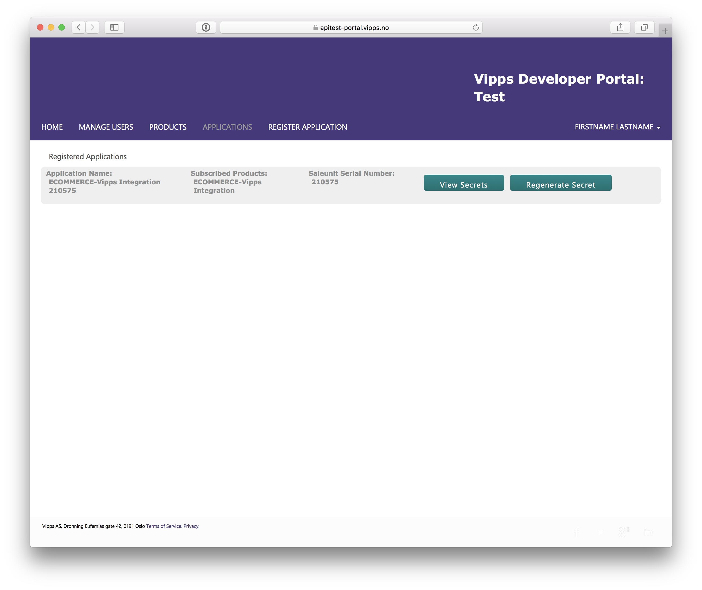

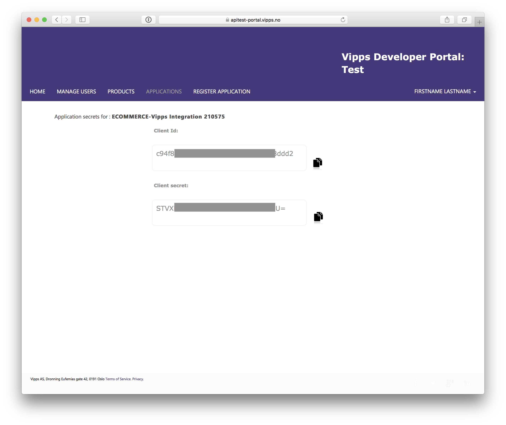

Under the tab **"REGISTER APPLICATION"** it should say, marked in red: 'All existing products have been subscribed':

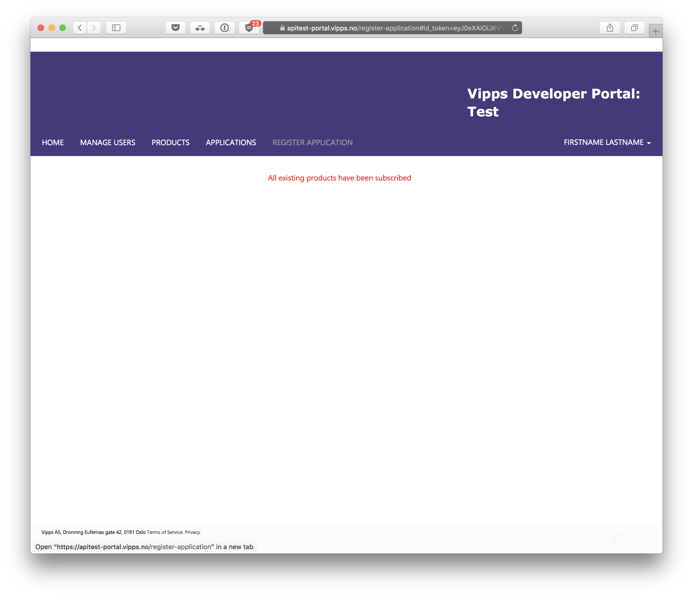

If you need more Vipps applications, please contact integration@vipps.no.

To get the last API key needed for a Access Token request you will need to access the profile tab. This tab is accessed by selecting your account name in the top right(FIRSTNAME LASTNAME in the image bellow), and then selecting PROFILE. On this tab you will find your `Ocp-Apim-Subscription-Key` under DEFAULT_ACCESSTOKEN.

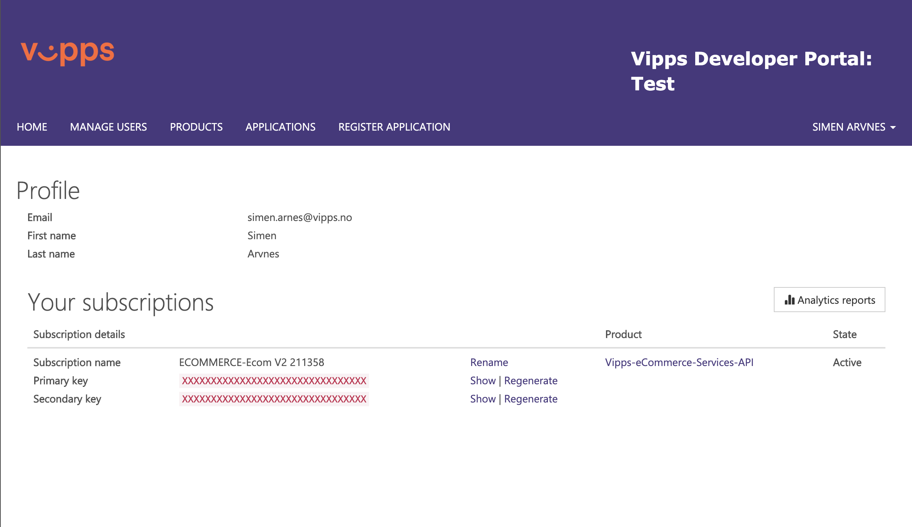

### Overview for keys needed for a Access Token request
| Keys              |  Value                                       |
|-------------------|----------------------------------------------|
| `Ocp-Apim-Subscription-Key` | Go to Developer Portal -> Click on your name on top right -> select profile -> find subscription named `DEFAULT_ACCESSTOKEN` and copy the value from Primary key here. Note that for new eCommerce merchants you may only have one key for the product `Vipps-eCommerce-Services-API` that is valid for both eCommerce and access token requests. |
| `client_id`  | Go to Developer Portal -> Select the Applications tab -> Select View secret for your application -> `Client Id`|
| `client_secret` | Go to Developer Portal -> Select the Applications tab -> Select View secret for your application -> `Client secret`|

## Using Postman to fetch Access Tokens

[Postman](https://www.getpostman.com/)
is a common tool for working with REST APIs. We offer a
[Postman Collection](https://www.getpostman.com/collection)
for most of our products, to make development easier.
See the
[Postman documentation](https://www.getpostman.com/docs/)
for more information about using Postman.

By following the steps below, you can make calls to the Access Token
endpoint, and see the full `request` and `response` for the calls. While in [Step 4](#step-4) we show how to proceed with a full order using the eCommerce API.

### Setting up Postman
We will only provide a quick guide to setting up Postman here, for a more complete guide with pictures please see the [Postman Guide](https://github.com/vippsas/vipps-developers/blob/master/postman-guide.md).

As all transaction with our API's require a Access Token we include a Access Token request in some of our Postman collections and environments. We will use the Access Token request from the eCommerce Postman collection and environment in this guide, as it will be used as example in [Step 4](#step-4).

#### Step 1: Import the Postman Collection

1. Click `Import` in the upper left corner.
2. Import the [vipps-ecom-api-postman-collection.json](https://raw.githubusercontent.com/vippsas/vipps-ecom-api/master/tools/vipps-ecom-api-postman-collection.json) file

#### Step 2: Import the Postman Environment

1. Click `Import` in the upper left corner.
2. Import the [vipps-ecom-api-postman-enviroment.json](https://raw.githubusercontent.com/vippsas/vipps-ecom-api/master/tools/vipps-ecom-api-postman-enviroment.json) file

#### Step 3: Setup Postman Environment

1. Click the "eye" icon in the top right corner.
2. In the dropdown window, click `Edit` in the top right corner.
3. Fill in the `Current Value` for the following fields to get started.
   - `Ocp-Apim-Subscription-Key-Access-Token`
   - `client_id`
   - `client_secret`

#### Obtaining an Access Token with Postman

Make a `Get Access Token` call by selecting the `Get Access Token` call, and click send.
The test script in the Postman request will then add the Access Token from the response to the `Authorization` environment variable.

# Step 4

## Your first product call
We will in this step show how to make a transaction using the eCommerce API, but using the API's for our other products should be similar.

### Resources and guides for other products
| Product | Resource             |
|---------|----------------------|
| Vipps Invoice | [Github Page](https://github.com/vippsas/vipps-invoice-api)   |
| Vipps PSP     | [Github Page](https://github.com/vippsas/vipps-psp-api)       |

### Values required for eCommerce transactions
| Keys              |  Value                                       |
|-------------------|----------------------------------------------|
| `orderId`                                 | Max length 30 characters string created by the merchant. |
| `Authorization`                           | "Bearer" followed by the Access Token obtained from the Get Access Token call (example: `"Bearer Im5iQ3dXMTF3M1hrQi14VWFYd0t <snip>"`)|
| `merchantSerialNumber`                    | Go to Developer Portal -> Select the Applications tab -> Copy the Saleunit Serial Number from your application |
| `Ocp-Apim-Subscription-Key` For eCommerce | Go to Developer Portal -> Click on your name on top right -> Select profile -> find subscription relevant to your product and copy the Primary key across |
| `amount`                                  | The amount in øre that the customer should pay. |
| `fallBack`                                | The URL that the landing page will redirect after |
| `callbackPrefix`                          | The URL that Vipps will send callback requests to |


### From initiate to capture using Postman
#### Product request -  Step 1 - access token
Acquire a `access_token`as shown in [Step 3](#Step-3).

#### Product request -  Step 2 - additional values
Fill in the `Current Value` for the values provided in the [values table](#values-required-for-ecommerce-transactions), where `Ocp-Apim-Subscription-Key` is `Ocp-Apim-Subscription-Key-Ecom` in the Postman environment.

#### Product request -  Step 3 - initiate payment
Select Initiate Payment and send. This will return a `url` that will take the user to the Vipps landing page. To proceed to the next step the user will have to accept on this landing page and in the app. See the [Vipps Developers README page](https://github.com/vippsas/vipps-developers#the-vipps-test-environment-mt) for information about acquiring the test apps.

#### Product request -  Step 4 - reserved
##### Product request - Step 4.1 - callback
When the customer has accepted the payment, or the payment failed, Vipps will send a callback to `callbackPrefix`/v2/payments/`orderId`. As Postman does not support callbacks, we will not use it in this example. Please read the corresponding section about callbacks for the relevant product (for eCommerce see [this link](https://github.com/vippsas/vipps-ecom-api/blob/master/vipps-ecom-api.md#callback)). 

##### Product request - Step 4.1 - details request
The details request endpoint provided by the eCommerce API allows you to get the history and current status of a order. If you have initiated a order in Postman all variables should have been set, so to send the request select the request and send.

###### Example response from Get Details request
```json
{
    "orderId": "2103894920912387234",
    "transactionSummary": {
        "capturedAmount": 0,
        "remainingAmountToCapture": 200,
        "refundedAmount": 0,
        "remainingAmountToRefund": 0
    },
    "transactionLogHistory": [
        {
            "amount": 200,
            "transactionText": "Transaction initiated through Postman",
            "transactionId": "5002662892",
            "timeStamp": "2019-01-23T10:02:14.513Z",
            "operation": "RESERVE",
            "requestId": "",
            "operationSuccess": true
        },
        {
            "amount": 200,
            "transactionText": "Transaction initiated through Postman",
            "transactionId": "5002662892",
            "timeStamp": "2019-01-23T10:01:14.123Z",
            "operation": "INITIATE",
            "requestId": "",
            "operationSuccess": true
        }
    ]
}
```
#### Product request -  Step 5 - capture payment
When a order has been identified as reserved, the merchant will need to capture the amount. The captured amount is as default set int the Postman environment to 0, as this corresponds to capturing the entire amount.

##### Example response from Capture request
```json
{
    "orderId": "2107251548843709260",
    "transactionInfo": {
        "amount": 200,
        "timeStamp": "2019-01-30T10:24:01.562Z",
        "transactionText": "Transaction captured through Postman",
        "status": "Captured",
        "transactionId": "5001448147"
    },
    "transactionSummary": {
        "capturedAmount": 200,
        "remainingAmountToCapture": 0,
        "refundedAmount": 0,
        "remainingAmountToRefund": 200
    }
}
```


## Summary

Now you should have `Client_id`, `Client_secret`, `Access Token Subscription Key`, `Product Subscription Key` and `merchantSerialNumber`.

**Important**: While doing payments you will use the `Product Subscription Key` and when getting the access token you will use the `Access Token Subscription Key`.
