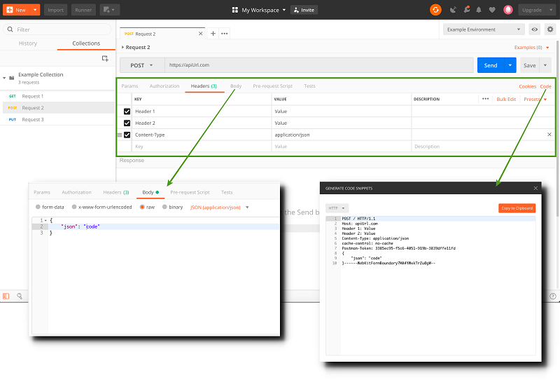

<!-- START_METADATA
---
title: Quick start guides
sidebar_position: 15
---
END_METADATA -->

# Quick start guides

<!-- START_TOC -->

## Table of Contents

* [What you need for getting started with the API](#what-you-need-for-getting-started-with-the-api)
* [Getting started with Postman](#getting-started-with-postman)
  * [Import collections and environments](#import-collections-and-environments)
  * [Update the environment values](#update-the-environment-values)
  * [Run API calls](#run-api-calls)
* [Try it Out!](#try-it-out)
* [Questions?](#questions)

<!-- END_TOC -->

Document version: 4.3.0.

## What you need for getting started with the API

You will need to set up a few things before you can break loose in testing the API.

You need:

1. A *test user*.

    All customers automatically get test users. See [test users](vipps-test-environment#test-users) for more information.

1. A *test sale unit*.

    You create this yourself by logging in to the Vipps portal at <https://portal.vipps.no>. This requires BankId.
    See instructions for creating the [test sale unit](vipps-test-environment#test-merchants).

1. A Vipps *test app* for your mobile phone.

    See instructions for installing the [Vipps test app](vipps-test-environment#vipps-test-apps), *Vipps MT*.

1. A Postman application on your computer.

    Download Postman from <https://www.postman.com/downloads/> and install it.
    Don't use the web version, because we should never save our keys on the web.

## Getting started with Postman

[Postman](https://learning.postman.com/docs/getting-started/introduction/)
is a common tool for working with REST APIs.
It allows you to make calls to the API endpoints and see the full
request and response for each call, including headers.

### Import collections and environments

We provide a Postman collections and environments to make development easier.
Our Postman collections contain example API calls that you can run in the test environment.

Our Postman environments include all the variables needed to run the examples in the collection.
You will need to update some of the variables, so that the example works with your test user and test sale unit.

Once you have installed Postman, you can import an environment from one our our APIs and then customize it for your own use.

1. To import the collection or environment, save the file to your desktop. Then, click the *Import* button in the Postman interface.

2. Select the file(s) and click *Open*.

### Update the environment values

The Postman environments comes pre-filled with some values, but there are still
some required values which have to be manually entered. These are described in the quick start guide for each API.

You must normally update the variables to use your API keys: `client_id`, `client_secret`, `Ocp-Apim-Subscription-Key`, and `merchantSerialNumber`.

### Run API calls

After you have imported and updated the collections and environments, you can begin to run the calls.

In general, there is a sequence to running these, so check in the applicable quick start guide for that API to see what to run first.

Some methods require a `body` with information that is sent with the request.
Vipps provides pre-populated test data, but this can be modified.

You might want to make the same request from your own application. You can
generate snippets of code in various languages that will help you do this.
Click the Code link to open the "Generate code snippets" modal.

## Try it out!

Your next step is to test out the examples!

Choose one of the API quick start guides listed below.
This will lead you through a sequence of steps where you can experiment with every endpoint in the API.

By following the steps, you will make calls to all the endpoints and see the full `request` and `response` for each call.

* [eCom API](https://github.com/vippsas/vipps-ecom-api/blob/master/vipps-ecom-api-quick-start.md)
* [Recurring API](https://github.com/vippsas/vipps-recurring-api/blob/master/vipps-recurring-api-quick-start.md)
* [Login API](https://github.com/vippsas/vipps-login-api/blob/master/vipps-login-api-quick-start.md)
* [Partner API](https://github.com/vippsas/vipps-partner-api/blob/main/vipps-partner-api-quick-start.md)
* [PSP API](https://github.com/vippsas/vipps-psp-api/blob/master/vipps-psp-api-quick-start.md)
* [QR API](https://github.com/vippsas/vipps-qr-api/blob/main/vipps-qr-api-quick-start.md)

## Questions?

When contacting us about API issues, we are usually able to help faster if you send us
the complete request and response.

We're always happy to help with code or other questions you might have!
Please create an [issue](https://github.com/vippsas/vipps-developers/issues),
a [pull request](https://github.com/vippsas/vipps-developers/pulls),
or [contact us](https://github.com/vippsas/vipps-developers/blob/master/contact.md).

Sign up for our [Technical newsletter for developers](https://github.com/vippsas/vipps-developers/tree/master/newsletters).
