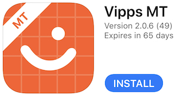

# The Vipps test environment (MT)

The Merchant Test Environment (MT) is available for all Vipps customers.

The environment is suitable for testing _most_ of the Vipps functionality, but some
functionality in the production environment is not available in MT.
In general, MT does not contain functionality that requires integration with
third parties, such as Payment Service Providers, EVRY, Nets, banks, etc.

Functionality not available in MT (a non-exhaustive list):
* Push alerts may be unstable
* Payment of invoices, both for Vipps Regninger and Vipps Faktura
* Limited support for testing card statuses that require connections to Nets, etc
* Limited support for looking up customer information in [KAR](https://www.bits.no/en/bank/konto-og-adresseringsregister-kar/), etc

To test functionality that is not available in MT, you will have to use the
production environment in a controlled manner. One example may be to test
Vipps Regninger with real invoices, but with small amounts. We recommend 2 NOK.

Other differences in MT:
* We allow 10,000 incorrect PIN attempts before locking the Vipps user's account

## Test users

The welcome email contains information about your test profile. The test mobile number is registered with everything required to complete a payment.

You can use this test user to in the [Vipps test apps](#vipps-test-apps).

**Important:** Do _not_ use the test phone number in production,
as the test number may be a real phone number for a real Vipps user.

If you need additional payment cards, you can add it in the Vipps app.
See [Credit card numbers](https://github.com/vippsas/vipps-developers/tree/master/testdata#credit-card-numbers)
for more details.

If you have not yet received the welcome email, see the
[standard reply](https://github.com/vippsas/vipps-developers/blob/master/housekeeping/response-apinokler.txt)
(in Norwegian) for requests for this.

There is no way to get a test user in the production environment. 
The production environment only contains real users and data.

See also: [Vipps Test Data](https://github.com/vippsas/vipps-developers/blob/master/testdata/README.md).

## Test amounts

Vipps supports using special amounts that are always "rejected in the app", etc -
without anyone needing to use the app. This is useful for testing,
test automation, etc.

| Amount | Error                     |
|--------|---------------------------|
| 1.51   | Not sufficient funds      |
| 1.86   | Expired Card              |
| 1.87   | Invalid card              |
| 1.82   | Refused by issuer         |
| 1.83   | Suspected fraud           |
| 1.84   | Withdrawal limit exceeded |
| 1.97   | 3D Secure denied          |

## Vipps test apps

The test apps for iOS and Android are identical to the production apps, but connects to the
Vipps [the Vipps test environment (MT)](#the-vipps-test-environment-mt) instead of the production environment.

Only test accounts, with random phone numbers, are available in the test environments.
Normal Vipps users are not available, so you can not use your own phone number with the test apps.

### Limitations of the test apps

* Push alerts do not work
* For iOS: There may be conflicts with the production apps, and we recommend to only have one of the apps installed

### iOS

The iOS test app is available in Apple TestFlight.
You do *not* need an activation code.

1. Open the [TestFlight](https://testflight.apple.com/join/hTAYrwea) link
2. Install the "Vipps MT" app
3. Open the "Vipps MT" app
4. Enter the test phone number, that was sent in the welcome email to the email address used in the registration. Your normal Vipps user is not available in the test environment.
5. On the "Verify your number" screen: Use PIN  `1236`.
6. On the "Enter your code" screen: Use PIN `1236`.
7. Enable FaceID (or TouchID) and confirm with PIN  `1236`.
8. Accept push notifications.

You are now ready to use the iOS test app connected to the Vipps test environment.

**Please note:** App-switching on iOS uses the same URL pattern for both the
production Vipps app (in App Store) and the MT test app (in TestFlight).
This means that iOS may open either of the apps for a `vipps://` URL, as iOS
can not know which of the apps to open. Because of this, we recommend to
only have one of the apps installed on the same device.

### Android

The Android test app is available in App Center.
You do *not* need an activation code.

1. Open the [App Center](https://install.appcenter.ms/orgs/vipps/apps/vipps-android/distribution_groups/mt%20testers) link. If you get a push message prompting to whitelist the source, you should be able to do this via the "Settings" button.
2. Install the "Vipps Android" app
3. Open the "Vipps Android" app
4. Enter the test phone number, that was sent in the welcome email to the email address used in the registration. Your normal Vipps user is not available in the test environment.
5. On the "Verify your number" screen: Use PIN  `1236`.
6. On the "Enter your code" screen: Use PIN `1236`.
7. Enable touch id and confirm with PIN  `1236`.
8. Accept push notifications.

You are now ready to use the Android test app connected to the Vipps test environment.
